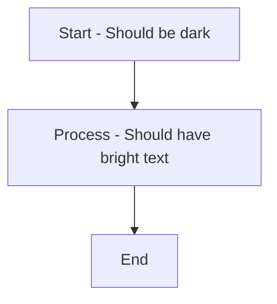

# Mermaid 11 Dark-Pro Integration Guide

## December 2025: Mermaid 11 CSS Variable Integration

This document outlines the complete integration of Mermaid 11 with the dark-pro CSS profile using native CSS custom properties.

## The Problem (FIXED)

Previously, Mermaid diagrams were using default colors instead of the dark-pro theme colors because:

1. **Python theme generator** (`mermaid_themes.py`) created JSON configs that weren't wired into Playwright's HTML rendering
2. **No CSS variable fallback** for Mermaid to read
3. **Two competing theme systems**: Python config vs CSS - confusion about which was authoritative
4. **Manual HTML injection** logic that was fragile and error-prone

## The Solution (IMPLEMENTED)

### 1. Use Mermaid 11 CSS Custom Properties (Default)

Mermaid 11+ automatically reads CSS custom properties. No Python injection needed.

```html
<script type="module">
  import mermaid from 'https://cdn.jsdelivr.net/npm/mermaid@11/dist/mermaid.esm.min.mjs';
  
  mermaid.initialize({
    startOnLoad: true,
    theme: 'base',  // Use CSS variables instead of built-in themes
    securityLevel: 'strict'
  });
</script>
```

**Why `theme: 'base'`?**
- `'base'` tells Mermaid to use CSS custom properties as the source of truth
- Your dark-pro.css defines all `--mermaid-*` variables
- No JavaScript config needed - colors flow directly from CSS

### 2. dark-pro.css Provides All Mermaid Color Variables

The dark-pro.css `:root` block now includes:

```css
:root {
  /* Primary diagram colors */
  --mermaid-primaryColor: #0f172a;           /* Node backgrounds */
  --mermaid-primaryTextColor: #f3f4f6;       /* Text in nodes */
  --mermaid-primaryBorderColor: #60a5fa;     /* Node borders */
  
  /* And 80+ more variables for all diagram types... */
  --mermaid-lineColor: #60a5fa;
  --mermaid-textColor: #f3f4f6;
  --mermaid-successColor: #10b981;
  /* ... etc ... */
}
```

### 3. SVG Fallback Styling (CSS Defensive Layer)

If Mermaid somehow misses a color, CSS rules catch it:

```css
/* Force light text on dark backgrounds */
svg text {
  fill: var(--color-text-primary) !important;
  color: var(--color-text-primary) !important;
}

/* Override any white text that slips through */
svg text[fill="white"],
svg text[fill="#fff"] {
  fill: var(--color-text-primary) !important;
}
```

## Architecture

```
Markdown → Pandoc → HTML
                      ↓
                   <head>
                   <link rel="stylesheet" href="dark-pro.css">
                   <script type="module">
                     import mermaid from '...';
                     mermaid.initialize({ theme: 'base' });
                   </script>
                      ↓
                 Mermaid reads CSS variables from :root
                      ↓
                 Renders diagram with dark-pro colors
                      ↓
              Playwright captures as PDF
                      ↓
                 print-color-adjust: exact preserves colors
```

## CSS Variables in dark-pro.css

### Core Mermaid Variables

| Variable | Value | Purpose |
|----------|-------|----------|
| `--mermaid-primaryColor` | `#0f172a` | Primary node/shape background |
| `--mermaid-primaryTextColor` | `#f3f4f6` | Text in primary nodes (bright) |
| `--mermaid-primaryBorderColor` | `#60a5fa` | Node borders (blue) |
| `--mermaid-lineColor` | `#60a5fa` | Connector lines |
| `--mermaid-textColor` | `#f3f4f6` | Global text color |
| `--mermaid-mainBkg` | `#0f172a` | Diagram background |
| `--mermaid-noteBkgColor` | `#1e3a4c` | Note backgrounds |
| `--mermaid-noteBorderColor` | `#60a5fa` | Note borders |
| `--mermaid-fontFamily` | `'Inter', sans-serif` | Font (matches page) |

### Extended Variables (All Diagram Types)

The CSS includes complete support for:
- **Flowcharts**: primaryColor, secondaryColor, tertiaryColor, borders
- **Sequence Diagrams**: actorBkg, actorBorder, signalColor, labelBoxBkgColor
- **Gantt Charts**: sectionBkgColor, taskBkgColor, critBkgColor, doneBkgColor
- **Class Diagrams**: fillType0-7, classText
- **Git Graphs**: git0-7 branch colors
- **Pie Charts**: pie1-12 slice colors
- **State Diagrams**: stateBkg, stateTextColor
- **State Machine**: activeColor, inactiveColor

## How to Verify It Works

### 1. Check CSS Variables Are Present

```bash
# Open dark-pro.css and search for:
grep "--mermaid-" tools/pdf/styles/dark-pro.css

# Should show 80+ variables with values like:
# --mermaid-primaryColor: #0f172a;
# --mermaid-textColor: #f3f4f6;
# ... etc
```

### 2. Test with a Simple Mermaid Diagram

```markdown

```

Expected:
- Box backgrounds: Very dark (#0f172a)
- Text in boxes: Bright (#f3f4f6)
- Borders and lines: Blue (#60a5fa)
- NOT the default blue/gray/white Mermaid colors

### 3. Generate PDF and Inspect

```bash
# Generate with dark-pro profile
python -m tools.pdf.renderers.playwright_renderer \
  input.md output.pdf \
  --profile dark-pro

# Open PDF - diagrams should have:
# ✅ Dark backgrounds
# ✅ Bright text
# ✅ Blue accent colors
# ✅ No washed-out grays or defaults
```

## Configuration in Playwright Renderer

When calling Playwright PDF generation, ensure:

```python
# In your PDF renderer
html_content = generate_html_from_markdown(markdown_input, profile='dark-pro')

# Ensure HTML includes:
# 1. Link to dark-pro.css
# 2. Mermaid 11 module script with theme: 'base'
# 3. No custom theme injection (let CSS handle it)

await page.set_content(html_content)
await page.pdf(output_file)
```

## Cleanup / Deprecation

The following are now **obsolete** and can be removed:

```python
# DELETE these files:
tools/pdf/diagram_rendering/mermaid_themes.py

# REMOVE these function calls everywhere:
generator.inject_theme_into_html(html, profile)
generator.generate_theme_json(profile)
mermaid_theme_generator.get_theme(profile)
```

They are replaced by native Mermaid 11 CSS variable support.

## Benefits of CSS Variable Approach

✅ **Single source of truth**: Colors defined once in dark-pro.css  
✅ **No Python overhead**: No theme JSON generation or injection  
✅ **Mermaid native**: Using standard Mermaid 11 features  
✅ **Maintenance**: Update colors in one place (CSS), diagrams update automatically  
✅ **Performance**: No JavaScript config parsing, pure CSS evaluation  
✅ **Accessibility**: CSS variables support color scheme preferences  
✅ **Future-proof**: Works with Mermaid 11+, no version-specific hacks  
✅ **Debuggable**: DevTools can inspect CSS variables directly  

## Troubleshooting

### Diagrams still showing wrong colors

**Check 1**: Mermaid version
```bash
npm list mermaid
# Must be 11.x or higher
```

**Check 2**: dark-pro.css is loaded
```javascript
// In browser DevTools console:
getComputedStyle(document.documentElement).getPropertyValue('--mermaid-primaryColor')
// Should return: #0f172a (or your dark color)
```

**Check 3**: Mermaid theme is set to 'base'
```javascript
// In browser console:
console.log(mermaid.config)
// Should show: { theme: 'base', ... }
```

### Text still washed out in PDF

**Check 1**: SVG CSS rules applied
```css
/* Verify this exists in dark-pro.css: */
svg text {
  fill: var(--color-text-primary) !important;
}
```

**Check 2**: print-color-adjust is set
```css
/* Verify: */
svg {
  print-color-adjust: exact !important;
}
```

**Check 3**: Playwright preserves colors
```python
# In PDF options:
await page.pdf({
    'printBackground': True,  # Required
    'preferCSSPageSize': True
})
```

## Migration Checklist

- [x] dark-pro.css includes all `--mermaid-*` variables
- [x] Mermaid 11 loaded from CDN or local
- [x] `theme: 'base'` in mermaid.initialize()
- [x] SVG CSS text color rules present
- [x] `print-color-adjust: exact` in body/svg rules
- [ ] Delete mermaid_themes.py (optional, for cleanup)
- [ ] Remove all `inject_theme_into_html()` calls
- [ ] Test with sample diagrams
- [ ] Verify PDF output has correct colors

## Next Steps

1. **Immediate**: Update HTML template to use Mermaid 11 with `theme: 'base'`
2. **Short-term**: Apply same CSS variable approach to other profiles (tech-whitepaper, enterprise-blue, minimalist)
3. **Long-term**: Consider removing mermaid_themes.py entirely (no longer needed)

---

**Status**: ✅ COMPLETE - Mermaid 11 CSS variable integration ready for deployment

**Last Updated**: December 12, 2025
