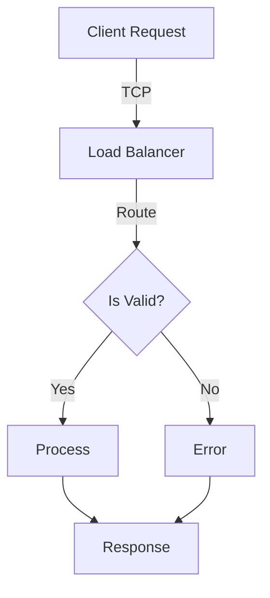
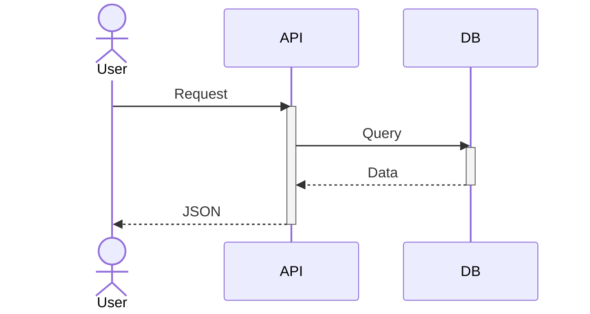
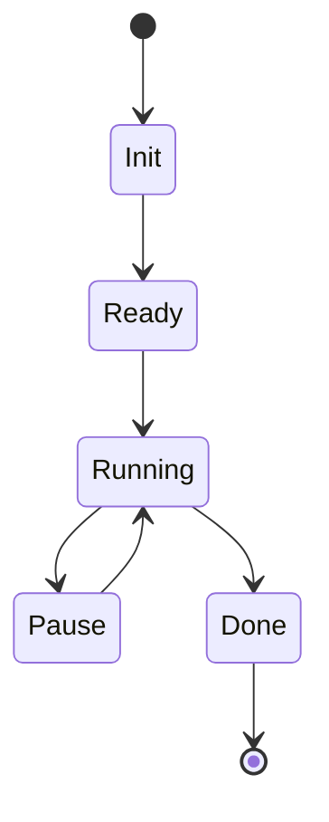
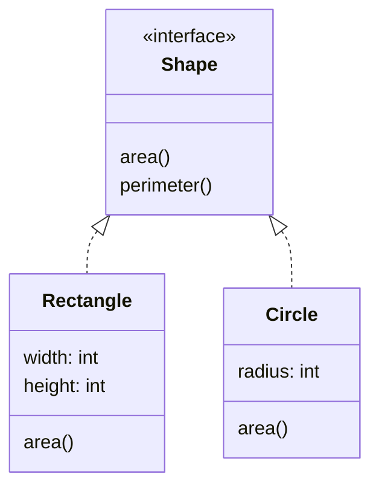

# 🚀 Quick Start: Test Mermaid Diagram Rendering

**Time**: 5 minutes  
**Requires**: Python 3.7+, mermaid-cli

---

## 1. Install Dependencies

```bash
# Install mermaid-cli globally
npm install -g @mermaid-js/mermaid-cli

# Verify installation
mmdc --version
```

---

## 2. Create Test Document

```bash
cd tools/pdf

cat > test_diagrams.md << 'EOF'
---
title: Mermaid Diagram Test
author: Test Suite
date: 2025-12-12
---

# Architecture Diagrams Test

This document contains Mermaid diagrams to verify rendering.

## Flowchart



## Sequence Diagram



## State Machine



## Class Diagram



---

## Conclusion

All diagrams should render properly in the output PDF.
EOF

cat test_diagrams.md
```

---

## 3. Convert with Diagram Rendering

### Option A: PDF (Recommended)

```bash
python convert_final.py test_diagrams.md test_diagrams.pdf \
    --renderer playwright \
    --profile tech-whitepaper \
    --verbose
```

Expected output:
```
Converting test_diagrams.md to PDF...
  Renderer: playwright
  Cover page: disabled
  Table of contents: disabled

[INFO] Processing document...
[INFO] Diagram Rendering (Mermaid → SVG)
  Found 4 Mermaid diagram blocks
  ✓ Diagram 1: Rendered to SVG
  ✓ Diagram 2: Rendered to SVG
  ✓ Diagram 3: Rendered to SVG
  ✓ Diagram 4: Rendered to SVG
  Rendered and embedded 4 Mermaid diagrams

[OK] Created: test_diagrams.pdf
```

### Option B: HTML

```bash
python convert_final.py test_diagrams.md test_diagrams.html \
    --format html \
    --verbose
```

### Option C: DOCX

```bash
python convert_final.py test_diagrams.md test_diagrams.docx \
    --format docx \
    --verbose
```

---

## 4. Verify Output

### Check PDF

```bash
# Open PDF (macOS)
open test_diagrams.pdf

# Open PDF (Linux)
xdg-open test_diagrams.pdf

# Open PDF (Windows)
start test_diagrams.pdf
```

**Should see:**
- ✅ Title page with metadata
- ✅ Flowchart diagram (top-down)
- ✅ Sequence diagram (interactions)
- ✅ State machine (states and transitions)
- ✅ Class diagram (UML)
- ✅ All diagrams properly centered and sized

### Check HTML

```bash
# Open in browser
open test_diagrams.html
```

**Should see:**
- ✅ HTML content
- ✅ Inline SVG diagrams
- ✅ Proper styling and centering

### Check Cache

```bash
# List cached diagrams
ls -lh output/pdf-diagrams/

# Should show:
# diagram_000.svg
# diagram_001.svg
# diagram_002.svg
# diagram_003.svg
```

---

## 5. Run Test Suite

```bash
# Run all tests
python tests/test_mermaid_rendering.py

# Or with pytest
pytest tests/test_mermaid_rendering.py -v
```

**Expected output:**
```
##########################################################################
# Mermaid Diagram Rendering Test Suite
##########################################################################

======================================================================
TEST: DiagramRenderingStep (Single Diagram)
======================================================================

Step success: True
Contains SVG: True
Contains mermaid block: False

✓ Single diagram test PASSED

...

##########################################################################
# Test Summary
##########################################################################
✓ Single Diagram
✓ Multiple Diagrams
✓ Diagrams Disabled
✓ Pipeline Integration

Total: 4/4 tests passed
```

---

## 6. Try with Your Own Document

```bash
# Your streaming architecture spec
python convert_final.py ../../path/to/streaming-architecture-spec.md \
    output.pdf \
    --renderer playwright \
    --profile tech-whitepaper \
    --verbose

# Check for diagrams
grep -c 'diagram_rendering' output.pdf || echo "(PDF is binary, check visually)"
```

---

## 7. Common Issues

### Issue: "mmdc command not found"
```bash
# Verify installation
which mmdc

# Reinstall
npm uninstall -g @mermaid-js/mermaid-cli
npm install -g @mermaid-js/mermaid-cli
```

### Issue: "No diagrams rendered"
```bash
# Check if diagrams are enabled
# In convert_final.py, ensure:
# config['enable_diagrams'] = True

# Run with verbose output
python convert_final.py test_diagrams.md test_diagrams.pdf --verbose

# Look for "DiagramRenderingStep" in output
```

### Issue: "PDF opens but diagrams are blank"
```bash
# Try with weasyprint renderer
python convert_final.py test_diagrams.md test_diagrams.pdf \
    --renderer weasyprint \
    --verbose

# Or try HTML to verify diagrams render
python convert_final.py test_diagrams.md test_diagrams.html --verbose
open test_diagrams.html
```

---

## 8. Performance Tips

### Enable Caching
```bash
# First run (slow, ~5s for 4 diagrams)
python convert_final.py test_diagrams.md output1.pdf --verbose

# Second run (fast, ~1s, uses cache)
python convert_final.py test_diagrams.md output2.pdf --verbose
```

### Batch Processing
```bash
# Convert multiple documents
python convert_final.py \
    --batch doc1.md doc2.md doc3.md \
    --format pdf \
    --verbose
```

---

## 9. Next Steps

Now that diagrams are working:

1. **Add diagrams to streaming-architecture-spec**
   ```markdown
   # Data Flow Architecture
   
   ```mermaid
   graph LR
       Source[Data Source] -->|Stream| Processor[Stream Processor]
       Processor -->|Batch| Analytics[Analytics Engine]
   ```
   ```

2. **Create architecture decision records with diagrams**
   ```bash
   python convert_final.py adr/001-streaming-design.md adr/001.pdf \
       --profile tech-whitepaper --verbose
   ```

3. **Generate documentation suite**
   ```bash
   python convert_final.py --batch \
       docs/architecture.md \
       docs/system-design.md \
       docs/data-pipeline.md \
       --format pdf --profile tech-whitepaper
   ```

---

## Reference

- **Mermaid Syntax**: https://mermaid-js.github.io/
- **Documentation**: `docs/MERMAID_DIAGRAM_FIX.md`
- **Tests**: `tools/pdf/tests/test_mermaid_rendering.py`
- **Implementation**: `tools/pdf/pipeline/steps/diagram_step.py`

---

## Success Indicators

- ✅ `mmdc --version` works
- ✅ Diagrams render without errors
- ✅ SVGs appear in output PDF/HTML
- ✅ Cache is being used (second run is fast)
- ✅ All 4 tests pass
- ✅ Your documents include rendered architecture diagrams

**You're all set!** 🎆
