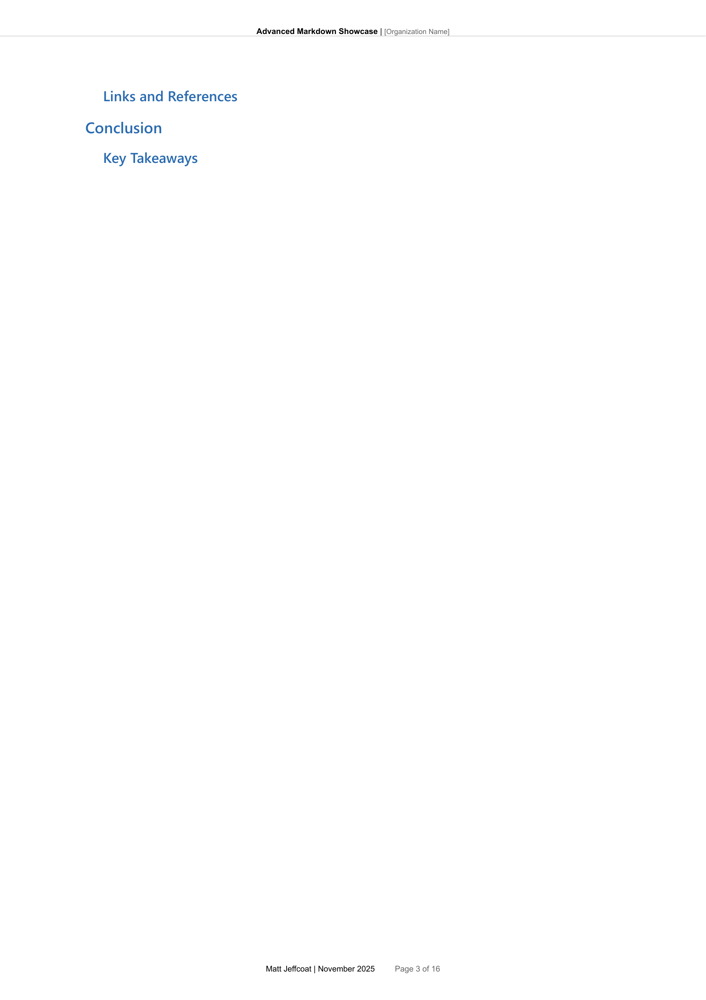
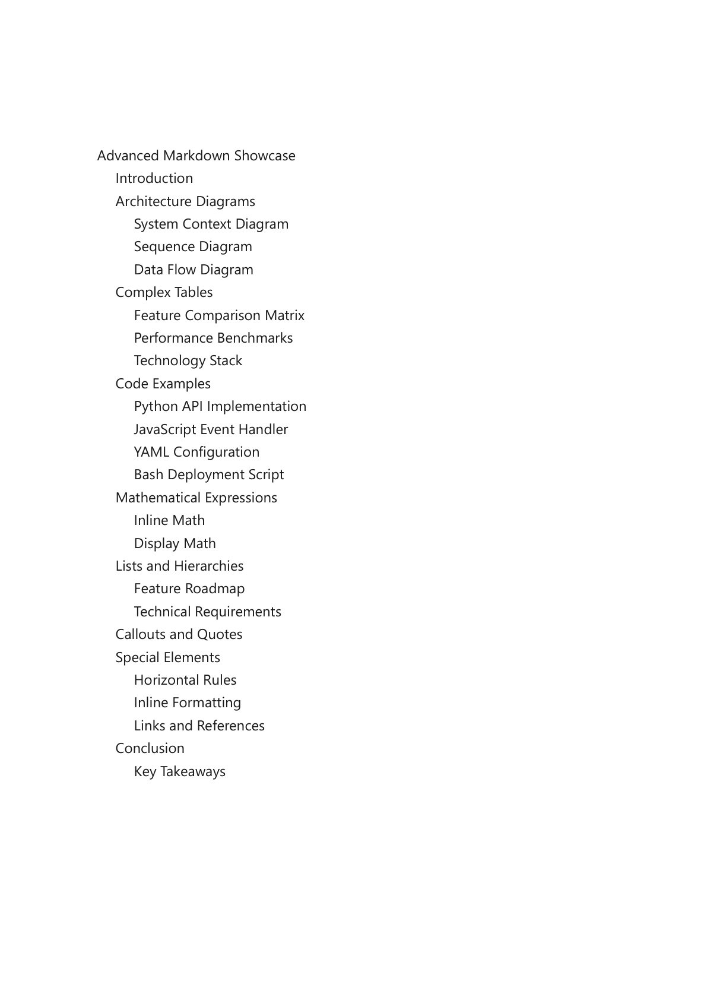
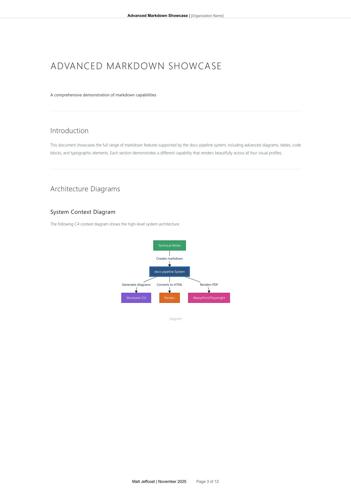
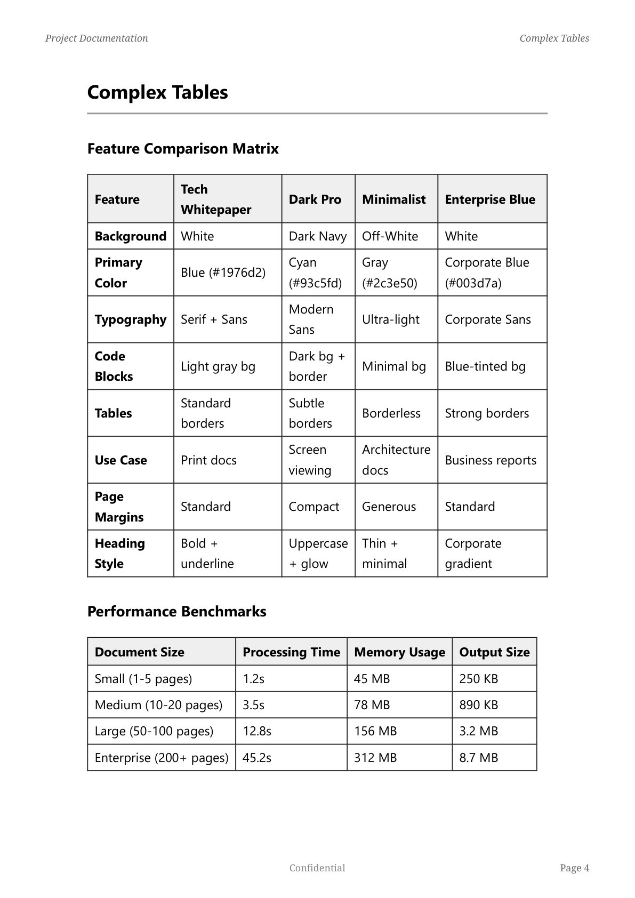
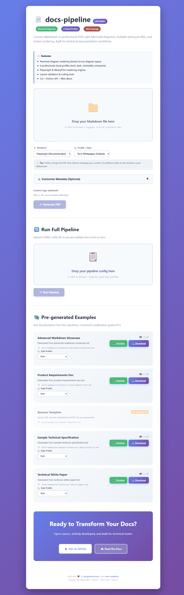
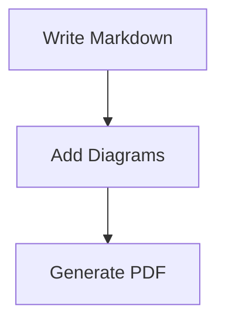

<div align="center">

# 📄 docs-pipeline

**Transform Markdown into publication-quality PDFs with professional styling, Mermaid diagrams, and zero configuration.**


[🚀 Quick Start](#-quick-start) · [📖 Documentation](#-documentation) · [✨ Features](#-features) · [💻 Examples](#-examples)

</div>

---

## Why docs-pipeline?

<table>
<tr>
<td width="33%" align="center">

### 🎨 Professional Output

4 visual profiles turn basic Markdown into polished technical documentation

</td>
<td width="33%" align="center">

### ⚡ Zero Config

Works out-of-the-box with sensible defaults. Customize only what matters.

</td>
<td width="33%" align="center">

### 🧪 Battle-Tested

140KB of tests covering layout, scaling, and diagram rendering

</td>
</tr>
</table>

---

## 🆚 How Does It Compare?

| Feature | docs-pipeline | Pandoc Alone | Sphinx | MkDocs + PDF Plugin |
|---------|--------------|--------------|---------|---------------------|
| **Setup Time** | ⚡ 30 seconds (Docker) | ⚠️ 15-30 min (manual deps) | ⚠️ 30-60 min (complex config) | ⚠️ 20-30 min (plugins) |
| **Mermaid Auto-Render** | ✅ Built-in, theme-matched | ❌ Manual preprocessing | ⚠️ Requires sphinx-mermaid | ⚠️ Requires plugin |
| **Visual Profiles** | ✅ 4 production-ready | ❌ Write CSS from scratch | ❌ Complex LaTeX templates | ⚠️ HTML themes (not PDF) |
| **Single Command** | ✅ `convert_final.py` | ⚠️ Multi-step shell pipeline | ❌ sphinx-build + config | ❌ mkdocs + pandoc chain |
| **PDF Quality** | ✅ 300 DPI print-ready | ✅ High quality | ✅ LaTeX-quality | ⚠️ Print CSS limitations |
| **Web Interface** | ✅ Flask demo included | ❌ None | ❌ None | ✅ Live server (HTML only) |
| **Metadata System** | ✅ CLI/YAML/Env/Frontmatter | ⚠️ Frontmatter only | ⚠️ conf.py + frontmatter | ⚠️ mkdocs.yml only |
| **Batch Processing** | ✅ YAML workspaces | ❌ Manual shell scripting | ⚠️ Makefile/script | ❌ Manual iteration |
| **Docker Containerized** | ✅ Official image | ❌ Manual Dockerfile | ⚠️ Community images | ⚠️ Community images |
| **Dependency Hell** | ✅ Solved (Docker) | ❌ Pandoc + filters + tools | ❌ Python + LaTeX + deps | ❌ Node + Python + Pandoc |
| **Best For** | Quick professional PDFs | Universal doc conversion | Large technical docs | Documentation websites |

**Why docs-pipeline wins:**
- **Zero-config with Docker** - `docker-compose up` and you're done
- **Opinionated workflows** - Pandoc is powerful but overwhelming; we wrap complexity into simple commands
- **Production-ready styling** - 4 professional profiles instead of starting from blank CSS
- **Modern stack** - Playwright rendering beats WeasyPrint for pixel-perfect output

**When to use alternatives:**
- **Pandoc alone:** You need maximum flexibility and custom Lua filters
- **Sphinx:** You're building large multi-page technical documentation sites
- **MkDocs:** You primarily need HTML docs and PDF is secondary

---

## 📸 See the Difference

Generate drastically different-looking PDFs from the **same Markdown** by changing one flag:

```bash
# All commands use the same canonical invocation pattern
python -m tools.pdf.convert_final spec.md output.pdf --profile tech-whitepaper   # Clean, technical
python -m tools.pdf.convert_final spec.md output.pdf --profile dark-pro          # Modern, dark theme
python -m tools.pdf.convert_final spec.md output.pdf --profile minimalist        # Spacious, elegant
python -m tools.pdf.convert_final spec.md output.pdf --profile enterprise-blue   # Corporate-friendly
```

<table>
<tr>
<td width="50%">

#### Tech Whitepaper



*Clean technical style with structured layout*

Best for: API docs, technical specs, developer guides

</td>
<td width="50%">

#### Dark Pro



*High contrast with dramatic shadows*

Best for: Presentations, demo materials, portfolio pieces

</td>
</tr>
<tr>
<td width="50%">

#### Minimalist



*Maximum whitespace, thin typography*

Best for: Architecture Decision Records, RFCs, executive summaries

</td>
<td width="50%">

#### Enterprise Blue



*Conservative blue/gray corporate style*

Best for: Client deliverables, business reports, proposals

</td>
</tr>
</table>

> 💡 **Same content. Different profiles. Zero CSS editing.**

---

## 🚀 Quick Start

### 🐳 Docker Setup (Recommended - 30 seconds)

**Docker is required** due to system dependencies (Pandoc, Playwright, Chromium, Node.js, Mermaid CLI).

```bash
git clone https://github.com/mjdevaccount/docs-pipeline.git
cd docs-pipeline
docker-compose up
```

Open http://localhost:8080

**That's it.** Upload a Markdown file, download your PDF.



*Interactive web interface with profile selection, metadata customization, and example PDFs*

---

### 🔧 Local Installation (Advanced - Manual Dependencies)

**⚠️ Warning:** Local setup requires manual installation of system dependencies. Docker is **strongly recommended** for most users.

**System Requirements:**
- Python 3.9+
- Pandoc
- Node.js 18+
- 300MB+ for Playwright Chromium

**Ubuntu/Debian:**
```bash
# Install system dependencies
sudo apt-get update
sudo apt-get install -y pandoc curl git \
    libpango-1.0-0 libpangoft2-1.0-0 libfontconfig1 libcairo2

# Install Node.js
curl -fsSL https://deb.nodesource.com/setup_20.x | sudo -E bash -
sudo apt-get install -y nodejs

# Install Mermaid CLI
sudo npm install -g @mermaid-js/mermaid-cli

# Install Python dependencies
pip install -r requirements.txt
pip install -r tools/pdf/requirements-pdf.txt
playwright install chromium
```

**macOS:**
```bash
# Install system dependencies
brew install pandoc node

# Install Mermaid CLI
npm install -g @mermaid-js/mermaid-cli

# Install Python dependencies
pip install -r requirements.txt
pip install -r tools/pdf/requirements-pdf.txt
playwright install chromium
```

**Windows:**
```powershell
# Install Chocolatey first: https://chocolatey.org/install
choco install pandoc nodejs

# Install Mermaid CLI
npm install -g @mermaid-js/mermaid-cli

# Install Python dependencies
pip install -r requirements.txt
pip install -r tools/pdf/requirements-pdf.txt
playwright install chromium
```

---

### 🎯 Generate Your First PDF

**Using Docker (Recommended):**
```bash
# Start container
docker-compose up -d

# Generate PDF via CLI inside container
docker exec -it docs-pipeline-web python -m tools.pdf.convert_final \
    docs/examples/advanced-markdown-showcase.md \
    output/showcase.pdf \
    --profile tech-whitepaper

# Or use the web interface at http://localhost:8080
```

**Local Installation:**
```bash
python -m tools.pdf.convert_final \
    docs/examples/advanced-markdown-showcase.md \
    output/showcase.pdf \
    --profile dark-pro
```

> 💡 **Canonical Command:** All examples use `python -m tools.pdf.convert_final` for consistency.  
> You can also use `python tools/pdf/convert_final.py` directly.

---

### Real-World Examples

#### Generate a Professional Resume

```bash
# Set your personal defaults once
export USER_NAME="Your Name"
export USER_TITLE="Senior Software Engineer"
export DOC_LOGO_PATH="$HOME/Documents/headshot.png"

# Generate resume
python -m tools.pdf.convert_final docs/examples/resume-template.md \
    resume.pdf \
    --profile minimalist \
    --version "2024.12" \
    --generate-cover
```

#### Create a Client Proposal

```bash
python -m tools.pdf.convert_final proposal.md client-proposal.pdf \
    --author "Your Name" \
    --organization "Your Company" \
    --classification "CONFIDENTIAL" \
    --profile enterprise-blue \
    --logo "client-logo.png" \
    --generate-cover \
    --generate-toc
```

#### Batch Generate Portfolio Documents

Create `portfolio.yaml`:
```yaml
workspaces:
  portfolio:
    defaults:
      author: "Your Name"
      organization: "Portfolio"
      classification: "PUBLIC"
    documents:
      - input: projects/project1.md
        output: output/project1.pdf
        metadata:
          title: "Project Title"
          version: "1.0"
      - input: projects/project2.md
        output: output/project2.pdf
        metadata:
          title: "Another Project"
          version: "2.0"
```

Run:
```bash
python -m tools.docs_pipeline.cli --config portfolio.yaml
```

---

## ✨ Features

<table>
<tr>
<td width="50%">

#### 🎨 Multiple Visual Profiles

```bash
--profile tech-whitepaper  # Technical docs
--profile dark-pro          # Modern presentations
--profile minimalist        # Architecture docs
--profile enterprise-blue    # Business reports
```

*Dramatically different looks, same content*

</td>
<td width="50%">

#### 📊 Mermaid Diagram Rendering



*Automatically rendered with theme matching*

</td>
</tr>
<tr>
<td width="50%">

#### ⚙️ Two Rendering Engines

- **Playwright** (recommended) - Pixel-perfect browser rendering
- **WeasyPrint** - Faster for simple documents

*Choose the right tool for your use case*

</td>
<td width="50%">

#### ⚙️ Metadata Customization

```bash
# CLI arguments
--author "Your Name" --organization "Company"

# Environment variables
export USER_NAME="Your Name"
export ORGANIZATION="Company"
export DOC_LOGO_PATH="$HOME/Documents/logo.png"

# YAML frontmatter
---
author: Your Name
version: 1.0
classification: CONFIDENTIAL
---
```

*Flexible metadata with multiple override levels*

</td>
</tr>
<tr>
<td width="50%">

#### 🧪 Tested & Validated

```
tests/
├── test_page_size_measurement.py
├── test_scaling_validation.py
├── test_project_docs_layout.py
└── verify_pdf_diagrams.py
```

*140KB of tests covering layout, scaling, diagrams*

</td>
<td width="50%">

#### 🔄 YAML Pipeline Support

```yaml
workspaces:
  default:
    defaults:
      author: "Your Name"
      organization: "Company"
    documents:
      - input: doc.md
        metadata:
          version: "1.0"
          classification: "CONFIDENTIAL"
```

*Batch processing with workspace defaults*

</td>
</tr>
</table>

---

## 🏗️ Architecture

Built with **SOLID principles** and **clean separation of concerns**:

```
docs-pipeline/
├── 🐳 Docker Setup
│   ├── Dockerfile              # Python 3.11 + all dependencies
│   └── docker-compose.yml      # Web demo + optional Structurizr
│
├── 📦 tools/
│   ├── pdf/                    # Core PDF Generation Engine
│   │   ├── convert_final.py    # Main CLI entry point
│   │   ├── cli/                # Command-line interface
│   │   │   ├── main.py         # Full CLI implementation
│   │   │   └── md2pdf.bat      # Windows batch file
│   │   ├── config/             # Configuration management
│   │   │   ├── profiles.py     # Visual profile system
│   │   │   └── examples/       # Config examples
│   │   ├── diagram_rendering/  # Extensible diagram system
│   │   │   ├── orchestrator.py # Diagram pipeline
│   │   │   ├── mermaid.py      # Mermaid renderer
│   │   │   └── base.py         # Renderer interface
│   │   ├── external_tools/     # SOLID wrappers
│   │   │   ├── pandoc.py       # Pandoc executor
│   │   │   ├── mermaid_cli.py  # Mermaid CLI wrapper
│   │   │   └── base.py         # Tool interface
│   │   ├── metadata/           # Document metadata extraction
│   │   ├── pipeline/           # Pipeline orchestration
│   │   ├── renderers/          # PDF rendering backends
│   │   │   └── playwright_renderer.py
│   │   ├── styles/             # Visual profiles (CSS)
│   │   │   ├── tech-whitepaper.css
│   │   │   ├── dark-pro.css
│   │   │   ├── minimalist.css
│   │   │   ├── enterprise-blue.css
│   │   │   └── layout.css
│   │   ├── playwright_pdf/     # Playwright integration
│   │   ├── examples/           # Usage examples
│   │   ├── tests/              # 140KB test suite
│   │   ├── docs/               # Internal docs
│   │   └── REORGANIZATION_SUMMARY.md
│   │
│   ├── docs_pipeline/          # Multi-doc orchestration
│   │   └── cli.py              # YAML pipeline processor
│   │
│   ├── prompts/                # AI enhancement (optional)
│   │   └── agents/             # Multi-agent system
│   │
│   └── structurizr/            # C4 diagram generation
│       └── docker/             # DSL to diagram export
│
├── 🛠️ scripts/                 # Automation utilities
│   ├── create_profile_screenshots.py
│   └── record_demo_gif.py
│
├── 🌐 web_demo.py              # Flask web interface (port 8080)
├── 📄 CONTRIBUTING.md          # Contribution guidelines
├── 📜 LICENSE                  # MIT License
└── 📚 docs/
    ├── examples/               # Sample documents
    │   ├── resume-template.md
    │   └── advanced-markdown-showcase.md
    └── images/                 # Visual assets
        ├── demo.gif            # 3.4MB demo animation
        ├── tech-whitepaper-example.png
        ├── dark-pro-example.png
        ├── minimalist-example.png
        └── enterprise-blue-example.png
```

**Design Philosophy:**

- ✅ **SOLID Principles** - Single responsibility, dependency injection, interface segregation
- ✅ **Extensible** - Add profiles/renderers/diagrams without modifying core
- ✅ **Tested** - 140KB real test coverage (verified, not aspirational)
- ✅ **Professional** - Industry-standard Python package structure
- ✅ **Refactored** - Reduced `tools/pdf/` clutter by 70% (17 files → 5)
- ✅ **Docker-First** - All dependencies containerized for zero-config setup

**Recent Refactor:** Reorganized `tools/pdf/` from monolithic structure to focused packages. [See details](tools/pdf/REORGANIZATION_SUMMARY.md).

---

## 🎯 Use Cases

| Use Case | Profile Recommendation | Why |
|----------|----------------------|-----|
| **API Documentation** | `tech-whitepaper` | Clean, structured layout for endpoints |
| **Architecture Decision Records** | `minimalist` | Whitespace emphasizes key decisions |
| **Client Deliverables** | `enterprise-blue` | Professional, corporate-friendly |
| **Internal Presentations** | `dark-pro` | Modern, high contrast for screens |
| **Technical Specifications** | `tech-whitepaper` | Borders and structure aid scanning |

---

## 📋 Requirements

### 🐳 Docker Installation (Recommended)

**Required:**
- Docker 20.10+
- Docker Compose 2.0+
- 2GB disk space (for images and dependencies)
- 4GB RAM (recommended for large documents)

**All dependencies are handled automatically in the container:**
- Python 3.11
- Pandoc
- Playwright + Chromium browser
- Node.js + Mermaid CLI
- WeasyPrint dependencies (Pango, Cairo, Fontconfig)

**Why Docker?** Zero manual setup, guaranteed consistency, works identically on Mac/Linux/Windows.

---

### 💻 Local Installation (Advanced)

**If you must run locally without Docker:**

**System Dependencies (Manual Installation Required):**
- Python 3.9+
- Pandoc 2.18+
- Node.js 18+
- Playwright with Chromium (300MB+ download)
- Mermaid CLI (Node.js package)
- WeasyPrint system libraries (Linux/Mac)

**Python Dependencies:**
```bash
pip install -r requirements.txt
pip install -r tools/pdf/requirements-pdf.txt
playwright install chromium
```

**Platform-Specific Setup:**
- Ubuntu/Debian: See [Local Installation](#-local-installation-advanced---manual-dependencies) above
- macOS: Requires Homebrew for Pandoc and system libraries
- Windows: Requires Chocolatey or manual installs

**Storage:**
- 300MB+ for Playwright Chromium
- 50MB for Python packages
- 100MB for Node.js and Mermaid CLI

---

### 🤖 Optional Features

**AI Document Enhancement:**
- OpenAI API key (for `tools/prompts/` functionality)
- Anthropic API key (alternative provider)

**Not required for core PDF generation.**

---

## 🔧 Configuration

### Environment Variables

Set these once in your shell for automatic metadata:

```bash
export USER_NAME="Your Name"
export ORGANIZATION="Your Company"
export DOC_LOGO_PATH="$HOME/Documents/logo.png"
```

These values are used as defaults when not specified in frontmatter or CLI arguments.

### Metadata Customization

Metadata can be set in three ways (priority order):

1. **CLI Arguments** (highest priority)
   ```bash
   python -m tools.pdf.convert_final doc.md output.pdf --author "John Doe" --version "2.0"
   ```

2. **YAML Frontmatter** (in markdown file)
   ```yaml
   ---
   author: John Doe
   version: 2.0
   classification: CONFIDENTIAL
   ---
   ```

3. **Environment Variables** (lowest priority, used as defaults)
   ```bash
   export USER_NAME="John Doe"
   export ORGANIZATION="Acme Corp"
   ```

### YAML Pipeline Configuration

For batch processing, use workspace defaults:

```yaml
workspaces:
  default:
    defaults:
      author: "Your Name"
      organization: "Your Company"
    documents:
      - input: doc1.md
        output: doc1.pdf
        metadata:
          version: "1.0"
      - input: doc2.md
        output: doc2.pdf
        metadata:
          version: "2.0"
```

## 🔧 Troubleshooting

| Problem | Solution |
|---------|----------|
| **Docker not starting** | Ensure Docker Desktop is running and port 8080 is free: `docker ps`, `lsof -i :8080` (Mac/Linux) or `netstat -ano \| findstr :8080` (Windows) |
| **Local install fails** | Use Docker instead - local installation requires complex system dependencies |
| **Playwright install fails** | In Docker container: `docker exec -it docs-pipeline-web playwright install chromium` |
| `ModuleNotFoundError: playwright` | Run `playwright install chromium` |
| Mermaid diagrams not rendering | Check `--renderer playwright` (not weasyprint) |
| PDFs look different than expected | Try `--profile tech-whitepaper` explicitly |
| Logo not found | Set `DOC_LOGO_PATH` env var or place logo at `$HOME/Documents/logo.png` |

**Still stuck?** [Open an issue](https://github.com/mjdevaccount/docs-pipeline/issues) with:

- Your command
- Error message
- OS and Python version

---

## 📖 Documentation

- [PDF Generation Guide](tools/pdf/README.md) - Layout engine, Mermaid optimization, document profiles
- [Getting Started Tutorial](docs/getting-started.md) - Step-by-step guide for first-time users
- [AI Agents Architecture](tools/prompts/ARCHITECTURE.md) - Multi-agent system design and extension
- [Structurizr Integration](tools/structurizr/README.md) - Docker-based diagram generation

---

## 💻 Examples

Complete examples in each tool directory:

- `docs/examples/` - Sample markdown documents with diagrams
  - `resume-template.md` - Professional resume template with optimal frontmatter
  - `advanced-markdown-showcase.md` - Demonstrates all features
- `tools/prompts/examples/` - Rough drafts and pipeline configurations
- `tools/structurizr/` - Example DSL files and export configs

**Quick Start Examples:**

```bash
# Generate resume
python -m tools.pdf.convert_final docs/examples/resume-template.md resume.pdf \
    --profile minimalist --version "2024.12"

# Generate all example PDFs
./scripts/generate-examples.sh
```

---

## 📝 License

MIT License - Free for personal and commercial use.

## 👤 Author

**Matt Jeffcoat** - Senior Software Engineer  
Building tools for technical documentation and AI-powered workflows.

[GitHub](https://github.com/mjdevaccount) · [LinkedIn](https://linkedin.com/in/matt-jeffcoat)

## 🙏 Acknowledgments

- [Playwright](https://playwright.dev) - Browser automation
- [Pandoc](https://pandoc.org) - Markdown processing
- [Mermaid](https://mermaid.js.org) - Diagram syntax

---

<div align="center">

**⭐ Found this useful? Give it a star!**

</div>
