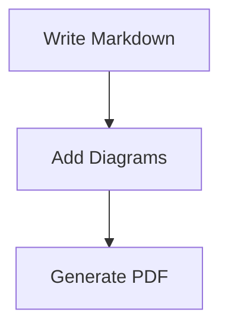

<div align="center">

# 📄 docs-pipeline

**Transform Markdown into publication-quality PDFs with professional styling, Mermaid diagrams, and zero configuration.**

[](LICENSE)
[](https://www.python.org/downloads/)

[🚀 Quick Start](#-quick-start) · [📖 Documentation](#-documentation) · [✨ Features](#-features) · [💻 Examples](#-examples)

</div>

---

## Why docs-pipeline?

<table>
<tr>
<td width="33%" align="center">

### 🎨 Professional Output

4 visual profiles turn basic Markdown into polished technical documentation

</td>
<td width="33%" align="center">

### ⚡ Zero Config

Works out-of-the-box with sensible defaults. Customize only what matters.

</td>
<td width="33%" align="center">

### 🧪 Battle-Tested

100KB+ of tests covering layout, scaling, and diagram rendering

</td>
</tr>
</table>

---

## 📸 See the Difference

Generate drastically different-looking PDFs from the **same Markdown** by changing one flag:

```bash
python -m tools.pdf.convert_final spec.md output.pdf --profile tech-whitepaper  # Clean, technical
python -m tools.pdf.convert_final spec.md output.pdf --profile dark-pro         # Modern, dark theme
python -m tools.pdf.convert_final spec.md output.pdf --profile minimalist      # Spacious, elegant
python -m tools.pdf.convert_final spec.md output.pdf --profile enterprise-blue # Corporate-friendly
```

<table>
<tr>
<td width="50%">

#### Tech Whitepaper

*Clean technical style with structured layout*

Best for: API docs, technical specs, developer guides

</td>
<td width="50%">

#### Dark Pro

*High contrast with dramatic shadows*

Best for: Presentations, demo materials, portfolio pieces

</td>
</tr>
<tr>
<td width="50%">

#### Minimalist

*Maximum whitespace, thin typography*

Best for: Architecture Decision Records, RFCs, executive summaries

</td>
<td width="50%">

#### Enterprise Blue

*Conservative blue/gray corporate style*

Best for: Client deliverables, business reports, proposals

</td>
</tr>
</table>

> 💡 **Same content. Different profiles. Zero CSS editing.**

---

## 🚀 Quick Start

### Try the Live Demo (30 seconds)

```bash
git clone https://github.com/mjdevaccount/docs-pipeline.git
cd docs-pipeline
docker-compose up
```

Open http://localhost:8080

**That's it.** Upload a Markdown file, download your PDF.

---

### CLI Installation (2 minutes)

**Install:**

```bash
pip install -r requirements.txt
pip install -r tools/pdf/requirements-pdf.txt
```

**Generate PDF:**

```bash
python -m tools.pdf.convert_final input.md output.pdf --profile dark-pro
```

---

### Your First PDF (5 minutes)

1. **Use an example file:**

```bash
# Try one of the example documents
cp docs/examples/advanced-markdown-showcase.md hello.md
```

Or create your own `hello.md` with Markdown content and Mermaid diagrams.

2. **Generate PDF:**

```bash
python -m tools.pdf.convert_final hello.md hello.pdf --profile tech-whitepaper
```

3. **Done!** Open `hello.pdf` to see:
   - Professional styling
   - Rendered Mermaid diagram
   - Page numbers and headers

---

## ✨ Features

<table>
<tr>
<td width="50%">

#### 🎨 Multiple Visual Profiles

```bash
--profile tech-whitepaper  # Technical docs
--profile dark-pro          # Modern presentations
--profile minimalist        # Architecture docs
--profile enterprise-blue    # Business reports
```

*Dramatically different looks, same content*

</td>
<td width="50%">

#### 📊 Mermaid Diagram Rendering



*Automatically rendered with theme matching*

</td>
</tr>
<tr>
<td width="50%">

#### ⚙️ Two Rendering Engines

- **Playwright** (recommended) - Pixel-perfect browser rendering
- **WeasyPrint** - Faster for simple documents

*Choose the right tool for your use case*

</td>
<td width="50%">

#### 🧪 Tested & Validated

```
tests/
├── test_page_size_measurement.py
├── test_scaling_validation.py
├── test_project_docs_layout.py
└── verify_pdf_diagrams.py
```

*100KB+ of tests covering layout, scaling, diagrams*

</td>
</tr>
</table>

---

## 🏗️ Architecture

Built with clean separation of concerns:

```
docs-pipeline/
├── tools/
│   ├── pdf/                    # Core: Markdown → PDF conversion
│   │   ├── playwright_pdf/     # Browser-based rendering
│   │   ├── profiles/            # Visual styling profiles
│   │   └── tests/               # Layout + scaling validation
│   ├── docs_pipeline/          # CLI: Multi-document orchestration
│   └── prompts/                # Optional: AI document enhancement
├── web_demo.py                 # Live web interface
└── docs/
    ├── examples/                # Sample documents
    └── images/                  # Screenshots
```

**Design Philosophy:**

- ✅ Single Responsibility - Each module does one thing well
- ✅ Tested - Real tests, not aspirational claims
- ✅ Extensible - Add profiles/renderers without changing core
- ✅ Practical - Works out-of-box, customize if needed

---

## 🎯 Use Cases

| Use Case | Profile Recommendation | Why |
|----------|----------------------|-----|
| **API Documentation** | `tech-whitepaper` | Clean, structured layout for endpoints |
| **Architecture Decision Records** | `minimalist` | Whitespace emphasizes key decisions |
| **Client Deliverables** | `enterprise-blue` | Professional, corporate-friendly |
| **Internal Presentations** | `dark-pro` | Modern, high contrast for screens |
| **Technical Specifications** | `tech-whitepaper` | Borders and structure aid scanning |

---

## 📋 Requirements

### Minimum

- Python 3.9+
- 50MB disk space

### Optional

- Docker (for web demo)
- OpenAI/Anthropic API key (for AI document enhancement)

### Automatically Installed

- Playwright (browser automation)
- Pandoc (Markdown processing)
- All Python dependencies

**No manual setup required.** `pip install` handles everything.

---

## 🔧 Troubleshooting

| Problem | Solution |
|---------|----------|
| `ModuleNotFoundError: playwright` | Run `playwright install chromium` |
| Mermaid diagrams not rendering | Check `--renderer playwright` (not weasyprint) |
| PDFs look different than expected | Try `--profile tech-whitepaper` explicitly |
| Docker demo won't start | Ensure port 8080 is free: `lsof -i :8080` (Linux/Mac) or `netstat -ano \| findstr :8080` (Windows) |

**Still stuck?** [Open an issue](https://github.com/mjdevaccount/docs-pipeline/issues) with:

- Your command
- Error message
- OS and Python version

---

## 📖 Documentation

- [PDF Generation Guide](tools/pdf/README.md) - Layout engine, Mermaid optimization, document profiles
- [Getting Started Tutorial](docs/getting-started.md) - Step-by-step guide for first-time users
- [AI Agents Architecture](tools/prompts/ARCHITECTURE.md) - Multi-agent system design and extension
- [Structurizr Integration](tools/structurizr/README.md) - Docker-based diagram generation

---

## 💻 Examples

Complete examples in each tool directory:

- `docs/examples/` - Sample markdown documents with diagrams
- `tools/prompts/examples/` - Rough drafts and pipeline configurations
- `tools/structurizr/` - Example DSL files and export configs

Generate all example PDFs:

```bash
./scripts/generate-examples.sh
```

---

## 📝 License

MIT License - Free for personal and commercial use.

## 👤 Author

**Matt Jeffcoat** - Senior Software Engineer  
Building tools for technical documentation and AI-powered workflows.

[GitHub](https://github.com/mjdevaccount) · [LinkedIn](https://linkedin.com/in/matt-jeffcoat)

## 🙏 Acknowledgments

- [Playwright](https://playwright.dev) - Browser automation
- [Pandoc](https://pandoc.org) - Markdown processing
- [Mermaid](https://mermaid.js.org) - Diagram syntax

---

<div align="center">

**⭐ Found this useful? Give it a star!**

</div>
