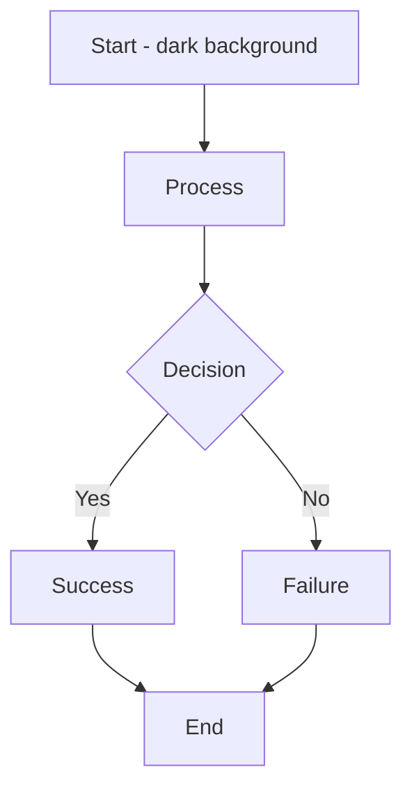
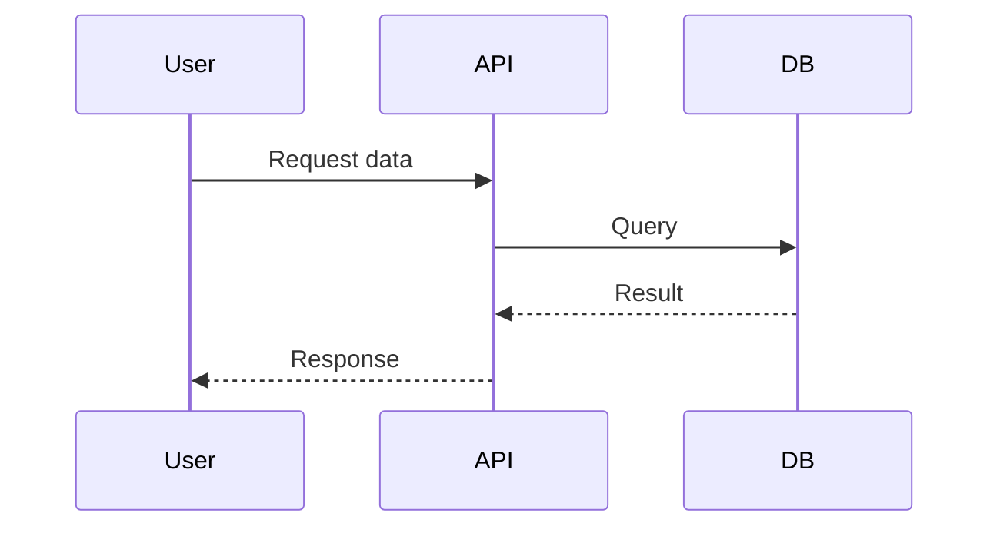

# Mermaid 11 Integration - Implementation Checklist

## Critical Code Changes Required

These are the EXACT changes needed to activate Mermaid 11 CSS variable theming in your stack.

---

## 1. Update HTML Template (CRITICAL)

**File**: Wherever you generate HTML before passing to Playwright  
**Action**: Ensure Mermaid 11 is loaded with `theme: 'base'`

### Before (Current - Uses old Mermaid):
```html
<script src="https://unpkg.com/mermaid/dist/mermaid.min.js"></script>
<script>
  mermaid.initialize({ startOnLoad: true, theme: 'dark' });
</script>
```

### After (Mermaid 11 - Uses CSS variables):
```html
<script type="module">
  import mermaid from 'https://cdn.jsdelivr.net/npm/mermaid@11/dist/mermaid.esm.min.mjs';
  
  mermaid.initialize({
    startOnLoad: true,
    theme: 'base',              // KEY: Use CSS variables instead of built-in theme
    themeVariables: {},         // Leave empty - CSS will provide all variables
    securityLevel: 'strict',
    flowchart: {
      useMaxWidth: true,
      padding: 20
    },
    sequence: {
      useMaxWidth: true
    },
    gantt: {
      useMaxWidth: true
    }
  });
  
  // Optional: contentLoaded event for debugging
  mermaid.contentLoaded();
</script>
```

### Why This Works:

- **`theme: 'base'`** tells Mermaid to use CSS custom properties from `:root`
- **`themeVariables: {}`** empty = CSS drives all colors (no JavaScript override)
- **ES module import** = Mermaid 11 tree-shaking, smaller bundle
- **`contentLoaded()`** = triggers re-render if HTML is set after page load (Playwright use case)

---

## 2. Verify dark-pro.css Has Mermaid Variables (ALREADY DONE)

**File**: `tools/pdf/styles/dark-pro.css`  
**Status**: ✅ COMPLETE - CSS already includes all mermaid-* variables

### Verify Presence:
```bash
grep "--mermaid-primaryColor" tools/pdf/styles/dark-pro.css
# Output: --mermaid-primaryColor: #0f172a;

grep -c "--mermaid-" tools/pdf/styles/dark-pro.css
# Output: 80+  (confirms 80+ Mermaid variables defined)
```

---

## 3. Update Playwright Renderer (RECOMMENDED)

**File**: `tools/pdf/renderers/playwright_renderer.py` (or wherever PDF rendering happens)

### Before (Current):
```python
async def render_pdf(page, pdf_file, config):
    await page.pdf({
        'path': str(pdf_file),
        'format': 'A4',
        'printBackground': True,
        'preferCSSPageSize': True
    })
```

### After (With explicit color preservation):
```python
async def render_pdf(page, pdf_file, config):
    # Additional screenshot for debugging (optional)
    if config.verbose:
        await page.screenshot(
            path=str(pdf_file.parent / pdf_file.stem + '_debug.png'),
            full_page=True
        )
    
    # PDF with enhanced color settings
    await page.pdf({
        'path': str(pdf_file),
        'format': config.page_format or 'A4',
        'printBackground': True,
        'preferCSSPageSize': True,
        'margin': {
            'top': '2cm',
            'bottom': '2cm',
            'left': '1.8cm',
            'right': '1.8cm'
        },
        # PDF 2.0 for better compression and modern features
        'pdf_version': '2.0',
        # Optional: Generate outline from h1/h2/h3 tags
        'outline': True
    })
```

### Why These Changes:
- **`printBackground: True`** = preserves SVG fill colors in PDF
- **`preferCSSPageSize: True`** = respects CSS @page rules
- **`pdf_version: '2.0'`** = modern PDF format (better compression)
- **`outline: True`** = auto-generate bookmarks from headings

---

## 4. Remove Old Mermaid Theme Generation (OPTIONAL - FOR CLEANUP)

**Files to Delete** (no longer needed):
```bash
rm tools/pdf/diagram_rendering/mermaid_themes.py
```

**Remove from Code** (search and delete all instances):
```python
# REMOVE these imports:
from tools.pdf.diagram_rendering.mermaid_themes import MermaidThemeGenerator
from tools.pdf.diagram_rendering.mermaid_themes import get_default_theme_generator

# REMOVE these function calls:
generator = MermaidThemeGenerator()
generator.inject_theme_into_html(html, profile='dark-pro')
generator.generate_theme_json(profile)
generator.get_colors_for_profile(profile)
```

**Why It's Safe to Delete:**
- Mermaid 11 reads CSS variables automatically
- No JavaScript injection needed
- Python theme config is superseded by CSS

---

## 5. Test Verification Steps

### 5.1 Verify CSS Variables Are Present

```bash
# Check that mermaid variables exist
grep "--mermaid-" tools/pdf/styles/dark-pro.css | head -5

# Expected output:
# --mermaid-primaryColor: #0f172a;
# --mermaid-primaryTextColor: #f3f4f6;
# --mermaid-primaryBorderColor: #60a5fa;
# --mermaid-lineColor: #60a5fa;
# --mermaid-textColor: #f3f4f6;
```

### 5.2 Test with Sample Markdown

Create `test_mermaid.md`:
```markdown
# Test Mermaid Dark Theme




```

Generate PDF:
```bash
cd /path/to/docs-pipeline
python -m tools.pdf.renderers.playwright_renderer \
  test_mermaid.md \
  test_mermaid.pdf \
  --profile dark-pro \
  --verbose
```

Open `test_mermaid.pdf` and verify:
- ✅ Node backgrounds are very dark (#0f172a)
- ✅ Text in nodes is bright (#f3f4f6)
- ✅ Connection lines are blue (#60a5fa)
- ✅ NOT the default Mermaid gray/blue/white colors
- ✅ NO washed-out or hard-to-read text

### 5.3 Compare Before/After

If you still see old colors:
1. Check browser DevTools: `getComputedStyle(document.documentElement).getPropertyValue('--mermaid-primaryColor')`
2. Should return `#0f172a` (very dark)
3. If it returns anything else, CSS isn't loaded or variables are wrong

---

## 6. CLI Options to Unlock (BONUS)

Add to your CLI parser:

```python
# In your argument parser (e.g., Click or argparse)

@click.option(
    '--profile',
    type=click.Choice(['dark-pro', 'tech-whitepaper', 'enterprise-blue', 'minimalist']),
    default='dark-pro',
    help='CSS profile for styling (dark-pro, tech-whitepaper, enterprise-blue, minimalist)'
)
def generate_pdf(input_file, output_file, profile):
    """Generate PDF with specified CSS profile."""
    config = PdfGenerationConfig(
        html_file=input_file,
        pdf_file=output_file,
        css_profile=profile
    )
    await generate_pdf(config)
```

Usage:
```bash
python -m tools.pdf.renderers.playwright_renderer \
  document.md \
  document.pdf \
  --profile dark-pro
```

---

## 7. Deployment Checklist

### Before Going Live:

- [ ] Mermaid 11 module script added to HTML template
- [ ] `theme: 'base'` confirmed in mermaid.initialize()
- [ ] dark-pro.css confirmed to have `--mermaid-*` variables (80+ total)
- [ ] SVG text CSS rules present in dark-pro.css
- [ ] `print-color-adjust: exact !important` confirmed in CSS
- [ ] Playwright PDF options include `printBackground: True`
- [ ] Test PDF generated with sample Mermaid diagrams
- [ ] Colors verified as correct (dark backgrounds, bright text, blue lines)
- [ ] mermaid_themes.py deleted (optional cleanup)
- [ ] Old inject_theme_into_html() calls removed (optional cleanup)
- [ ] Test with real project documentation
- [ ] No console errors in browser DevTools
- [ ] PDF file size reasonable (should be smaller with modern PDF features)

---

## 8. Troubleshooting

### Issue: Diagrams still show washed-out colors

**Solution 1**: Check Mermaid version
```bash
# Open browser console:
echo "mermaid version:"
curl -s 'https://cdn.jsdelivr.net/npm/mermaid@11/package.json' | grep '"version"'
```

**Solution 2**: Verify theme is 'base'
```javascript
// Browser console:
console.log(mermaid.config.theme);
// Should output: 'base'
```

**Solution 3**: Check CSS variables
```javascript
// Browser console:
let styles = getComputedStyle(document.documentElement);
console.log('Primary:', styles.getPropertyValue('--mermaid-primaryColor'));
console.log('Text:', styles.getPropertyValue('--mermaid-textColor'));
// Should show: #0f172a and #f3f4f6
```

### Issue: CSS variables not loading

**Check**: Is dark-pro.css linked in the HTML?
```html
<!-- Should exist in <head>: -->
<link rel="stylesheet" href="dark-pro.css">
```

**Check**: Are variables defined at `:root` level?
```bash
grep -A 3 ":root {" tools/pdf/styles/dark-pro.css
# Should show variables immediately after
```

### Issue: PDF output still has old colors

**Check**: Playwright PDF options
```python
# Ensure these are set:
await page.pdf({
    'printBackground': True,     # Required for colors
    'preferCSSPageSize': True,   # Required for CSS @page
    'pdf_version': '2.0'         # Modern PDF support
})
```

---

## Summary

✅ **One-line fix**: Update HTML template to load Mermaid 11 with `theme: 'base'`

✅ **Already done**: dark-pro.css has all mermaid CSS variables

✅ **Optional**: Remove old Python theme generator (mermaid_themes.py)

✅ **Result**: Mermaid diagrams automatically use dark-pro colors via CSS

---

**Implementation Time**: 5-10 minutes  
**Complexity**: Low (mostly configuration, no new code)  
**Impact**: High (fixes diagram color issues, simplifies architecture)

