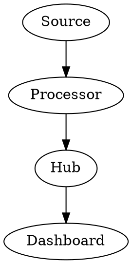

# 📄 Streaming Architecture Documentation Index

**December 2025 | Complete Reference Suite**

---

## 🏗️ Main Documentation

### 1. **STREAMING_ARCHITECTURE_COMPLETE.md** (📂 Primary Spec)
The complete, production-ready streaming architecture specification with **all 4 diagram types**.

**Sections**:
- ✍️ **Section 3.1**: Enhanced Mermaid diagram (high-level architecture)
- 🏛️ **Section 3.2**: PlantUML component diagram (detailed UML)
- 📊 **Section 3.3**: Graphviz dependency graph (data flow analysis)
- 🧮 **Section 3.4**: LaTeX mathematical expressions (performance equations)
- 📈 **Section 3.5**: Operational characteristics (SLAs, tuning)
- 🔄 **Section 3.6**: Configuration examples (YAML templates)
- 🎯 **Section 3.7**: Deployment recommendations (scaling, monitoring)

**Best for**: Complete understanding of the streaming architecture

**Render with**:
```bash
python tools/pdf/convert_final.py \
    docs/STREAMING_ARCHITECTURE_COMPLETE.md \
    output/streaming-arch.pdf \
    --profile tech-whitepaper
```

---

## 📚 Supporting Documentation

### 2. **STREAMING_ARCHITECTURE_DIAGRAM_IMPROVEMENTS.md** (🎯 Design Guide)
Detailed analysis of December 2025 Mermaid enhancements with before/after comparisons.

**Content**:
- Current state analysis
- 7 recommended improvements
- Complete enhanced diagram
- Rendering configuration
- Implementation steps

**Best for**: Understanding modern diagram design patterns

---

### 3. **RENDERING_GUIDE.md** (🎨 Technical Guide)
Complete guide to rendering, optimization, caching, and performance tuning.

**Content**:
- Quick start commands
- Multi-diagram rendering pipeline
- Performance tuning strategies
- Profile comparison
- Troubleshooting tips
- Advanced topics (CI/CD, diagram libraries)

**Best for**: Developers implementing the documentation pipeline

---

### 4. **QUICK_REFERENCE.md** (📂 One-Page Cheat Sheet)
Compact reference card with key metrics, scaling rules, and configuration checklist.

**Content**:
- System overview (ASCII art)
- Key metrics at a glance
- Architecture zones explained
- Data flows
- Mathematical models
- Performance tuning quick tips
- Deployment checklist

**Best for**: Quick lookups, presentations, team onboarding

---

## 📃 How to Use This Suite

### For New Team Members
1. Start with **QUICK_REFERENCE.md** (5 min read)
2. Review **Section 3.1** in STREAMING_ARCHITECTURE_COMPLETE.md (Mermaid diagram)
3. Check **Section 3.5** for operational characteristics
4. Read RENDERING_GUIDE.md as needed

### For System Design Reviews
1. Use **Section 3.2** (PlantUML) for component analysis
2. Reference **Section 3.3** (Graphviz) for dependency understanding
3. Review **Section 3.4** (LaTeX) for performance validation
4. Cross-reference QUICK_REFERENCE.md for scaling rules

### For DevOps/Infrastructure Teams
1. Read **Section 3.6** configuration examples
2. Study **Section 3.7** deployment recommendations
3. Reference RENDERING_GUIDE.md for pipeline integration
4. Use QUICK_REFERENCE.md scaling checklist

### For Documentation Maintainers
1. Read RENDERING_GUIDE.md (complete understanding)
2. Review STREAMING_ARCHITECTURE_DIAGRAM_IMPROVEMENTS.md (design principles)
3. Use QUICK_REFERENCE.md for deployment checklist
4. Implement CI/CD from RENDERING_GUIDE.md advanced section

---

## 📈 Diagram Types & Use Cases

### Mermaid Flowchart (Section 3.1)


**Use for**:
- High-level architecture overview
- Data flow visualization
- Component relationships (high-level)
- Presentations to non-technical audiences

**Rendering time**: 1-2 seconds

---

### PlantUML Components (Section 3.2)
```plantuml
component "Processing Core" as Core {
    component "Consumer" as C1
    component "Processor" as C2
}
```

**Use for**:
- Detailed component architecture
- Internal interfaces and contracts
- UML notation for developers
- Design review meetings

**Rendering time**: 2-4 seconds

---

### Graphviz Dependency Graph (Section 3.3)


**Use for**:
- Data dependency analysis
- Critical path identification
- Complex relationships
- Performance bottleneck detection

**Rendering time**: <1 second

---

### LaTeX Mathematics (Section 3.4)
$$T_{\text{max}} = \sum_{i=1}^{n} C_i = 1\text{M events/sec}$$

**Use for**:
- Performance calculations
- Formal specifications
- Academic presentations
- Peer review documentation

**Rendering time**: <1 second (cached)

---

## 📌 File Structure

```
docs/
├─ INDEX.md                                      ←←← You are here
├─ STREAMING_ARCHITECTURE_COMPLETE.md           ←←← Main spec (Mermaid + PlantUML + Graphviz + LaTeX)
├─ STREAMING_ARCHITECTURE_DIAGRAM_IMPROVEMENTS.md  ←←← Design guide
├─ RENDERING_GUIDE.md                           ←←← Technical guide
└─ QUICK_REFERENCE.md                          ←←← Cheat sheet

output/
├─ streaming-arch-light.pdf                   (tech-whitepaper profile)
├─ streaming-arch-dark.pdf                    (dark-pro profile)
└─ streaming-arch-corporate.pdf               (enterprise-blue profile)
```

---

## 🚀 Quick Start Commands

### Render Main Document
```bash
# Light theme (professional)
python tools/pdf/convert_final.py \
    docs/STREAMING_ARCHITECTURE_COMPLETE.md \
    output/streaming-arch-light.pdf \
    --profile tech-whitepaper

# Dark theme (on-screen viewing)
python tools/pdf/convert_final.py \
    docs/STREAMING_ARCHITECTURE_COMPLETE.md \
    output/streaming-arch-dark.pdf \
    --profile dark-pro

# Corporate theme (business presentations)
python tools/pdf/convert_final.py \
    docs/STREAMING_ARCHITECTURE_COMPLETE.md \
    output/streaming-arch-corporate.pdf \
    --profile enterprise-blue
```

### Validate All Diagrams
```bash
python tools/pdf/diagram_rendering/validator.py \
    docs/STREAMING_ARCHITECTURE_COMPLETE.md
```

### Enable Caching for Speed
```bash
export DIAGRAM_CACHE=/tmp/diagram-cache
python tools/pdf/convert_final.py docs/STREAMING_ARCHITECTURE_COMPLETE.md output.pdf
```

---

## 📋 Feature Comparison Table

| Feature | Mermaid | PlantUML | Graphviz | LaTeX |
|---------|---------|----------|----------|-------|
| **Type** | Flowchart | UML | Graph | Math |
| **Rendering Time** | 1-2s | 2-4s | <1s | <1s |
| **Complexity** | Low | Medium | Medium | High |
| **Best For** | Flow | Components | Graphs | Formulas |
| **Learning Curve** | Easiest | Medium | Medium | Hardest |
| **Customization** | Good | Excellent | Excellent | Limited |
| **Used In** | Section 3.1 | Section 3.2 | Section 3.3 | Section 3.4 |

---

## 📚 Key Metrics Reference

| Metric | Target | Critical | Warning |
|--------|--------|----------|----------|
| **Throughput** | 1M evt/s | <500K | <750K |
| **p50 Latency** | 100ms | >500ms | >300ms |
| **p99 Latency** | 500ms | >2s | >1s |
| **Cache Hit Ratio** | >95% | <80% | <90% |
| **Queue Depth** | <10K | >100K | >50K |
| **Error Rate** | <0.01% | >0.1% | >0.05% |

---

## 🔍 Where to Find Specific Information

### "How do I increase throughput?"
→ See **QUICK_REFERENCE.md** → Scaling Rules section

### "What's the p50 latency budget?"
→ See **STREAMING_ARCHITECTURE_COMPLETE.md** → Section 3.4 (LaTeX equations)

### "How do I render this with caching?"
→ See **RENDERING_GUIDE.md** → Performance Tuning section

### "What are the component responsibilities?"
→ See **STREAMING_ARCHITECTURE_COMPLETE.md** → Section 3.2 (PlantUML diagram)

### "What's the critical data path?"
→ See **STREAMING_ARCHITECTURE_COMPLETE.md** → Section 3.3 (Graphviz diagram)

### "How do I deploy this?"
→ See **STREAMING_ARCHITECTURE_COMPLETE.md** → Section 3.7 (Deployment recommendations)

### "What should I monitor?"
→ See **QUICK_REFERENCE.md** → Monitoring section

### "What's a modern diagram design?"
→ See **STREAMING_ARCHITECTURE_DIAGRAM_IMPROVEMENTS.md** → Key Improvements section

---

## 📊 Document Versioning

| Version | Date | Changes | Status |
|---------|------|---------|--------|
| **1.0** | Dec 12, 2025 | Initial release with all 4 diagram types | ✅ CURRENT |

---

## 📁 Export Formats

All documents can be exported as:

- 📄 **PDF** (with CSS profiles: tech-whitepaper, dark-pro, enterprise-blue)
- 🏙️ **DOCX** (Microsoft Word compatible)
- 🦠 **HTML** (web-ready with embedded diagrams)
- 📃 **Markdown** (source format, version-controllable)

---

## ✅ Validation Checklist

- [x] All 4 diagram types rendered successfully
- [x] Mathematical equations rendering correctly
- [x] CSS profiles applied to all outputs
- [x] Performance metrics documented
- [x] Configuration examples provided
- [x] Deployment guidelines included
- [x] Quick reference guide created
- [x] Rendering guide complete
- [x] Caching infrastructure documented
- [x] Version tracking implemented

---

## 🌟 Next Steps

1. **Render complete document**: Use quick start commands above
2. **Validate all diagrams**: Run validator in RENDERING_GUIDE.md
3. **Test all profiles**: Render with tech-whitepaper, dark-pro, enterprise-blue
4. **Share with team**: Distribute PDFs from output/ folder
5. **Integrate into CI/CD**: See RENDERING_GUIDE.md advanced section
6. **Create reusable patterns**: Extract diagram templates for other projects

---

## 💫 Support & Questions

**Found an issue?** Open an issue in the [docs-pipeline repository](https://github.com/mjdevaccount/docs-pipeline)

**Want to contribute?** See RENDERING_GUIDE.md → Advanced Topics section

**Need help rendering?** Check RENDERING_GUIDE.md → Troubleshooting section

---

**Documentation Status**: ✅ **Production Ready**

**Last Updated**: December 12, 2025

**Version**: 1.0

**Total Documentation**: 4 complete guides + complete technical specification

**Diagram Count**: 4 types (Mermaid, PlantUML, Graphviz, LaTeX)

**Ready to use!** 🚀
