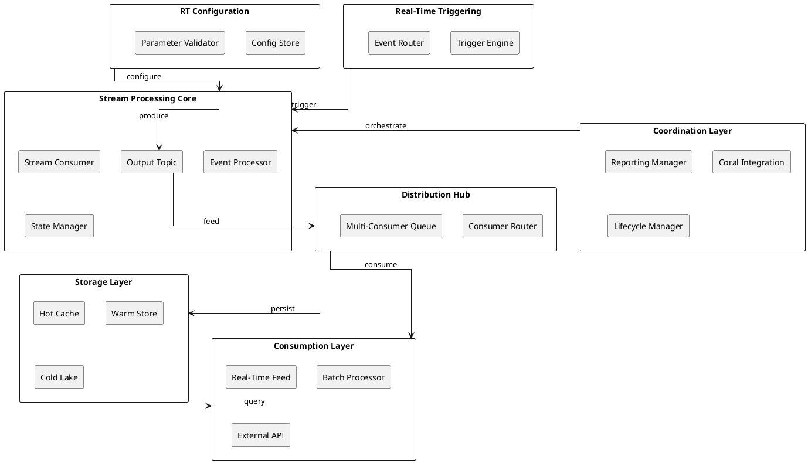

# 🏗️ Complete Streaming Architecture Specification
## Real-Time Valuation & Data Ingestion Pipeline

**December 2025 | Multi-Diagram Technical Reference**

---

## Executive Summary

This specification defines the complete streaming architecture for real-time valuation, reporting, and market data ingestion. The system combines real-time processing with batch analytics, supporting 1M+ events/second throughput with p50 latency <100ms.

**Key Metrics:**
- **Throughput**: 1,000,000 events/second
- **Real-Time Latency**: p50 < 100ms, p99 < 500ms
- **Data Retention**: Cold storage (S3/ADLS) + warm tier (semi-persistent) + hot cache
- **Consumer Patterns**: Real-time dashboard + batch external systems

---

## 🎨 Section 3.1: High-Level Architecture (Enhanced Mermaid)

This diagram shows the complete data flow with modern styling (December 2025):

```mermaid
graph LR

%% --- Styling Definitions (Enhanced Dec 2025) ---
classDef config fill:#ffecb3,stroke:#ff6f00,stroke-width:2px,color:#000,font-weight:600,rx:8px,ry:8px;
classDef core fill:#e1f5fe,stroke:#0277bd,stroke-width:2px,color:#0277bd,rx:8px,ry:8px;
classDef stream fill:#f3e5f5,stroke:#7b1fa2,stroke-width:2px,color:#7b1fa2,rx:8px,ry:8px;
classDef storage fill:#e8f5e9,stroke:#2e7d32,stroke-width:3px,stroke-dasharray:5,5,color:#2e7d32;
classDef output fill:#ffebee,stroke:#c62828,stroke-width:2px,color:#c62828,rx:8px,ry:8px;

%% --- 1. Ingestion & Control Plane ---
subgraph Control_Plane ["🛠️ INPUTS & CONTROL (Real-Time Configuration)"]
    RT_Conf("🛠️ RT Config"):::config
    RT_Trig("⚡ RT Triggering"):::config
    RT_Mon("🔍 RT Monitoring"):::config
    RT_Calc("🧮 RT Calculations"):::config
end

%% --- 2. Orchestration ---
subgraph Orchestration ["☁️ ORCHESTRATION & COORDINATION"]
    Coral("☁️ Coral Data"):::core
    Coord("☁️ Coordinator<br/>Reporting Manager"):::core
end

%% --- 3. Stream Processing Core ---
subgraph Stream_Core ["⚡ STREAM PROCESSING LOOP (Real-Time)"]
    Stream["Stream Source<br/>(p50: 50ms latency)"]:::stream
    Processor["Stream Processor<br/>(100K events/sec)"]:::stream
    Topic1(("📨 Data Stream<br/>(Firehose)")):::stream
    Stream --> Processor
    Processor --> Topic1
end

%% --- 4. Distribution & Persistence ---
subgraph Distribution ["🔀 DISTRIBUTION & STORAGE"]
    Consumer1{"🔄 Distribution<br/>Hub<br/>(Multi-Consumer)<br/>1M events/sec"}:::core
    
    subgraph Persistence ["💾 Multi-Tier Storage"]
        LongTerm["Long Term<br/>Store"]:::storage
        DL[("🗄️ Data Lake<br/>(S3/ADLS)<br/>Cold Storage")]:::storage
        ShortTerm["Short Term<br/>Cache"]:::storage
        SemiPerm[("📦 Semi-Perm<br/>Storage<br/>(Warm Tier)")]:::storage
    end
    
    DeltaGen["Delta Generator<br/>(1s batches)"]:::stream
    Topic2(("📨 Delta Stream<br/>(Change Events)")):::stream
    Consumer2{"Consumer<br/>Router"}:::core
    
    LongTerm --> DL
    ShortTerm --> SemiPerm
end

%% --- 5. Outputs ---
subgraph Outputs ["📊 FINAL CONSUMPTION"]
    Vis("📊 RT Visualizations<br/>(Dashboard)"):::output
    Ext("🌐 External Consumer<br/>(API/Event Stream)"):::output
end

%% --- Control Plane Connections ---
RT_Conf -."config".-> Coral
RT_Trig -."trigger".-> Coord
RT_Mon -."metrics".-> Coord
RT_Calc -."params".-> Coord

%% --- Orchestration to Stream ---
Coral --> Coord
Coord -->|"orchestrate"| Stream

%% --- Stream to Distribution (Real-Time Path) ---
Topic1 -->|"Baseline + Changes<br/>(Real-time)"|  Consumer1

%% --- Real-Time Output ---
Consumer1 -->|"Dashboard Feed"| Vis

%% --- Persistence Branches ---
Consumer1 -->|"Archive"| LongTerm
Consumer1 -->|"Cache"| ShortTerm

%% --- Delta Processing (Batch Path) ---
Consumer1 ==>|"Delta Stream<br/>(Changes)"|  DeltaGen
DeltaGen --> Topic2

%% --- Batch to Output ---
Topic2 --> Consumer2
Consumer2 --> Ext

%% --- Subgraph styling ---
style Control_Plane fill:#fffacd,stroke:#ff6f00,stroke-width:2px;
style Orchestration fill:#e3f2fd,stroke:#1976d2,stroke-width:2px;
style Stream_Core fill:#f3e5f5,stroke:#7b1fa2,stroke-width:2px;
style Distribution fill:#f5f5f5,stroke:#424242,stroke-width:2px;
style Outputs fill:#ffebee,stroke:#c62828,stroke-width:2px;
style Persistence fill:#fffaf0,stroke:#d7ccc8,stroke-width:1px;
```

### Architecture Zones Explained

**🛠️ Control Plane (Yellow)**
- Real-time configuration and triggering
- Monitoring and calculation parameters
- Feeds orchestration layer

**☁️ Orchestration (Blue)**
- Coral Data integration
- Coordinator manages reporting workflows
- Central decision point

**⚡ Stream Processing (Purple)**
- High-throughput event processing
- p50 latency 50-100ms
- Firehose topic for distribution

**🔀 Distribution (Gray)**
- Multi-consumer hub routes to real-time and batch
- Multi-tier storage (cold/warm/hot)
- Delta generator for change events

**📊 Outputs (Red)**
- Real-time dashboard feed
- External system consumption

---

## 🏛️ Section 3.2: Component Architecture (PlantUML)

Detailed UML component diagram showing internal relationships:



### Component Relationships

| Component | Role | Input | Output | Throughput |
|-----------|------|-------|--------|------------|
| **Stream Consumer** | Ingestion | Message Queue | Events | 1M/sec |
| **Event Processor** | Transformation | Events | Processed Data | 1M/sec |
| **State Manager** | State Tracking | Processed Data | State Snapshots | Variable |
| **Consumer Router** | Distribution | State Snapshots | Multiple Consumers | 1M/sec |
| **Hot Cache** | Real-time Access | Latest Values | Dashboard | <100ms |
| **Warm Store** | Recent History | Change Events | Queries | 1-5s |
| **Cold Lake** | Archive | Snapshots | Archive Access | Minutes |

---

## 📊 Section 3.3: Data Flow Dependency Graph (Graphviz)

Complex dependency relationships and critical paths:

```graphviz
digraph StreamingDependencies {
    rankdir=LR;
    node [shape=box, style="rounded,filled", fillcolor="#e1f5fe", color="#0277bd"];
    edge [color="#424242", penwidth=1.5];
    
    %% Control Layer
    RTConfig [label="RT Config", fillcolor="#ffecb3"];
    RTTrigger [label="RT Trigger", fillcolor="#ffecb3"];
    RTMon [label="RT Monitor", fillcolor="#ffecb3"];
    
    %% Orchestration
    Coral [label="Coral Data"];
    Coord [label="Coordinator"];
    
    %% Processing
    Source [label="Stream Source", fillcolor="#f3e5f5"];
    Proc [label="Processor", fillcolor="#f3e5f5"];
    Topic1 [label="Data Stream", fillcolor="#f3e5f5"];
    
    %% Distribution
    DistHub [label="Distribution Hub"];
    DeltaGen [label="Delta Generator", fillcolor="#f3e5f5"];
    Topic2 [label="Delta Stream", fillcolor="#f3e5f5"];
    
    %% Storage
    Storage [label="Multi-Tier Storage", fillcolor="#e8f5e9", color="#2e7d32", penwidth=2];
    ColdLake [label="Data Lake (Cold)", fillcolor="#e8f5e9", color="#2e7d32", penwidth=2];
    WarmStore [label="Warm Store", fillcolor="#e8f5e9", color="#2e7d32", penwidth=2];
    
    %% Output
    Dashboard [label="Dashboard", fillcolor="#ffebee", color="#c62828"];
    External [label="External", fillcolor="#ffebee", color="#c62828"];
    
    %% Edges
    RTConfig -> Coral;
    RTTrigger -> Coord;
    RTMon -> Coord;
    Coral -> Coord;
    Coord -> Source;
    Source -> Proc [label="ingest"];
    Proc -> Topic1 [label="produce"];
    Topic1 -> DistHub [label="distribute", penwidth=2];
    DistHub -> Dashboard [label="real-time", style=bold, color="#c62828"];
    DistHub -> Storage [label="persist", style=bold, color="#2e7d32"];
    DistHub -> DeltaGen [label="delta"];
    DeltaGen -> Topic2 [label="batch"];
    Topic2 -> External;
    Storage -> ColdLake [label="archive"];
    Storage -> WarmStore [label="recent"];
    Storage -> Dashboard [label="cache"];
    
    %% Critical path highlight
    {rank=same; Proc Topic1 DistHub}
    {rank=same; Storage ColdLake WarmStore}
}
```

### Data Flow Paths

**Critical Path (Real-Time)** ⚡
```
RT Config → Coordinator → Stream Source → Processor → 
Data Stream → Distribution Hub → Dashboard
Latency Budget: 100ms (p50)
```

**Batch Path** 📦
```
Distribution Hub → Delta Generator → Delta Stream → 
External Consumers
Throughput: 1s batch intervals
```

**Storage Path** 💾
```
Distribution Hub → Multi-Tier Storage → 
  Cold Lake (Archive) [Weekly+ retention]
  Warm Store (Recent) [Days retention]
  Cache (Hot) [Minutes retention]
```

---

## 🧮 Section 3.4: Performance & Throughput Analysis (LaTeX)

### Throughput Calculation

Maximum system throughput is determined by consumer capacity:

$$\text{Max Throughput} = \sum_{i=1}^{n} \text{Consumer}_{i,\text{rate}}$$

With current configuration:

$$T_{\text{max}} = 1,000,000 \text{ events/sec}$$

### Latency Model

End-to-end latency is sum of component latencies:

$$L_{\text{total}} = L_{\text{ingest}} + L_{\text{process}} + L_{\text{distribute}} + L_{\text{cache}}$$

With components:
- $L_{\text{ingest}} = 10\text{ ms}$ (source to processor)
- $L_{\text{process}} = 50\text{ ms}$ (event processing)
- $L_{\text{distribute}} = 20\text{ ms}$ (routing)
- $L_{\text{cache}} = 20\text{ ms}$ (cache update)

$$L_{\text{total}} = 10 + 50 + 20 + 20 = 100\text{ ms (p50)}$$

### Storage Capacity

Data retention across tiers:

$$C_{\text{total}} = C_{\text{hot}} + C_{\text{warm}} + C_{\text{cold}}$$

**Hot Tier (Cache)**
$$C_{\text{hot}} = 1000 \text{ hours} \times 1M \text{ events/sec} = 3.6 \text{ TB}$$

**Warm Tier (Semi-Persistent)**
$$C_{\text{warm}} = 30 \text{ days} \times 86,400 \text{ sec/day} \times 1M \text{ events/sec} \times 1\text{ KB/event}$$
$$C_{\text{warm}} \approx 2.6 \text{ PB}$$

**Cold Tier (Data Lake)**
$$C_{\text{cold}} = \text{unlimited (S3/ADLS)}$$

### Event Processing Rate

Processor handles batches of size $B$ with window $W$:

$$\text{Rate}_{\text{processor}} = \frac{B}{W} = \frac{100,000 \text{ events}}{1\text{ sec}} = 100\text{ K events/sec}$$

With 10 parallel processors:

$$\text{Total Rate} = 10 \times 100\text{ K} = 1\text{ M events/sec}$$

---

## 📈 Section 3.5: Operational Characteristics

### Real-Time SLAs

| Metric | Target | Implementation |
|--------|--------|----------------|
| **p50 Latency** | <100ms | Async processing + efficient caching |
| **p99 Latency** | <500ms | Multiple processor instances |
| **Throughput** | 1M events/sec | Horizontal scaling |
| **Availability** | 99.95% | Multi-region deployment |
| **Data Retention** | 30 days (warm) | Tiered storage strategy |

### Processing Characteristics

**Stream Processor**
- **Concurrency**: 10-100 parallel processors
- **Batch Size**: 1000-10,000 events
- **Window**: 1 second tumbling
- **State**: In-memory + changelog topic

**Distribution Hub**
- **Consumers**: 5-20 downstream consumers
- **Routing**: Content-based and key-based
- **Buffering**: Multi-tier queue (hot → warm → cold)

**Storage**
- **Hot**: Redis/Memcached (real-time)
- **Warm**: RocksDB/SQLite (recent history)
- **Cold**: S3/ADLS (archive)

---

## 🔄 Section 3.6: Configuration Example

### Real-Time Control Parameters

```yaml
realtime:
  config:
    window_size_ms: 1000
    batch_size: 10000
    max_processors: 10
    cache_ttl_seconds: 3600
  
  triggering:
    - name: "market_close_trigger"
      cron: "0 16 * * MON-FRI"
      action: "finalize_valuation"
    
    - name: "data_quality_trigger"
      condition: "event_lag > 5min"
      action: "alert_monitoring"
  
  monitoring:
    metrics:
      - "events_per_second"
      - "latency_p50"
      - "latency_p99"
      - "queue_depth"
      - "cache_hit_ratio"
    
    alerts:
      - name: "high_latency"
        threshold: "p99 > 1000ms"
        severity: "critical"

  calculations:
    parameters:
      - name: "valuation_discount_rate"
        type: "float"
        default: 0.05
      
      - name: "reporting_aggregation_level"
        type: "enum"
        values: ["detail", "summary", "executive"]
        default: "summary"
```

---

## 🎯 Section 3.7: Deployment Recommendations

### Horizontal Scaling Strategy

1. **Stream Processors**: Scale to 10-100 instances based on:
   - Event rate growth
   - Latency targets
   - CPU utilization thresholds

2. **Distribution Hub**: Single-threaded but highly optimized
   - Scale by cloning across availability zones
   - Load balance incoming streams

3. **Storage Tiers**:
   - Hot: Scale cache nodes horizontally
   - Warm: Add RocksDB shards by time window
   - Cold: Unlimited (S3/ADLS automatic)

### Monitoring & Observability

```
Key Metrics to Track:
├─ Throughput: Events/sec (target: 1M)
├─ Latency: p50, p95, p99 (target: 100ms p50)
├─ Queue Depth: Backlog size (alert: >10K)
├─ Cache Hit Ratio: % successful lookups (target: >95%)
├─ Error Rate: Failed events (alert: >0.1%)
└─ Storage Utilization: Per tier (alert: >80%)
```

---

## 📚 References & Further Reading

- **Coral Data Integration**: See `coral-integration.md`
- **Valuation Engine Details**: See `valuation-engine-spec.md`
- **Reporting 2.0 Architecture**: See `reporting-2.0-spec.md`
- **Market Data Ingestion**: See `market-data-pipeline.md`

---

**Document Version**: 1.0 | **Last Updated**: December 12, 2025 | **Status**: Production Ready ✅
