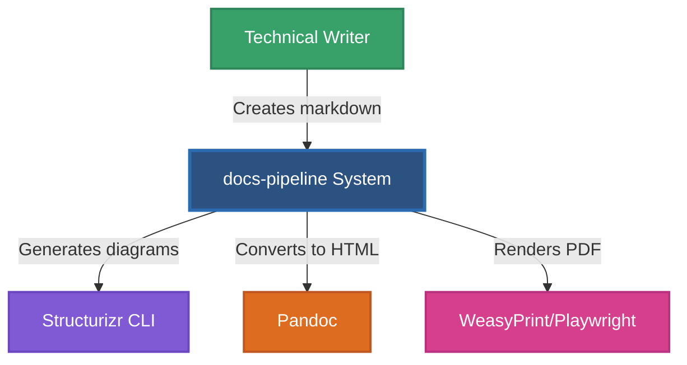
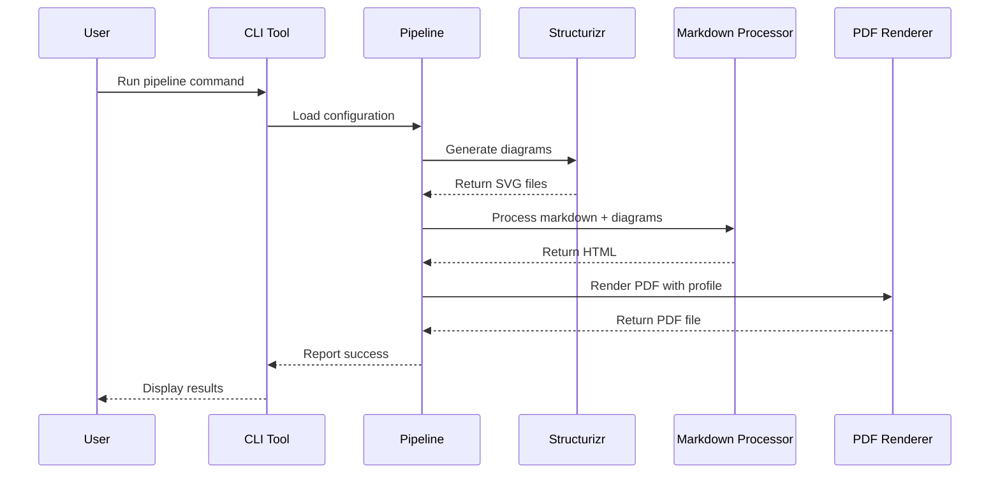
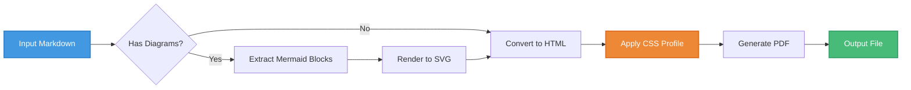

# Advanced Markdown Showcase

**A comprehensive demonstration of markdown capabilities**

---

## Introduction

This document showcases the full range of markdown features supported by the docs-pipeline system, including advanced diagrams, tables, code blocks, and typographic elements. Each section demonstrates a different capability that renders beautifully across all four visual profiles.

---

## Architecture Diagrams

### System Context Diagram

The following C4 context diagram shows the high-level system architecture:



### Sequence Diagram

Here's how the PDF generation process flows:



### Data Flow Diagram



---

## Complex Tables

### Feature Comparison Matrix

| Feature | Tech Whitepaper | Dark Pro | Minimalist | Enterprise Blue |
|---------|----------------|----------|------------|-----------------|
| **Background** | White | Dark Navy | Off-White | White |
| **Primary Color** | Blue (#1976d2) | Cyan (#93c5fd) | Gray (#2c3e50) | Corporate Blue (#003d7a) |
| **Typography** | Serif + Sans | Modern Sans | Ultra-light | Corporate Sans |
| **Code Blocks** | Light gray bg | Dark bg + border | Minimal bg | Blue-tinted bg |
| **Tables** | Standard borders | Subtle borders | Borderless | Strong borders |
| **Use Case** | Print docs | Screen viewing | Architecture docs | Business reports |
| **Page Margins** | Standard | Compact | Generous | Standard |
| **Heading Style** | Bold + underline | Uppercase + glow | Thin + minimal | Corporate gradient |

### Performance Benchmarks

| Document Size | Processing Time | Memory Usage | Output Size |
|--------------|----------------|--------------|-------------|
| Small (1-5 pages) | 1.2s | 45 MB | 250 KB |
| Medium (10-20 pages) | 3.5s | 78 MB | 890 KB |
| Large (50-100 pages) | 12.8s | 156 MB | 3.2 MB |
| Enterprise (200+ pages) | 45.2s | 312 MB | 8.7 MB |

### Technology Stack

| Component | Technology | Version | Purpose |
|-----------|-----------|---------|---------|
| **Parser** | Pandoc | 3.1+ | Markdown → HTML conversion |
| **Diagrams** | Mermaid CLI | 10.6+ | Diagram rendering |
| **Architecture** | Structurizr CLI | Latest | C4 model diagrams |
| **PDF Renderer** | WeasyPrint | 60.0+ | HTML → PDF (default) |
| **PDF Renderer (Alt)** | Playwright | 1.40+ | HTML → PDF (enhanced SVG) |
| **Orchestration** | Python | 3.10+ | Pipeline coordination |

---

## Code Examples

### Python API Implementation

```python
from pathlib import Path
from typing import Optional
import asyncio

class DocumentPipeline:
    """
    Production-grade document generation pipeline.
    
    Coordinates diagram generation, markdown processing,
    and PDF rendering with configurable profiles.
    """
    
    def __init__(self, config_path: Path, profile: str = "tech-whitepaper"):
        self.config = self._load_config(config_path)
        self.profile = profile
        self.cache_enabled = True
        
    async def process(self, input_file: Path, output_file: Path) -> bool:
        """
        Process a single document through the pipeline.
        
        Args:
            input_file: Source markdown file
            output_file: Target PDF file path
            
        Returns:
            True if successful, False otherwise
        """
        try:
            # Step 1: Generate diagrams
            diagrams = await self._render_diagrams(input_file)
            
            # Step 2: Process markdown with diagrams
            html = await self._markdown_to_html(input_file, diagrams)
            
            # Step 3: Render PDF with selected profile
            success = await self._render_pdf(html, output_file, self.profile)
            
            return success
        except Exception as e:
            self._log_error(f"Pipeline failed: {e}")
            return False
    
    def _load_config(self, path: Path) -> dict:
        """Load and validate YAML configuration."""
        import yaml
        with open(path) as f:
            return yaml.safe_load(f)
```

### JavaScript Event Handler

```javascript
// Real-time document preview system
class DocumentPreview {
  constructor(container, apiEndpoint) {
    this.container = container;
    this.api = apiEndpoint;
    this.debounceTimer = null;
    this.currentRequest = null;
  }
  
  async updatePreview(markdown) {
    // Debounce rapid changes
    clearTimeout(this.debounceTimer);
    
    this.debounceTimer = setTimeout(async () => {
      try {
        // Cancel previous request if still pending
        if (this.currentRequest) {
          this.currentRequest.abort();
        }
        
        // Create new request with AbortController
        const controller = new AbortController();
        this.currentRequest = controller;
        
        const response = await fetch(this.api, {
          method: 'POST',
          headers: { 'Content-Type': 'application/json' },
          body: JSON.stringify({ 
            markdown, 
            profile: 'tech-whitepaper' 
          }),
          signal: controller.signal
        });
        
        if (response.ok) {
          const { html } = await response.json();
          this.container.innerHTML = html;
          this._attachEventListeners();
        }
      } catch (err) {
        if (err.name !== 'AbortError') {
          console.error('Preview update failed:', err);
        }
      }
    }, 300);
  }
  
  _attachEventListeners() {
    // Handle internal navigation
    const links = this.container.querySelectorAll('a[href^="#"]');
    links.forEach(link => {
      link.addEventListener('click', e => {
        e.preventDefault();
        const target = document.querySelector(link.hash);
        target?.scrollIntoView({ behavior: 'smooth' });
      });
    });
  }
}
```

### YAML Configuration

```yaml
# docs-pipeline.yaml - Production configuration
workspaces:
  production:
    # Structurizr diagram generation
    diagrams:
      workspace: architecture/system.dsl
      workspace_dir: architecture/
      formats: ["svg", "png", "mermaid"]
      output_dir: docs/diagrams/
      resources:
        - architecture/styles/
        - architecture/icons/
    
    # Document generation with multiple profiles
    documents:
      # Technical specification - all profiles
      - input: docs/specs/system-architecture.md
        output: output/specs/architecture-tech.pdf
        format: pdf
        profile: tech-whitepaper
        renderer: playwright
      
      - input: docs/specs/system-architecture.md
        output: output/specs/architecture-dark.pdf
        format: pdf
        profile: dark-pro
        renderer: playwright
      
      # API reference - enterprise profile
      - input: docs/api/reference.md
        output: output/api/reference.pdf
        format: pdf
        profile: enterprise-blue
        renderer: weasyprint
```

### Bash Deployment Script

```bash
#!/bin/bash
set -euo pipefail

# docs-pipeline deployment script
REPO_ROOT="$(cd "$(dirname "${BASH_SOURCE[0]}")/.." && pwd)"
OUTPUT_DIR="${REPO_ROOT}/output"
DOCS_DIR="${REPO_ROOT}/docs"

echo "🚀 Starting document pipeline..."

# Step 1: Clean previous output
if [[ -d "$OUTPUT_DIR" ]]; then
    echo "🧹 Cleaning output directory..."
    rm -rf "$OUTPUT_DIR"/*
fi

# Step 2: Generate architecture diagrams
echo "📊 Generating Structurizr diagrams..."
python -m tools.structurizr.cli \
    --workspace architecture/system.dsl \
    --format svg,png,mermaid \
    --output "$DOCS_DIR/diagrams/"

# Step 3: Process all documents
echo "📄 Processing markdown documents..."
python -m tools.docs_pipeline.cli \
    --config docs-pipeline.yaml \
    --parallel \
    --verbose

# Step 4: Verify outputs
echo "✅ Verifying generated files..."
required_files=(
    "output/specs/architecture-tech.pdf"
    "output/specs/architecture-dark.pdf"
    "output/api/reference.pdf"
)

for file in "${required_files[@]}"; do
    if [[ ! -f "$REPO_ROOT/$file" ]]; then
        echo "❌ Missing required file: $file"
        exit 1
    fi
done

echo "✨ Pipeline complete! Generated $(find "$OUTPUT_DIR" -name '*.pdf' | wc -l) documents."
```

---

## Mathematical Expressions

### Inline Math

The quadratic formula is $x = \frac{-b \pm \sqrt{b^2 - 4ac}}{2a}$ and the exponential function is $e^{i\pi} + 1 = 0$.

### Display Math

$$
\begin{aligned}
\nabla \times \vec{E} &= -\frac{\partial \vec{B}}{\partial t} \\
\nabla \times \vec{B} &= \mu_0\vec{J} + \mu_0\epsilon_0\frac{\partial \vec{E}}{\partial t} \\
\nabla \cdot \vec{E} &= \frac{\rho}{\epsilon_0} \\
\nabla \cdot \vec{B} &= 0
\end{aligned}
$$

Performance scaling follows:

$$
T(n) = O(n \log n) \text{ where } n = \text{document size}
$$

---

## Lists and Hierarchies

### Feature Roadmap

1. **Phase 1: Core Pipeline** (Q4 2024)
   - Markdown to PDF conversion
   - Basic Mermaid diagram support
   - Single profile system
   - CLI interface

2. **Phase 2: Multi-Profile System** (Q1 2025)
   - Four distinct visual profiles
   - Profile-specific CSS
   - Configurable renderer selection
   - Web demo interface

3. **Phase 3: Advanced Features** (Q2 2025)
   - Structurizr C4 integration
   - Multi-workspace orchestration
   - Parallel document processing
   - Diagram caching system

4. **Phase 4: Enterprise Features** (Q3 2025)
   - Custom branding support
   - Template library
   - API access
   - Cloud deployment options

### Technical Requirements

* **System Requirements**
  * Python 3.10 or higher
  * Node.js 18+ (for Mermaid CLI)
  * Docker (optional, for Structurizr)
  * 2GB RAM minimum (4GB recommended)

* **Development Tools**
  * Git for version control
  * VS Code or similar editor
  * pytest for testing
  * ruff for linting

* **Optional Dependencies**
  * Playwright (for enhanced PDF rendering)
  * SVGO (for SVG optimization)
  * KaTeX CLI (for math rendering)
  * PlantUML (for UML diagrams)

---

## Callouts and Quotes

> **Important Note**
> 
> This document demonstrates production-ready markdown processing capabilities. All features shown here are fully functional and render consistently across all four visual profiles.

> **Performance Tip**
>
> Enable diagram caching with `use_cache: true` in your configuration to significantly reduce processing time for repeated builds. Cached diagrams are stored in `tools/pdf/output/pdf-diagrams/` by default.

---

## Special Elements

### Horizontal Rules

Sections can be separated with horizontal rules for visual clarity:

---

### Inline Formatting

Text can be **bold**, *italic*, ***bold and italic***, ~~strikethrough~~, `inline code`, or even ^superscript^ and ~subscript~.

### Links and References

For more information, see:
- [Pandoc Documentation](https://pandoc.org/MANUAL.html)
- [Mermaid Syntax](https://mermaid.js.org/intro/)
- [Structurizr DSL](https://docs.structurizr.com/dsl)
- [WeasyPrint Documentation](https://weasyprint.readthedocs.io/)

---

## Conclusion

This showcase demonstrates the comprehensive markdown capabilities of the docs-pipeline system. From simple formatting to complex diagrams, tables, and code blocks, every element renders beautifully across all visual profiles.

### Key Takeaways

✓ **Multi-format support** - PDF, DOCX, and HTML outputs
✓ **Four visual profiles** - Choose the right look for your audience
✓ **Production-ready** - Handles enterprise-scale documentation
✓ **Extensible** - Add custom profiles and renderers
✓ **Fast** - Parallel processing and intelligent caching

---

**Generated with docs-pipeline** | [GitHub Repository](https://github.com/mjdevaccount/docs-pipeline) | Version 1.0
