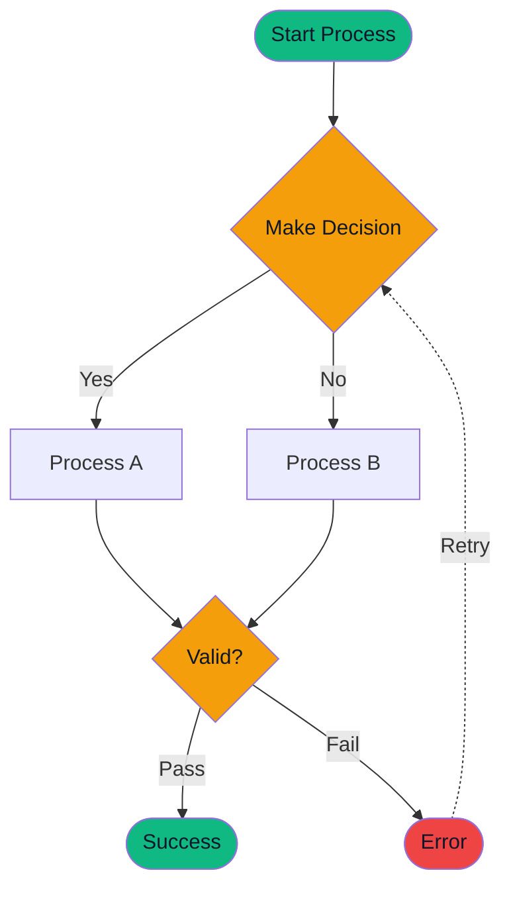
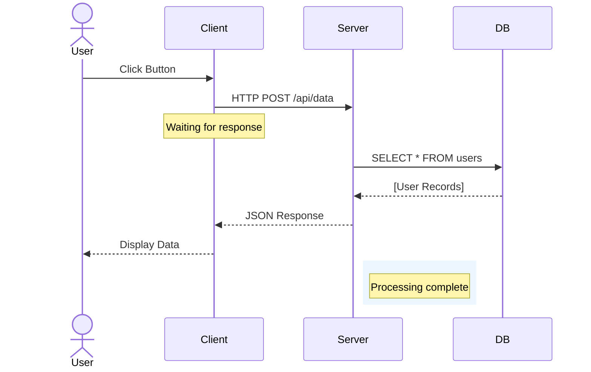
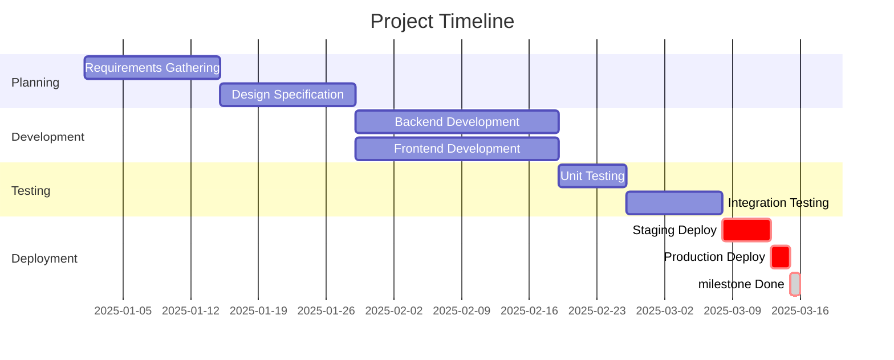
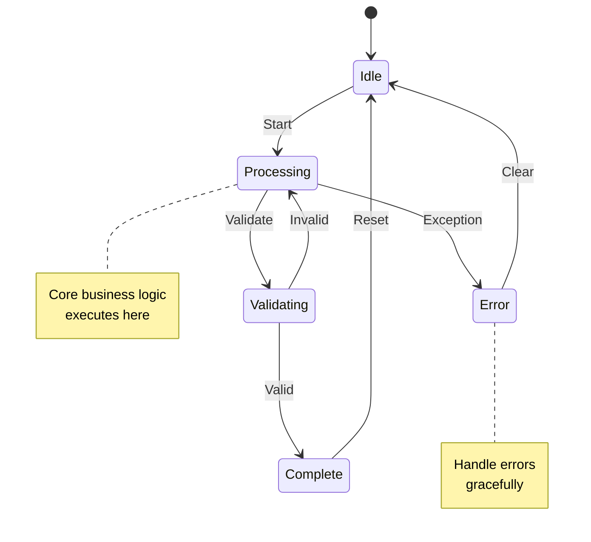
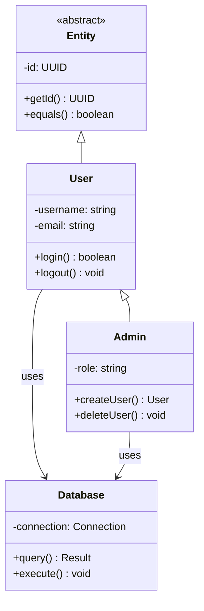
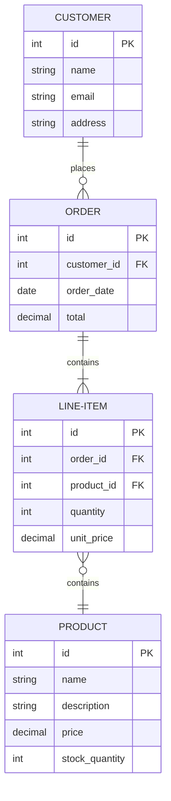
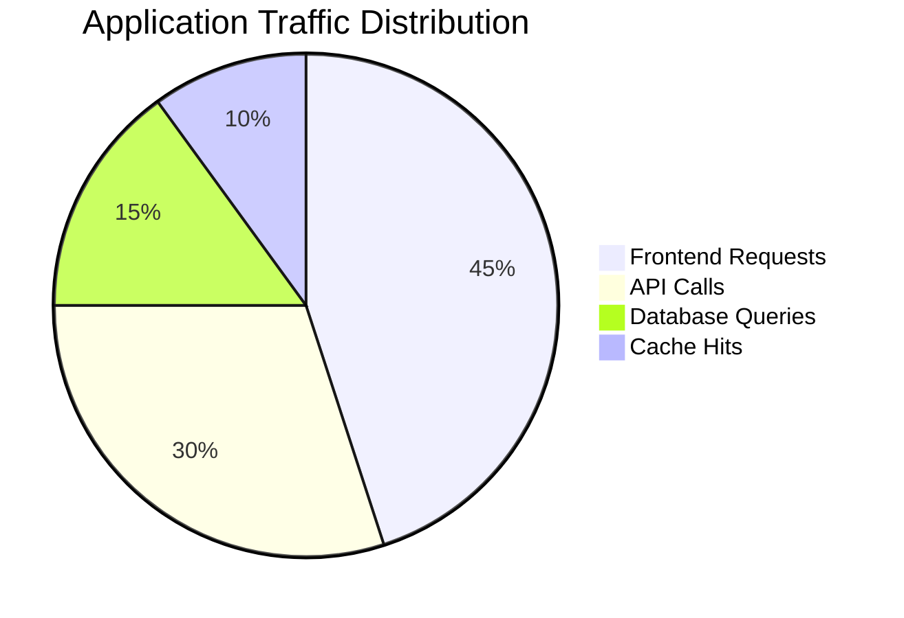
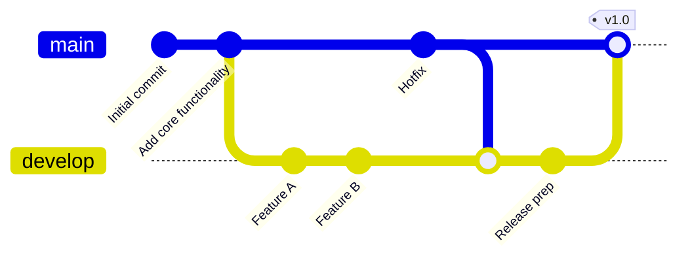

# 🎨 Mermaid Theming Test Suite

This document contains all Mermaid diagram types for visual regression testing.

**Purpose**: Verify that dark-pro.css theming is correctly applied to all diagram types

**Expected Result**: All diagrams should render with:
- ✅ Dark backgrounds (#0f172a, #1e293b)
- ✅ Primary blue borders/lines (#60a5fa)
- ✅ Light text (#f3f4f6)
- ✅ Proper contrast and readability

---

## Flowchart - Decision Tree



**Verify**:
- [ ] Node backgrounds are dark (or green/amber/red for styled nodes)
- [ ] Node borders are primary blue
- [ ] Text is readable (light on dark)
- [ ] Decision/process shapes are distinct
- [ ] Arrow labels are visible

---

## Sequence Diagram - Multi-Actor



**Verify**:
- [ ] Actor boxes have dark background
- [ ] Lifelines are visible (primary blue)
- [ ] Message arrows are blue
- [ ] Text labels are readable
- [ ] Notes/rectangles have proper contrast
- [ ] Response arrows (dashed) are visible

---

## Gantt Chart - Project Timeline



**Verify**:
- [ ] Task bars have primary blue background
- [ ] Done tasks are green
- [ ] Critical tasks are red
- [ ] Section backgrounds alternate (dark shades)
- [ ] Timeline numbers are readable
- [ ] Task labels are visible
- [ ] Milestone marker is visible

---

## State Diagram - System States



**Verify**:
- [ ] State boxes have dark background
- [ ] State borders are primary blue
- [ ] Transition labels are readable
- [ ] Arrows are visible
- [ ] Notes have proper background/text contrast
- [ ] Start/end states are distinct

---

## Class Diagram - Architecture



**Verify**:
- [ ] Class boxes have dark background
- [ ] Class names are bold and readable
- [ ] Method signatures are visible
- [ ] Inheritance arrows (lines) are primary blue
- [ ] Association arrows are visible
- [ ] Abstract class is distinguished
- [ ] All text is readable

---

## Entity Relationship Diagram - Database Schema



**Verify**:
- [ ] Entity boxes have dark background
- [ ] Attribute text is readable
- [ ] PK/FK annotations are visible
- [ ] Relationship lines are primary blue
- [ ] Cardinality symbols are clear
- [ ] Entity names stand out

---

## Pie Chart - Distribution



**Verify**:
- [ ] Pie segments have distinct colors
- [ ] Labels are readable
- [ ] Percentage/legend is visible
- [ ] Title is prominent

---

## Git Graph - Branch History



**Verify**:
- [ ] Commit nodes are visible
- [ ] Branch labels are readable
- [ ] Tags stand out
- [ ] Merge points are clear
- [ ] Timeline flows correctly

---

## Testing Instructions

### Local Test

```bash
# Install dependencies
pip install -r tools/pdf/requirements-pdf.txt

# Generate PDF
python -m tools.pdf.cli.main docs/examples/mermaid-test-suite.md \
    output/mermaid-test.pdf \
    --profile dark-pro \
    --verbose

# Open in PDF viewer
open output/mermaid-test.pdf  # macOS
# xdg-open output/mermaid-test.pdf  # Linux
# start output/mermaid-test.pdf  # Windows
```

### Docker Test

```bash
# Build image
docker build -t docs-pipeline:test .

# Run test
docker run --rm \
  -v $(pwd):/workspace \
  docs-pipeline:test \
  python -m tools.pdf.cli.main \
    /workspace/docs/examples/mermaid-test-suite.md \
    /workspace/output/mermaid-test.pdf \
    --profile dark-pro
```

### Verification Checklist

After generating PDF, verify:

**Colors**:
- [ ] Backgrounds are dark (#0f172a, #1e293b)
- [ ] Borders/lines are primary blue (#60a5fa)
- [ ] Text is light gray (#f3f4f6)
- [ ] Status colors work (green, red, amber)

**Contrast**:
- [ ] All text is readable
- [ ] No washed out elements
- [ ] Sufficient contrast ratio (4.5:1+)
- [ ] Diagrams match dark-pro.css variables

**Rendering**:
- [ ] No artifacts or visual glitches
- [ ] Shapes render correctly
- [ ] Lines/arrows are smooth
- [ ] Text is anti-aliased

**Consistency**:
- [ ] All diagram types consistent
- [ ] Colors match across diagrams
- [ ] Font sizes readable
- [ ] Spacing looks good

---

## Success Criteria

✅ **All diagrams render** - No errors or missing content  
✅ **Dark theme applied** - Colors match dark-pro.css  
✅ **Readable text** - All labels visible (light on dark)  
✅ **No artifacts** - Clean rendering, no visual issues  
✅ **PDF quality** - Professional appearance  
✅ **Consistent styling** - All diagram types themed  

---

## Troubleshooting

If diagrams don't render with dark-pro colors:

1. **Verify CSS variables**
   ```bash
   grep -n "--mermaid-primaryColor" tools/pdf/styles/dark-pro.css
   ```

2. **Check Mermaid enhancement step**
   ```bash
   grep -n "getCSSVariables" tools/pdf/pipeline/steps/mermaid_enhancement_step.py
   ```

3. **Enable debug logging**
   - Add `?debug` to URL in browser preview
   - Check console for CSS variable values

4. **Verify Mermaid version**
   ```bash
   npm list @mermaid-js/mermaid-cli
   # Should be @11.x or higher
   ```

---

**Generated**: December 12, 2025  
**Mermaid Version**: 11+  
**Dark Pro CSS**: Integrated  
**Status**: Production Ready ✅
