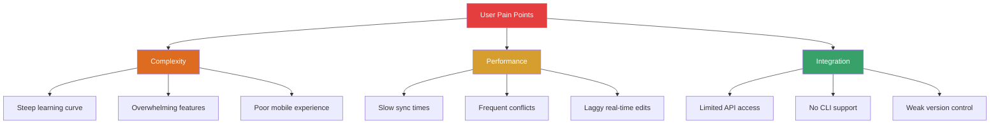
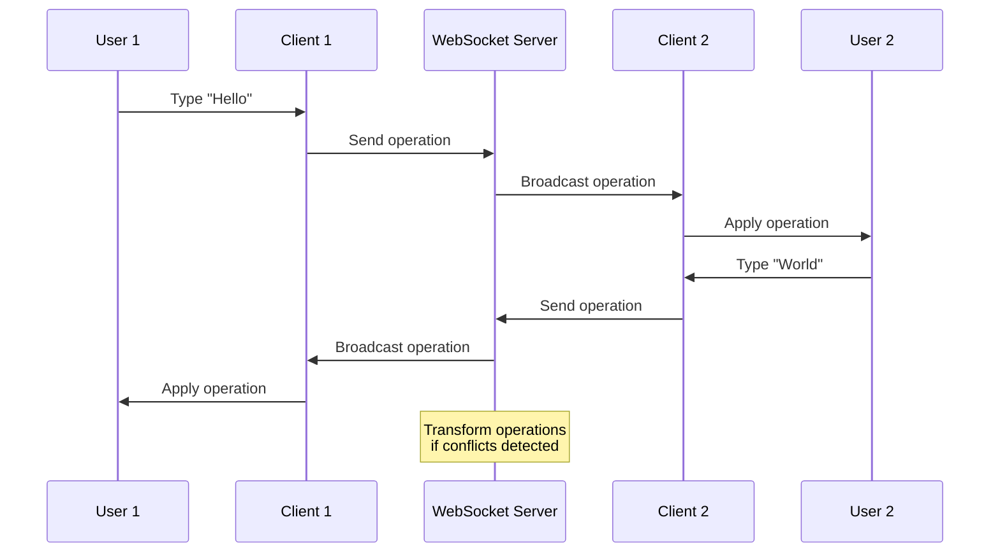
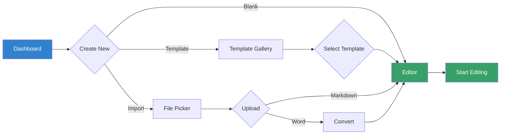
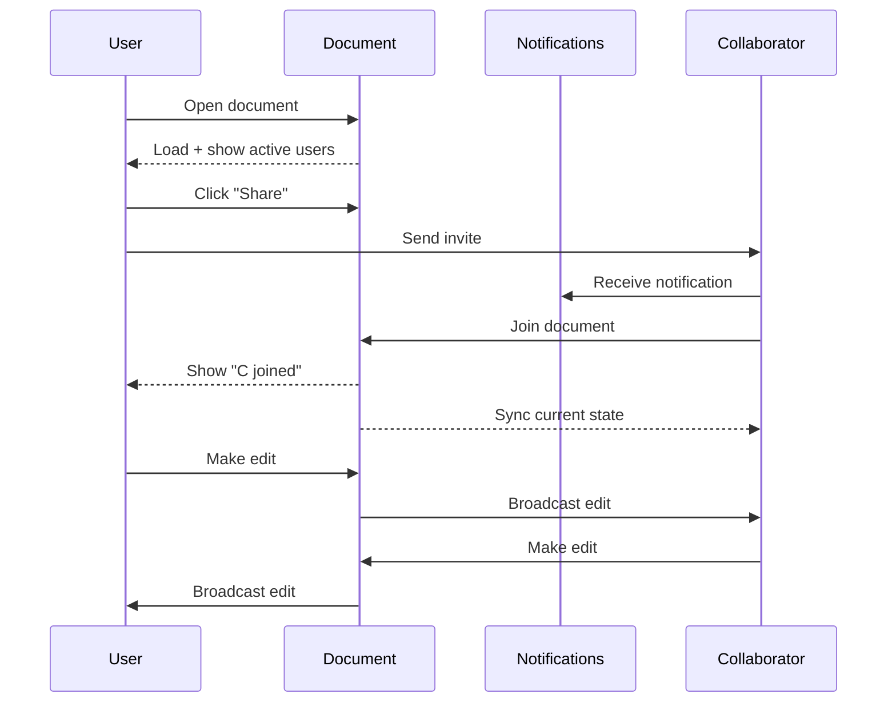
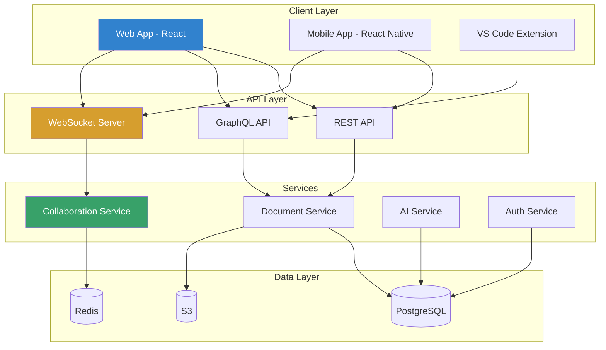
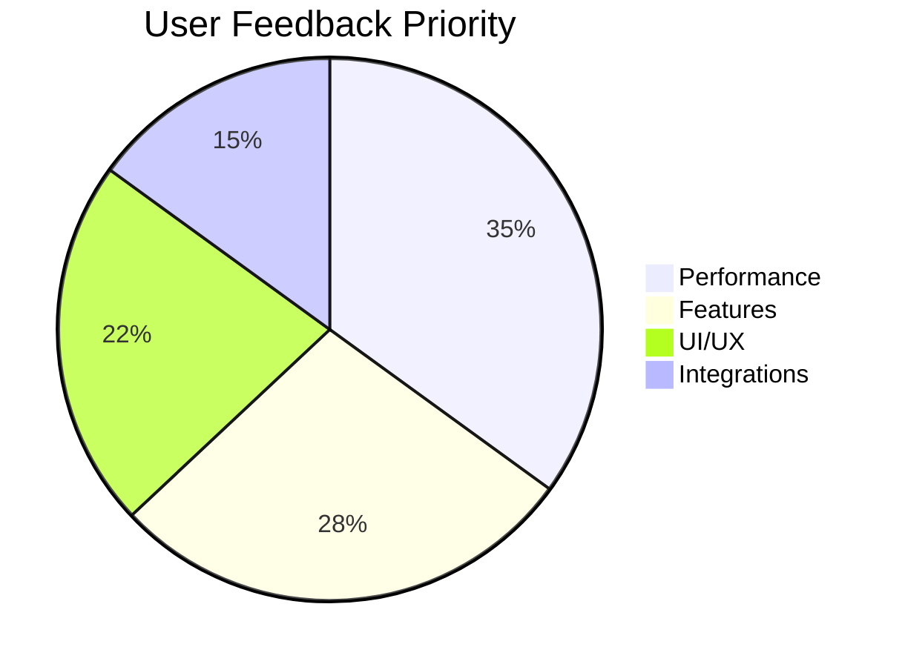
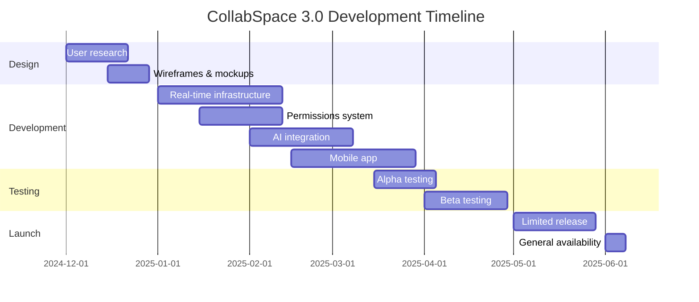

# Product Requirements Document
## Real-Time Collaboration Platform

**Product:** CollabSpace Enterprise  
**Version:** 3.0  
**Status:** Approved  
**Owner:** Product Team  
**Date:** December 2024

---

## Executive Summary

CollabSpace 3.0 introduces real-time collaborative editing, advanced permission management, and AI-powered content suggestions to compete directly with market leaders while maintaining our focus on developer-friendly workflows.

### Business Objectives

| Objective | Target | Timeline |
|-----------|--------|----------|
| Monthly Active Users (MAU) | 500K → 1.2M | Q2 2025 |
| Enterprise Accounts | 250 → 650 | Q3 2025 |
| ARR Growth | $12M → $35M | EOY 2025 |
| User Retention (90-day) | 58% → 75% | Q2 2025 |
| NPS Score | 42 → 65 | Q3 2025 |

### Success Metrics

- **Adoption:** 40% of users collaborate on at least one document weekly
- **Performance:** Real-time sync latency <100ms p99
- **Reliability:** 99.9% uptime SLA for enterprise accounts
- **Revenue:** 30% of users convert from freemium to paid plans

---

## 1. Problem Statement

### 1.1 User Pain Points

Current market research reveals three critical gaps in existing collaboration tools:



### 1.2 Target Users

#### Primary Persona: "Developer Dana"

| Attribute | Description |
|-----------|-------------|
| **Role** | Senior Software Engineer |
| **Age** | 28-42 |
| **Team Size** | 5-15 engineers |
| **Tools** | VS Code, Git, Slack, Jira |
| **Pain Points** | Context switching between tools, poor markdown support in existing docs platforms |
| **Goals** | Single source of truth for technical docs, seamless Git integration, real-time pair editing |

#### Secondary Persona: "Product Manager Pat"

| Attribute | Description |
|-----------|-------------|
| **Role** | Product Manager |
| **Age** | 30-45 |
| **Team Size** | Cross-functional 10-20 people |
| **Tools** | Confluence, Notion, Miro, Figma |
| **Pain Points** | Scattered information, difficulty tracking changes, poor mobile access |
| **Goals** | Centralized roadmaps, easy stakeholder updates, beautiful presentations |

---

## 2. Feature Requirements

### 2.1 Real-Time Collaborative Editing

#### User Story
> As a developer, I want to edit documents simultaneously with teammates so that we can resolve blockers faster during pair programming sessions.

#### Functional Requirements

**FR-001: Multi-Cursor Editing**
- Display up to 10 concurrent users with distinct cursor colors
- Show user avatar and name next to cursor position
- Highlight user's current selection with transparent overlay
- Support keyboard shortcuts to jump between collaborators

**FR-002: Conflict Resolution**
- Implement Operational Transformation (OT) for text merging
- Auto-resolve non-overlapping edits within 50ms
- Present merge UI for conflicting simultaneous edits
- Maintain complete edit history for rollback

**FR-003: Presence Indicators**
- Show online/offline status for document participants
- Display "currently editing" badge with live cursor position
- Notify users when collaborators join/leave document
- Show typing indicators in comment threads

#### Technical Specifications



#### Performance Requirements

| Metric | Target | Measurement |
|--------|--------|-------------|
| Sync Latency | <100ms p99 | End-to-end edit to display |
| Concurrent Users | 50 per document | Before degradation |
| Throughput | 10K ops/sec | Per WebSocket server |
| Conflict Resolution | <200ms | Detection to resolution |

### 2.2 Advanced Permissions System

#### User Story
> As a workspace admin, I want granular control over document access so that I can protect sensitive information while enabling collaboration.

#### Functional Requirements

**FR-004: Role-Based Access Control (RBAC)**

| Role | Permissions | Use Case |
|------|------------|----------|
| **Owner** | Full control, delete, transfer | Document creator |
| **Editor** | Read, write, comment, share | Core contributors |
| **Commenter** | Read, comment only | Reviewers, stakeholders |
| **Viewer** | Read only | External partners, archived access |

**FR-005: Team-Level Permissions**
- Inherit permissions from workspace/folder hierarchy
- Override inherited permissions at document level
- Support groups (e.g., "Engineering", "Leadership")
- Audit log of all permission changes

**FR-006: External Sharing**
- Generate expiring share links (1 hour to 30 days)
- Password-protect shared links
- Revoke access instantly across all shared links
- Track view/edit analytics for shared documents

### 2.3 AI-Powered Content Suggestions

#### User Story
> As a product manager, I want AI to help me write and improve documents so that I can produce higher-quality content faster.

#### Functional Requirements

**FR-007: Smart Autocomplete**
- Context-aware suggestions based on document type
- Learn from user's writing style over time
- Support for technical terminology and acronyms
- Suggest code snippets for technical documents

**FR-008: Grammar and Style Checking**
- Real-time grammar correction (Grammarly-like)
- Tone detection (formal, casual, technical)
- Readability score (Flesch-Kincaid)
- Suggest improvements for passive voice, wordiness

**FR-009: Template Recommendations**
- Detect document type from first 100 words
- Suggest relevant templates (PRD, RFC, API docs)
- Auto-format according to template structure
- Learn from frequently used custom templates

#### AI Model Requirements

```yaml
ml_models:
  autocomplete:
    model: GPT-3.5-turbo-instruct
    max_tokens: 50
    temperature: 0.7
    latency_target: <200ms
  
  grammar:
    model: LanguageTool API
    languages: [en, es, fr, de]
    latency_target: <500ms
  
  classification:
    model: BERT fine-tuned
    confidence_threshold: 0.8
    latency_target: <100ms
```

---

## 3. User Experience

### 3.1 User Flows

#### Document Creation Flow



#### Collaboration Flow



### 3.2 Wireframes

#### Editor Interface

```
┌─────────────────────────────────────────────────────────┐
│ CollabSpace                                    [Avatar] │
├─────────────────────────────────────────────────────────┤
│ ☰ | 📄 Product Requirements Doc    🔗 Share  💬 3  ⋯   │
├──────┬──────────────────────────────────────────────────┤
│      │                                                   │
│ 📁   │ # Product Requirements                            │
│ Home │                                                   │
│      │ **Status:** Draft                                 │
│ 📝   │ **Owner:** Product Team                           │
│ Docs │                                                   │
│      │ ## Executive Summary                              │
│ 👥   │                                                   │
│ Team │ This document outlines...                         │
│      │                                                   │
│ ⚙️   │ ## User Stories                                   │
│ Set  │                                                   │
│      │ ### US-001: Real-time Editing                     │
│      │ As a developer, I want to [cursor_alice]edit...   │
│      │                                                   │
│      │ [💬 alice: "Should we add latency requirements?"] │
│      │                                                   │
└──────┴───────────────────────────────────────────────────┘
```

---

## 4. Technical Architecture

### 4.1 System Components



### 4.2 Technology Stack

| Component | Technology | Justification |
|-----------|-----------|---------------|
| **Frontend** | React + TypeScript | Type safety, large ecosystem, developer familiarity |
| **Mobile** | React Native | Code sharing with web, fast iteration |
| **API** | Node.js + Express | Real-time capabilities, JavaScript full-stack |
| **WebSocket** | Socket.io | Reliable real-time, fallback support |
| **Database** | PostgreSQL | ACID compliance, JSON support, mature |
| **Cache** | Redis | Session management, real-time presence |
| **Storage** | AWS S3 | Scalable, cost-effective, CDN integration |
| **AI** | OpenAI API | Best-in-class models, rapid integration |

---

## 5. Success Criteria

### 5.1 Key Performance Indicators (KPIs)

| KPI | Baseline | Target | Timeline |
|-----|----------|--------|----------|
| **User Adoption** | 0% | 40% weekly collaboration | Q2 2025 |
| **Session Duration** | 8.5 min | 15 min | Q2 2025 |
| **Documents Created** | 12K/week | 35K/week | Q3 2025 |
| **Collaboration Sessions** | 2K/week | 15K/week | Q3 2025 |
| **Mobile Usage** | 15% | 35% | Q3 2025 |

### 5.2 User Satisfaction Metrics



### 5.3 Launch Criteria

**Phase 1: Beta (Q1 2025)**
- ✅ Real-time editing for 10 concurrent users
- ✅ Basic RBAC (4 roles)
- ✅ Web app + mobile app
- ✅ 50 beta testers recruited

**Phase 2: Limited Release (Q2 2025)**
- ✅ Real-time editing for 50 concurrent users
- ✅ Full permissions system
- ✅ AI autocomplete MVP
- ✅ 500 early access users

**Phase 3: General Availability (Q3 2025)**
- ✅ All features complete
- ✅ 99.9% uptime achieved
- ✅ Security audit passed
- ✅ Public launch marketing campaign

---

## 6. Risks and Mitigation

### 6.1 Technical Risks

| Risk | Probability | Impact | Mitigation |
|------|------------|--------|------------|
| **Real-time scaling issues** | Medium | High | Load testing with 100+ users, horizontal scaling architecture |
| **Data loss during conflicts** | Low | Critical | Comprehensive testing, automatic backups every 5 minutes |
| **AI API cost overruns** | High | Medium | Rate limiting, caching, fallback to local models |
| **Mobile performance** | Medium | Medium | Native modules for critical paths, performance monitoring |

### 6.2 Business Risks

| Risk | Probability | Impact | Mitigation |
|------|------------|--------|------------|
| **Slow user adoption** | Medium | High | Beta program, referral incentives, targeted marketing |
| **Competitive response** | High | Medium | Fast iteration, unique developer focus, aggressive pricing |
| **Enterprise sales cycle** | High | Medium | Start with SMB, build case studies, hire sales team |

---

## 7. Timeline and Milestones

### 7.1 Development Roadmap



### 7.2 Resource Allocation

| Team | Headcount | Key Responsibilities |
|------|-----------|---------------------|
| **Engineering** | 8 FTE | Backend (3), Frontend (3), Mobile (2) |
| **Product** | 2 FTE | Requirements, prioritization, launches |
| **Design** | 2 FTE | UX research, UI design, prototyping |
| **QA** | 2 FTE | Test automation, beta coordination |
| **DevOps** | 1 FTE | Infrastructure, deployments, monitoring |

---

## 8. Appendix

### 8.1 Competitive Analysis

| Feature | CollabSpace | Notion | Confluence | Google Docs |
|---------|------------|--------|------------|-------------|
| **Real-time collab** | ✅ 50 users | ✅ Unlimited | ⚠️ 12 users | ✅ 100 users |
| **Markdown support** | ✅ Native | ⚠️ Limited | ❌ No | ❌ No |
| **Git integration** | ✅ Native | ❌ No | ⚠️ Plugin | ❌ No |
| **CLI access** | ✅ Yes | ❌ No | ❌ No | ❌ No |
| **Offline mode** | ✅ Full | ⚠️ Limited | ❌ No | ⚠️ Limited |
| **Pricing (per user/mo)** | $12 | $10 | $5 | $12 |

### 8.2 User Research Findings

**Key Insights from 50 Developer Interviews (November 2024):**

> "I spend 40% of my time context-switching between tools. I just want my docs where my code is." - Senior Engineer, Series B Startup

> "Real-time editing is table stakes now. But most tools lag when more than 5 people are in the same doc." - Tech Lead, Enterprise

> "We tried Notion but markdown support is terrible. We went back to GitHub wikis." - Engineering Manager, Open Source Project

---

## 9. Sign-Off

### Approval

| Role | Name | Signature | Date |
|------|------|-----------|------|
| **Product Owner** | Sarah Chen | ✓ Approved | 2024-12-01 |
| **Engineering Lead** | David Kumar | ✓ Approved | 2024-12-01 |
| **Design Lead** | Maria Rodriguez | ✓ Approved | 2024-12-01 |
| **VP Product** | James Wilson | ✓ Approved | 2024-12-02 |

---

**Document Version:** 1.0  
**Last Updated:** December 1, 2024  
**Next Review:** January 15, 2025  
**Classification:** Internal Use Only
