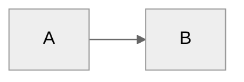

# PDF/DOCX Generation Tools

Professional Markdown to PDF, DOCX, or HTML conversion using **Pandoc + WeasyPrint + Mermaid-CLI** with advanced features:
- **Math Support:** LaTeX math rendering ($...$ and $$...$$)
- **Code Highlighting:** Syntax highlighting with customizable styles
- **Cross-References:** Automatic figure/table numbering and references
- **Glossary Expansion:** Automatic acronym/term expansion
- **Multiple Diagram Types:** Mermaid, PlantUML, Graphviz support
- **HTML Output:** Responsive HTML with navigation sidebar

**Version:** 2.0.0  
**Status:** Production-ready, enterprise-grade with advanced documentation features

---

## Architecture Overview

The conversion pipeline uses a **three-stage preprocessing + rendering architecture**:

```
Markdown (.md)
    ↓
[Stage 1: Preprocessing]
    ├─ YAML frontmatter extraction (PyYAML)
    ├─ Mermaid diagram detection (regex)
    └─ Diagram pre-rendering (Mermaid-CLI → SVG/PNG)
    ↓
Preprocessed Markdown (with embedded images)
    ↓
[Stage 2: Markdown Parsing]
    └─ Pandoc conversion (Markdown → HTML/DOCX)
    ↓
Intermediate Format (HTML for PDF, DOCX for Word)
    ↓
[Stage 3: Final Rendering]
    ├─ PDF: HTML → WeasyPrint → PDF (with CSS Paged Media)
    └─ DOCX: Direct Pandoc output (with optional reference template)
    ↓
Final Output (.pdf or .docx)
```

---

## Technical Pipeline Details

### Stage 1: Preprocessing (`convert_final.py`)

#### 1.1 YAML Frontmatter Extraction
- **Function:** `extract_metadata(md_content)`
- **Method:** String splitting on `---` delimiters
- **Parser:** PyYAML `safe_load()` for security
- **Output:** Metadata dict + cleaned Markdown content
- **Supported Fields:**
  - **Required/Common:** `title`, `author`, `organization`, `date`, `version`
  - **Document Type:** `type`, `classification`
  - **Enhanced (Optional):** `department`, `review_status`, `doc_id`/`document_id`, `prepared_for`/`preparedFor`
  - **Custom fields:** All other fields are passed through and can be accessed in templates

#### 1.2 Mermaid Diagram Detection & Rendering
- **Function:** `render_mermaid_to_svg(md_content, work_dir, also_png=False, cache_dir=None, use_cache=True, theme_config=None)`
- **Detection:** Regex pattern `r'```mermaid\n(.+?)```'` with `re.DOTALL`
- **Rendering Engine:** Mermaid-CLI (`mmdc`)
- **Process:**
  1. Extract Mermaid code block
  2. Generate MD5 hash for cache key (first 8 chars)
  3. **Cache Check:** If `use_cache=True` and cache exists, copy from cache
  4. Otherwise, write to temp `.mmd` file
  5. Execute `mmdc -i input.mmd -o output.svg -t neutral -b transparent [-c theme.json]`
  6. Optionally render PNG: `mmdc -i input.mmd -o output.png -t neutral -b white -s 2.0 [-c theme.json]`
  7. **Cache Save:** Save rendered SVG/PNG to cache directory (if enabled)
  8. Replace code block with Markdown image syntax: ``
- **Output Format:**
  - **PDF:** SVG (vector, transparent background, professional theme)
  - **DOCX:** PNG (raster, white background, high-resolution 2x scale for Word compatibility)
- **Theme Configuration:**
  - Default theme: `base` (more professional than `neutral`)
  - Theme config file: `pdf-tools/pdf-mermaid-theme.json` (auto-detected)
  - Custom theme: Use `--theme-config PATH` to override
  - Theme includes: Corporate colors, Segoe UI font, optimized spacing
- **Caching:** Diagrams cached by content hash in `pdf-tools/pdf-diagrams/` (configurable)
- **Error Handling:** Falls back to placeholder text if rendering fails

#### 1.3 Temporary File Management
- **Location:** `tempfile.mkdtemp(prefix='pdf_' or 'docx_')`
- **Contents:**
  - `preprocessed.md` - Markdown with diagrams replaced
  - `diagram_*.svg` - Rendered SVG files
  - `diagram_*.png` - Rendered PNG files (DOCX only)
- **Cleanup:** Automatic via `finally` block with `shutil.rmtree()`

---

### Stage 2: Markdown Parsing (Pandoc)

#### 2.1 Pandoc Configuration
- **Executable Detection:**
  - Windows: `C:\Program Files\Pandoc\pandoc.exe`
  - Fallback: `pandoc` in PATH
- **Input Format:** `markdown+pipe_tables+backtick_code_blocks+fenced_code_attributes+smart`
- **Extensions Enabled:**
  - `pipe_tables` - GitHub-style tables
  - `backtick_code_blocks` - Fenced code blocks
  - `fenced_code_attributes` - Code block attributes
  - `smart` - Smart typography (curly quotes, em dashes)

#### 2.2 PDF Path: Markdown → HTML
- **Command:**
  ```bash
  pandoc input.md \
    -f markdown+pipe_tables+backtick_code_blocks+fenced_code_attributes+smart \
    -t html5 \
    --standalone \
    --toc \
    --toc-depth=3 \
    --resource-path work_dir \
    -o output.html
  ```
- **Output:** Self-contained HTML5 with embedded SVG images
- **TOC:** Auto-generated, depth 3 (H1-H3)

#### 2.3 DOCX Path: Markdown → DOCX
- **Command:**
  ```bash
  pandoc input.md \
    -f markdown+pipe_tables+backtick_code_blocks+fenced_code_attributes+smart+tex_math_dollars+... \
    -t docx \
    --toc \
    --toc-depth=3 \
    --resource-path work_dir \
    --highlight-style github \
    [--reference-doc template.docx] \
    [-filter pandoc-crossref] \
    -o output.docx
  ```
- **Output:** Office Open XML (.docx) format
- **Reference Template:** Optional custom styling via `--reference-doc`
- **TOC:** Word-native table of contents
- **Math:** Rendered as Word-native equations
- **Code:** Syntax highlighted (Word-compatible)

#### 2.4 HTML Path: Markdown → HTML (New!)
- **Command:**
  ```bash
  pandoc input.md \
    -f markdown+... \
    -t html5 \
    --standalone \
    --toc \
    --mathjax \
    --highlight-style github \
    [-filter pandoc-crossref] \
    -o output.html
  ```
- **Output:** Responsive HTML5 with navigation sidebar
- **Features:** MathJax math rendering, syntax highlighting, cross-references
- **Navigation:** Fixed sidebar with TOC, responsive design

---

### Stage 3: Final Rendering

#### 3.1 PDF Rendering (WeasyPrint)

**HTML Post-Processing:**
- **Title Page Injection:** Dynamic HTML insertion before `<body>`
  - Logo: ``
  - Metadata: Extracted from YAML frontmatter
  - Classification banner: Styled div
  - Disclaimer: Legal text
- **H1 Suppression:** First `<h1>` commented out (used in title page)
- **TOC Positioning:** Header closure before TOC

**CSS Paged Media (`custom_css`):**
- **Page Size:** A4 (210mm × 297mm)
- **Margins:** 25mm top, 15mm sides, 20mm bottom
- **Running Headers:**
  - `@top-left`: Document title (hardcoded)
  - `@top-right`: Current section (`string(section-title)`)
  - `@bottom-center`: Footer text
  - `@bottom-right`: Page number (`counter(page)`)
- **Page Rules:**
  - `@page:first`: No headers/footers on title page
  - `@page toc`: Roman numerals for TOC pages
- **Typography:**
  - Font: Segoe UI (fallback: Arial, sans-serif)
  - Body: 11pt, line-height 1.6
  - H1: 24pt, H2: 18pt, H3: 14pt
  - Code: Consolas/Monaco, 10pt
- **Page Breaks:**
  - `page-break-after: avoid` on headings
  - `page-break-inside: avoid` on tables, code blocks
  - Orphan/widow control: 3 lines minimum

**WeasyPrint Execution:**
- **Library:** `weasyprint.HTML().write_pdf()`
- **Input:** HTML file path (string)
- **Stylesheets:** Inline CSS string
- **Output:** PDF file (binary)

#### 3.2 DOCX Rendering (Pandoc Native)

- **No Post-Processing:** Pandoc output is final
- **Reference Template:** If provided, Pandoc applies styles from template
- **Diagram Embedding:** PNG images embedded via `--resource-path`
- **Limitations:**
  - No logo support (Pandoc limitation)
  - TOC styling controlled by Word/Reference template
  - No custom title page (use reference template)

---

## Component Dependencies

### Core Tools

| Component | Version | Purpose | Required |
|-----------|---------|---------|----------|
| **Pandoc** | Latest | Markdown parsing, HTML/DOCX generation | ✅ Yes |
| **WeasyPrint** | ≥60.0 | HTML → PDF rendering | ✅ Yes (PDF only) |
| **Mermaid-CLI** | Latest | Diagram rendering (SVG/PNG) | ⚠️ Optional |
| **PyYAML** | ≥6.0 | Frontmatter parsing | ✅ Yes |
| **colorama** | ≥0.4.6 | Colored terminal output | ⚠️ Optional |

### System Dependencies

**Windows (WeasyPrint):**
- GTK Runtime (via MSYS2 or Chocolatey)
- Path: `C:\msys64\mingw64\bin\libgobject-2.0-0.dll`
- Installation: `choco install msys2-installer` → `pacman -S mingw-w64-x86_64-gtk3`

**All Platforms:**
- Node.js + npm (for Mermaid-CLI)
- Python 3.8+ (for script execution)

---

## Format-Specific Processing

### PDF Output

**Advantages:**
- ✅ Professional typography (CSS Paged Media)
- ✅ Custom title page with logo
- ✅ Running headers/footers
- ✅ Vector diagrams (SVG, scalable)
- ✅ Print-optimized layout
- ✅ Page break control

**Technical Details:**
- **File Size:** ~200-400 KB typical (text-heavy)
- **Rendering Time:** ~2-5 seconds per document
- **Memory:** ~50-100 MB peak (WeasyPrint)
- **Quality:** Print-ready, 300+ DPI equivalent

**Limitations:**
- ❌ Not editable (final format)
- ❌ Requires GTK runtime (Windows)
- ❌ CSS Paged Media limitations (some advanced features)

### DOCX Output

**Advantages:**
- ✅ Fully editable in Word
- ✅ Reference template support
- ✅ Word-native TOC
- ✅ Collaboration-friendly
- ✅ No GTK dependency

**Technical Details:**
- **File Size:** ~15-350 KB (varies with diagrams)
- **Rendering Time:** ~1-3 seconds per document
- **Memory:** ~20-50 MB peak (Pandoc only)
- **Quality:** Word-compatible, editable

**Limitations:**
- ❌ No logo support (Pandoc limitation)
- ❌ Raster diagrams (PNG, not vector)
- ❌ TOC styling requires reference template
- ❌ No custom title page (use template)

---

## Configuration & Customization

### CLI Options

```bash
# Basic conversion
md2pdf.py input.md [output.pdf|output.docx]

# Format control
--format pdf|docx              # Explicit format
--output-dir DIR               # Centralized output location

# Styling
--logo PATH                    # Custom logo (PDF only)
--css PATH                     # External CSS file for PDF styling
--theme-config PATH            # Mermaid diagram theme config JSON file
--reference-docx PATH           # DOCX template

# Batch processing & performance
--batch file1.md file2.md ...  # Multiple files
--config config.json           # Config file
--threads N                    # Parallel processing (default: 1)
--cache-diagrams               # Enable diagram caching (default: enabled)
--no-cache                     # Disable diagram caching
--cache-dir DIR                # Custom cache directory

# Validation & quality
--lint                         # Validate Markdown and YAML frontmatter
--check                        # Check dependencies and exit

# Automation
--log FILE                     # File logging
--verbose, -v                  # Verbose output with tracebacks
--output-dir DIR               # Centralized output location

# Information
--version                      # Show version
--formats                      # List supported formats
--help                         # Full help
```

### Config File Format (`pdf-config.json`)

```json
{
  "files": [
    {
      "input": "docs/report.md",
      "output": "output/report.pdf",
      "format": "pdf",
      "logo": "assets/logo.png",
      "css": "styles/custom.css",
      "reference_docx": "templates/corporate.docx"
    }
  ],
  "output_dir": "output/",
  "logo": "docs/default_logo.png",
  "css": "styles/default.css",
  "theme_config": "pdf-tools/pdf-mermaid-theme.json",
  "reference_docx": "templates/default.docx",
  "cache_dir": "pdf-tools/pdf-diagrams",
  "cache_diagrams": true,
  "threads": 4
}
```

### CSS Customization (PDF)

**External CSS File (Recommended):**
```bash
# Use external CSS file
python md2pdf.py docs/report.md --css styles/custom.css
```

Create `custom.css` with your styling:
```css
@page {
    size: A4;
    margin: 25mm 15mm 20mm 15mm;
    @top-left {
        content: "Your Company Name";
        font-size: 9pt;
        color: #666;
    }
    @bottom-right {
        content: "Page " counter(page);
        font-size: 9pt;
    }
}

body {
    font-family: 'Your Font', Arial, sans-serif;
    font-size: 11pt;
    line-height: 1.6;
}

/* Customize title page, headings, tables, etc. */
```

**Default CSS:** If no `--css` is provided, the tool uses embedded professional styling. You can customize the default by editing `convert_final.py` (lines ~320-585), or better yet, extract it to `custom.css.example` and use external CSS.

**CSS Features Supported:**
- Typography: Fonts, sizes, line-height
- Layout: Margins, page breaks, page size
- Colors: Text, borders, backgrounds
- Headers/Footers: Content, positioning, page numbers
- Paged Media: `@page` rules, running headers, page counters

### YAML Frontmatter Examples

**Basic Example:**
```yaml
---
title: Technical Specification
author: John Doe
organization: Acme Corp
date: November 2025
version: 1.0
type: Technical Specification
classification: CONFIDENTIAL – INTERNAL USE ONLY
---
```

**Enhanced Metadata Example:**
```yaml
---
title: Architecture Proposal
author: Jane Smith
organization: Tech Solutions Inc
date: December 2025
version: 2.1
type: Architecture Document
classification: INTERNAL USE ONLY
department: Engineering
review_status: Draft
doc_id: ARCH-2025-001
prepared_for: Executive Team
---
```

**All Supported Fields:**
- `title` - Document title (extracted from first H1 if missing)
- `author` - Author name (default: "Matt Jeffcoat")
- `organization` - Organization name (default: "Your Organization")
- `date` - Publication date (default: "November 2025")
- `version` - Document version (default: "1.0")
- `type` - Document type (default: "Technical Specification")
- `classification` - Security classification (default: "CONFIDENTIAL – INTERNAL USE ONLY")
- `department` - Department name (optional, shown if present)
- `review_status` - Review status (optional, shown if present)
- `doc_id` or `document_id` - Document identifier (optional, shown if present)
- `prepared_for` or `preparedFor` - Recipient name (optional, shown if present)

### Reference DOCX Template (DOCX)

Create a Word document with:
- Custom heading styles (Heading 1, 2, 3)
- Table styles
- Font settings
- Page layout
- Save as `.docx`

Pandoc applies these styles to output.

### Mermaid Diagram Theming

**Professional Theme Configuration:**

All Mermaid diagrams are rendered using a professional theme configuration file (`pdf-mermaid-theme.json`). This ensures consistent, corporate-grade styling across all diagrams.

**Default Theme File:** `pdf-tools/pdf-mermaid-theme.json`

**Theme Features:**
- **Font:** Segoe UI, Arial, sans-serif (matches PDF typography)
- **Colors:** Corporate blue palette (#1976d2 primary, #e3f2fd backgrounds)
- **Spacing:** Optimized node spacing (36px) and rank spacing (44px)
- **Base Theme:** Uses `neutral` theme (supported by all mermaid-cli versions, customized via theme config)

**Custom Theme:**

Create your own `pdf-mermaid-theme.json`:
```json
{
  "theme": "neutral",
  "themeVariables": {
    "fontFamily": "Segoe UI, Arial, sans-serif",
    "fontSize": "15px",
    "primaryColor": "#e3f2fd",
    "primaryTextColor": "#1976d2",
    "nodeTextColor": "#0a263c",
    "nodeBorder": "#1976d2",
    "lineColor": "#1976d2"
  },
  "flowchart": {
    "useMaxWidth": true,
    "htmlLabels": true,
    "nodeSpacing": 36,
    "rankSpacing": 44
  }
}
```

**Usage:**
```bash
# Use default theme (auto-detected)
python md2pdf.py docs/report.md

# Use custom theme
python md2pdf.py docs/report.md --theme-config themes/corporate.json

# In config file
{
  "theme_config": "themes/custom.json",
  "files": [...]
}
```

**High-Resolution PNG for DOCX:**
- PNG diagrams are rendered at 2x scale (`-s 2.0`) for crisp output in Word
- Maximum recommended width: 1200px for optimal Word compatibility

**Inline Theme Overrides:**

You can also use inline `%%{init:...}%%` directives in your Mermaid blocks for special cases:
```markdown

```

**Best Practices:**
- Keep diagram content professional (limit emojis, concise text)
- Prefer landscape layouts (width > height)
- Use consistent node spacing
- Test output with real data to fine-tune theme variables

---

## Performance Characteristics

### Single Document
- **Small (< 10 pages):** ~1-2 seconds
- **Medium (10-50 pages):** ~2-5 seconds
- **Large (50+ pages):** ~5-15 seconds

### Batch Processing
- **Throughput:** ~10-30 documents/minute (depends on diagram count)
- **Memory:** ~50-100 MB per concurrent conversion
- **Bottlenecks:**
  1. Mermaid rendering (if many diagrams)
  2. WeasyPrint PDF generation
  3. File I/O

### Optimization Tips

**✅ Implemented:**
- **Parallel Processing:** Use `--threads N` for concurrent batch conversions (2-4x speedup)
- **Diagram Caching:** Enabled by default (`--cache-diagrams`), caches rendered SVG/PNG by content hash
- **Cache Location:** Default `pdf-tools/pdf-diagrams/`, customizable via `--cache-dir`

**Performance Gains:**
- **First Run:** All diagrams rendered and cached
- **Subsequent Runs:** Unchanged diagrams loaded from cache (2-5x faster)
- **Batch with 4 threads:** ~3-4x throughput improvement on multi-core systems

**Example:**
```bash
# Fast batch conversion with caching and parallel processing
python md2pdf.py --config pdf-config.json --threads 4 --cache-diagrams
```

---

## Error Handling & Diagnostics

### Error Categories

1. **Dependency Errors:**
   - Missing Pandoc → Exit code 1
   - Missing WeasyPrint → ImportError
   - Missing GTK → Runtime error (Windows)

2. **Rendering Errors:**
   - Mermaid failure → Placeholder text inserted
   - Pandoc failure → Exception with stderr
   - WeasyPrint failure → Exception with details

3. **File Errors:**
   - Missing input → Clear error message
   - Permission denied → OS error
   - Invalid path → PathError

### Exit Codes

- `0`: Success
- `1`: Failure (batch/config mode: any failure)
- `2`: Invalid arguments

### Logging

**Console Output:**
- `[OK]` - Success (green)
- `[WARN]` - Warning (yellow)
- `[ERROR]` - Error (red)
- `[INFO]` - Information (cyan)

**File Logging (`--log`):**
- Timestamped entries
- Level-based filtering
- Format: `%(asctime)s - %(levelname)s - %(message)s`

**Verbose Mode (`--verbose`):**
- Full Python tracebacks
- Exception details
- Debug information

---

## Technical Limitations & Considerations

### Known Limitations

1. **Mermaid CLI:**
   - Requires Node.js runtime
   - Some complex diagrams may fail silently
   - PNG rendering slower than SVG

2. **WeasyPrint (PDF):**
   - GTK dependency on Windows (complex install)
   - CSS Paged Media not 100% feature-complete
   - Some advanced CSS features unsupported

3. **Pandoc (DOCX):**
   - No logo embedding (Word limitation)
   - TOC styling requires reference template
   - Complex tables may not render perfectly

4. **Performance:**
   - ✅ Parallel processing available (`--threads N`)
   - ✅ Diagram caching enabled by default (`--cache-diagrams`)
   - Large documents (>100 pages) may still be slow, but caching helps significantly

### Platform Considerations

**Windows:**
- GTK runtime required for PDF
- Path handling (backslashes vs forward slashes)
- PowerShell vs CMD differences

**macOS/Linux:**
- GTK typically pre-installed
- Pandoc via Homebrew/apt
- Path handling more consistent

---

## File Structure

```
pdf-tools/
├── md2pdf.py              # CLI wrapper (465 lines)
├── convert_final.py        # Core engine (636 lines)
├── md2pdf.bat             # Windows batch wrapper
├── requirements-pdf.txt    # Python dependencies
├── README.md              # This file
├── PDF_GENERATION_SETUP.md # Setup guide
├── pdf-config.json.example # Config example
└── [default_reference.docx] # Optional template
```

---

## Quick Start

### Easiest Way (Batch File)

```batch
# From project root
md2pdf.bat docs\report.md

# Convert to DOCX
md2pdf.bat docs\report.md docs\report.docx

# Batch conversion
md2pdf.bat --batch docs\*.md --format docx
```

### Python Direct

```bash
# From project root
python pdf-tools/md2pdf.py docs/report.md

# With options
python pdf-tools/md2pdf.py docs/report.md --format docx --verbose
```

---

## Installation

See `PDF_GENERATION_SETUP.md` for complete setup instructions.

**Quick install:**
1. `pip install -r requirements-pdf.txt`
2. Install Pandoc: `choco install pandoc` (Windows) or `brew install pandoc` (macOS)
3. Install Mermaid-CLI: `npm install -g @mermaid-js/mermaid-cli`
4. (Windows) Install GTK: See setup guide

---

## Help & Support

```batch
# Check dependencies
md2pdf.bat --check

# Show version
md2pdf.bat --version

# List formats
md2pdf.bat --formats

# Full help
md2pdf.bat --help
```

---

## New Features (v1.1.0)

**✅ Implemented:**

1. **🚀 Parallel Batch Processing** (`--threads N`)
   - Process multiple files concurrently using `ThreadPoolExecutor`
   - 2-4x speedup on multi-core systems
   - Progress bars with `tqdm` (optional dependency)
   - Example: `python md2pdf.py --batch *.md --threads 4`

2. **💾 Diagram Caching** (`--cache-diagrams`, enabled by default)
   - Hash-based cache (MD5) for rendered SVG/PNG diagrams
   - Cache location: `pdf-tools/pdf-diagrams/` (configurable)
   - 2-5x faster on subsequent runs with unchanged diagrams
   - Cache key includes diagram code + format (SVG vs PNG)

3. **🎨 External CSS Support** (`--css PATH`)
   - Load custom CSS files for PDF styling
   - Overrides default embedded CSS
   - Perfect for branded/seasonal styles
   - Non-programmers can update styles without code changes
   - Example: `python md2pdf.py docs/report.md --css styles/brand.css`

4. **✅ Markdown Validation** (`--lint`)
   - Validates YAML frontmatter syntax
   - Checks for recommended fields (author, date, version, etc.)
   - Detects mismatched code block delimiters
   - Warns about missing frontmatter
   - Example: `python md2pdf.py docs/report.md --lint`

5. **📋 Enhanced Metadata Mapping**
   - Supports additional fields: `department`, `review_status`, `doc_id`, `prepared_for`
   - Dynamically builds title page metadata block
   - Flexible field names (e.g., `doc_id` or `document_id`)
   - All custom fields passed through for future template use

6. **📊 Progress Bars & UX**
   - Real-time progress for batch operations (via `tqdm`)
   - Colored terminal output (via `colorama`)
   - Status indicators: `[OK]`, `[WARN]`, `[ERROR]`, `[INFO]`
   - Verbose mode with full tracebacks (`--verbose`)

7. **🔧 Enhanced Error Handling**
   - Non-zero exit codes for CI/CD integration
   - File logging support (`--log FILE`)
   - Dependency checking (`--check`)
   - Clear error messages with context

8. **🔢 Math Support** (LaTeX)
   - Full LaTeX math block and inline rendering
   - Supports `$...$` (inline) and `$$...$$` (display) syntax
   - MathJax integration for HTML output
   - Example: `$$E = mc^2$$` renders as proper equation

9. **💻 Code Highlighting** (`--highlight-style`)
   - Syntax highlighting with customizable styles
   - Default: GitHub style (clean and readable)
   - Options: `pygments`, `tango`, `kate`, `monochrome`, etc.
   - Example: `python md2pdf.py docs/report.md --highlight-style tango`

10. **🔗 Cross-References** (`--crossref-config`)
    - Automatic figure/table numbering
    - Reference syntax: `[@fig:label]` and `[@tbl:label]`
    - Requires: `pandoc-crossref` filter
    - Example: `python md2pdf.py docs/report.md --crossref-config crossref.yaml`

11. **📚 Glossary & Acronym Expansion** (`--glossary`)
    - Automatic acronym expansion (e.g., "API" → "Application Programming Interface (API)")
    - Glossary appendix generation
    - YAML-based configuration
    - Example: `python md2pdf.py docs/report.md --glossary glossary.yaml`

12. **🌐 HTML Output** (`--format html`)
    - Responsive HTML with navigation sidebar
    - MathJax for math rendering
    - Search-friendly structure
    - Custom CSS support
    - Example: `python md2pdf.py docs/report.md --format html`

13. **📊 Multiple Diagram Types**
    - **Mermaid:** Flowcharts, sequence diagrams, state diagrams (with professional theming)
    - **PlantUML:** UML diagrams, sequence diagrams, class diagrams
    - **Graphviz/DOT:** Graph visualizations
    - All diagrams cached and rendered to SVG/PNG

**Future Enhancements:**
- [ ] More output formats (EPUB, LaTeX, ODT) via Pandoc
- [ ] Draw.io/diagrams.net support
- [ ] Logo support in DOCX (via reference template workaround)
- [ ] Dry-run mode (`--dry-run`) for validation without conversion
- [ ] Plugin system for custom processors (pre-processing hooks)
- [ ] Template engine for title pages (Jinja2/Mustache)
- [ ] Performance profiling mode (`--profile`)
- [ ] Web dashboard / API server (Flask/FastAPI)
- [ ] Format auto-switch based on context/config

---

**Note:** All file paths in commands are relative to the **project root** (one level up from `pdf-tools/`).

**Last Updated:** January 2025  
**Maintained By:** Documentation Pipeline Team
