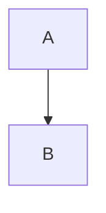
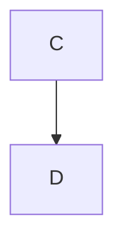

# Adaptive Diagram Sizing Analysis

## 🚨 CRITICAL ISSUES FOUND

### Most Likely Root Cause: **CSS Override**
**File**: [`pdf-tools/custom.css.playwright`](pdf-tools/custom.css.playwright#L374-L377)
- CSS rule `img, svg { max-width: 100%; height: auto; }` **overrides explicit width/height attributes** set by scaling
- Scaling sets `svg.setAttribute('width', newWidth)` but CSS `height: auto` recalculates based on `max-width: 100%`
- **Fix**: Exclude `[data-scaled]` elements from this rule (see Issue #6 below)

### Secondary Issues:
1. **Selector may miss Pandoc-wrapped SVGs** - [`pdf-tools/pdf_playwright.py`](pdf-tools/pdf_playwright.py#L72-L78)
2. **Timing too short** - 500ms may not be enough for SVG loading - [`pdf-tools/pdf_playwright.py`](pdf-tools/pdf_playwright.py#L1019)
3. **Measurement context mismatch** - Browser viewport != PDF page - [`pdf-tools/pdf_playwright.py`](pdf-tools/pdf_playwright.py#L65-L95)

---

## Overview

The adaptive diagram sizing system is designed to automatically scale down large diagrams that would overflow a page when combined with their headings, ensuring headings and diagrams stay together on the same page.

## How It Works

### Three-Tier System

**TIER 1: Analysis** (`analyze_heading_diagram_pairs`)
- **When**: Runs after page loads, after CSS injection, before pagination CSS
- **What**: Scans document for h2/h3 headings followed by SVG diagrams
- **How**: 
  - Calculates available page height: `10in - 0.75in (top) - 1in (bottom) = ~8.25in = 792px`
  - Measures heading height (including nested h3s between h2 and diagram)
  - Measures diagram height
  - Adds 48px buffer
  - If `totalHeight > availableHeight`, marks as problematic
- **Output**: List of problem pairs with heading IDs, heights, and overflow ratios

**TIER 2: Scaling** (`apply_adaptive_diagram_sizing`)
- **When**: Runs immediately after analysis, if problems found
- **What**: Intelligently resizes problematic diagrams
- **How**:
  - Calculates scale factor: `(availableHeight - headingHeight - 48px) / diagramHeight`
  - Only scales DOWN (if scale_factor >= 1.0, skip)
  - Minimum scale: 50% (to prevent unreadable diagrams)
  - Sets explicit width/height attributes on SVG (not CSS transform)
  - Adds `data-scaled` attribute for tracking
- **Output**: Diagrams physically resized with `data-scaled` attribute

**TIER 3: CSS Protection** (`inject_adaptive_pagination_css`)
- **When**: Runs after scaling
- **What**: Injects CSS rules to prevent page breaks
- **How**:
  - `[data-scaled]` elements get `page-break-before: avoid`
  - Headings get `page-break-after: avoid`
  - Diagrams get `page-break-inside: avoid`
- **Output**: CSS rules ensuring scaled diagrams stay with headings

## Current Implementation Status

### ✅ What's Working

1. **Functions are defined** - Both analysis and scaling functions exist
2. **Integration is correct** - Called in proper order in `generate_pdf_from_html()`
3. **Logic is sound** - Calculation and scaling logic appears correct
4. **CSS protection** - `[data-scaled]` CSS rules are in place

### ⚠️ Potential Issues & Problematic Code Links

#### 1. **Selector Issue** - May Miss Pandoc-Wrapped SVGs
**File**: [`pdf-tools/pdf_playwright.py`](pdf-tools/pdf_playwright.py#L72-L78)
```javascript
// Line 72-78: Looking for SVG in next sibling, but Pandoc wraps images differently
let next = heading.nextElementSibling;
while (next && !next.querySelector('svg') && !next.querySelector('img[src$=".svg"]') && 
       next.tagName !== 'H2' && next.tagName !== 'H3' && next.tagName !== 'H1') {
    next = next.nextElementSibling;
}

if (next && (next.querySelector('svg') || next.querySelector('img[src$=".svg"]'))) {
    const svg = next.querySelector('svg') || next.querySelector('img[src$=".svg"]');
```
**Problem**: Pandoc wraps images in `<figure>` or `<p>` tags, so `next.querySelector()` might find SVG but `next` itself is the wrapper, not the direct sibling. The SVG might be nested deeper.

**Impact**: Diagrams wrapped in `<figure></figure>` might not be detected correctly.

**Related**: See how Pandoc processes images in [`pdf-tools/convert_final.py`](pdf-tools/convert_final.py#L276-L280) - returns `` which Pandoc converts to HTML.

---

#### 2. **Timing Issue** - Insufficient Wait for SVG Rendering
**File**: [`pdf-tools/pdf_playwright.py`](pdf-tools/pdf_playwright.py#L1017-L1020)
```python
# FAANG-Level: TIER 1 - Analyze heading+diagram pairs BEFORE CSS injection
# Need to wait for content to render first
await page.wait_for_timeout(500)
problem_pairs = await analyze_heading_diagram_pairs(page, verbose)
```
**Problem**: 500ms might not be enough for:
- SVG files to load from disk (`file://` URLs)
- Images to render and get accurate dimensions
- CSS to apply and affect layout

**Impact**: `getBoundingClientRect()` might return 0 or incorrect dimensions if SVG hasn't loaded yet.

**Fix Needed**: 
- Increase to 1000ms+ OR
- Use `await page.wait_for_load_state('networkidle')` OR
- Wait for specific SVG elements: `await page.wait_for_selector('svg, img[src$=".svg"]')`

---

#### 3. **Measurement Issue** - Browser Viewport != PDF Page Context
**File**: [`pdf-tools/pdf_playwright.py`](pdf-tools/pdf_playwright.py#L65-L68)
```javascript
// Line 65-68: Calculating available height using browser DPI assumptions
const pageHeight = 10 * 96; // 10 inches in pixels at 96 DPI (A4 height minus margins)
const marginTop = 0.75 * 96;
const marginBottom = 1 * 96;
const availableHeight = pageHeight - marginTop - marginBottom; // ~8.25 inches
```
**File**: [`pdf-tools/pdf_playwright.py`](pdf-tools/pdf_playwright.py#L80-L95)
```javascript
// Line 80: Using browser offsetHeight
const headingHeight = heading.offsetHeight;

// Line 94-95: Using browser getBoundingClientRect()
const svgRect = svg.getBoundingClientRect();
const svgHeight = svgRect.height;
```
**Problem**: 
- Browser viewport measurements don't account for PDF page breaks
- `offsetHeight` includes margins/padding that might not be in PDF context
- `getBoundingClientRect()` is relative to viewport, not PDF page
- CSS `@page` margins might affect actual available space differently

**Impact**: Calculations might be off, causing false positives/negatives in overflow detection.

**Related CSS**: [`pdf-tools/pdf_playwright.py`](pdf-tools/pdf_playwright.py#L434-L436) defines `@page { margin: 0.75in 0.75in 1in 0.75in; }` but measurements don't account for this.

---

#### 4. **Scaling Logic Issue** - Finding Diagram After Heading
**File**: [`pdf-tools/pdf_playwright.py`](pdf-tools/pdf_playwright.py#L163-L178)
```javascript
// Line 163-178: Finding diagram after heading - same selector issue as analysis
let next = heading.nextElementSibling;
while (next && !next.querySelector('svg') && !next.querySelector('img[src$=".svg"]')) {
    // Also check for h3 between h2 and diagram
    if (next.tagName === 'H3' || next.tagName === 'H2') {
        // Continue searching from this heading
        let checkNext = next.nextElementSibling;
        while (checkNext && !checkNext.querySelector('svg') && !checkNext.querySelector('img[src$=".svg"]')) {
            checkNext = checkNext.nextElementSibling;
        }
        if (checkNext) {
            next = checkNext;
            break;
        }
    }
    next = next.nextElementSibling;
}
```
**Problem**: Same selector issue as #1 - if Pandoc wraps SVG in `<figure>`, this might find the figure but then querySelector inside it, causing confusion about which element to scale.

**Impact**: Might scale the wrong element or fail to scale entirely.

---

#### 5. **Verbose Output Not Showing** - Silent Failures
**File**: [`pdf-tools/pdf_playwright.py`](pdf-tools/pdf_playwright.py#L119-L122)
```python
if verbose and pairs:
    print(f"{WARN} Found {len(pairs)} heading+diagram pairs that need layout adjustment:")
    for p in pairs:
        print(f"  - '{p['headingText']}': {p['totalHeight']:.0f}px (available: {p['availableHeight']:.0f}px, ratio: {p['overflowRatio']:.2f}x)")
```
**File**: [`pdf-tools/pdf_playwright.py`](pdf-tools/pdf_playwright.py#L153-L154)
```python
if verbose:
    print(f"{INFO} Scaling diagram under '{pair['headingText']}' by {scale_factor:.2f}x")
```
**Problem**: No verbose output seen, meaning either:
- No problems detected (all diagrams fit) - but user says they don't
- Exception caught silently - line 126-128 catches exceptions but only prints if verbose
- Verbose flag not propagated correctly through call chain

**Impact**: Can't diagnose what's happening without debug output.

**Related**: Check if verbose is passed correctly in [`pdf-tools/pdf_playwright.py`](pdf-tools/pdf_playwright.py#L1020) - `analyze_heading_diagram_pairs(page, verbose)` should receive the flag.

---

#### 6. **CSS Interference** - Custom CSS Might Override Scaling
**File**: [`pdf-tools/pdf_playwright.py`](pdf-tools/pdf_playwright.py#L1010-L1015)
```python
# Inject CSS: custom file first (if provided)
if css_file and Path(css_file).exists():
    if verbose:
        print(f"{INFO} Loading custom CSS: {css_file}")
    css_content = Path(css_file).read_text(encoding='utf-8')
    await page.add_style_tag(content=css_content)
```
**Problem**: Custom CSS (like [`pdf-tools/custom.css.playwright`](pdf-tools/custom.css.playwright)) might have rules that:
- Override SVG width/height attributes set by scaling
- Force max-width/max-height that conflicts with scaling
- Apply transforms that interfere

**Impact**: Scaling applied but immediately overridden by CSS.

**Check**: [`pdf-tools/custom.css.playwright`](pdf-tools/custom.css.playwright#L374-L377) - **CONFLICT FOUND**:
```css
img, svg {
    max-width: 100%;
    height: auto;
    display: block;
}
```
**This CSS rule will override explicit width/height attributes** set by scaling! The `height: auto` will recalculate based on `max-width: 100%`, ignoring the scaled dimensions.

**Fix Needed**: Add `!important` to scaled diagrams OR exclude `[data-scaled]` from this rule:
```css
img:not([data-scaled]), svg:not([data-scaled]) {
    max-width: 100%;
    height: auto;
}
```

## Execution Flow

```
1. page.goto() - Load HTML
2. inject_web_fonts() - Load fonts
3. Inject custom CSS (if provided)
4. wait_for_timeout(500) - Wait for initial render
5. analyze_heading_diagram_pairs() - TIER 1: Find problems
   ├─ If problems found → apply_adaptive_diagram_sizing() - TIER 2: Scale
   └─ wait_for_timeout(300) - Wait for resize
6. inject_adaptive_pagination_css() - TIER 3: CSS protection
7. Generate cover/TOC
8. optimize_diagrams_for_print() - Width-based scaling (legacy, complements adaptive)
```

## Testing Recommendations

### Test Case 1: Large Diagram Detection
```markdown
## Architectural Vision
```mermaid
graph TB
    A[Very Large Diagram] --> B[Component]
    A --> C[Component]
    A --> D[Component]
    ... (many nodes to make it tall)
```
```

### Test Case 2: Nested Headings
```markdown
## Section Title
### Subsection

```

### Test Case 3: Multiple Diagrams
```markdown
## Section 1


## Section 2

```

## Debugging Steps

1. **Add debug output**:
   ```python
   if verbose:
       print(f"{INFO} Analyzing {len(headings)} headings for diagram pairs...")
       print(f"{INFO} Available page height: {availableHeight}px")
   ```

2. **Verify SVG detection**:
   ```javascript
   const svgs = document.querySelectorAll('svg, img[src$=".svg"]');
   console.log(`Found ${svgs.length} SVG diagrams`);
   ```

3. **Check measurements**:
   ```javascript
   console.log(`Heading: ${headingHeight}px, Diagram: ${svgHeight}px, Total: ${totalHeight}px`);
   ```

4. **Verify scaling**:
   ```javascript
   const scaled = document.querySelectorAll('[data-scaled]');
   console.log(`Scaled ${scaled.length} diagrams`);
   ```

## Recommendations

1. **Increase wait time** before analysis (1000ms instead of 500ms)
2. **Wait for images** explicitly: `await page.wait_for_load_state('networkidle')`
3. **More robust selectors** - check `<figure>`, `<p>`, and other containers
4. **Add debug logging** throughout the process
5. **Test with verbose mode** to see what's actually happening
6. **Consider PDF page context** - measurements might need PDF-specific adjustments

## Current Status: ⚠️ NEEDS VERIFICATION

The system is implemented but may not be detecting/scaling diagrams correctly. Needs testing with verbose output to diagnose.

