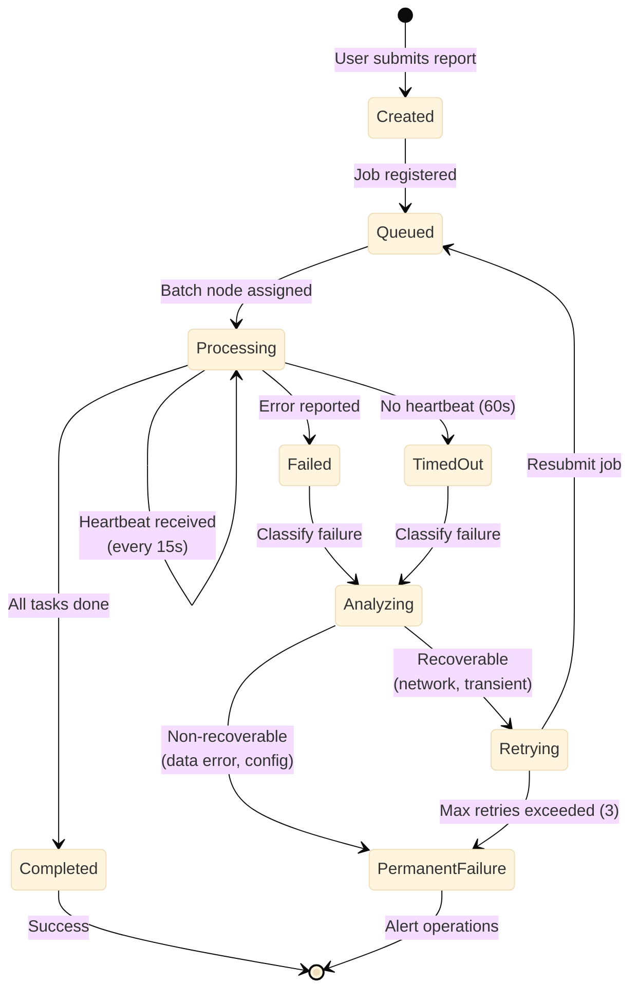

# Failure Detection Test Document

This is a minimal test document to validate scaling of the Failure Detection and Recovery diagram.

## Introduction

This document contains a single large diagram to test the scaling logic. The diagram should be properly scaled to fit within the available page space.

## Background

Before we get to the diagram, here's some background information to simulate real document content. This ensures we have content above the diagram, which is important for testing the scaling calculations.

The Reporting Manager provides automatic failure detection and recovery capabilities. When a job stops sending heartbeats, the system detects the timeout and automatically classifies the failure type.

### Failure Detection and Recovery

## Conclusion

This concludes the test document. The diagram above should be properly scaled to fit within the page boundaries.

