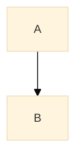

# Mermaid Directive Strategy

## The Problem

**Per-diagram directives override the theme file:**



This **overrides** `pdf-mermaid-theme.json` settings, making global optimization ineffective.

---

## Solution Options

### **Option 1: Remove Inline Directives (Recommended)**

**Approach:** Delete all `%%{init: ...}%%` directives, let theme file control everything.

**Pros:**
- ✅ Single source of truth (theme file)
- ✅ Consistent across all diagrams
- ✅ Easy to update globally (change theme file once)
- ✅ No per-diagram maintenance

**Cons:**
- ❌ Can't customize individual diagrams (but rarely needed)

**Implementation:**
```bash
# Remove all inline directives
sed -i '/%%{init:/d' *.md
```

---

### **Option 2: Update Inline Directives**

**Approach:** Keep directives but update them to use compact settings.

**Pros:**
- ✅ Per-diagram control
- ✅ Can optimize specific diagrams differently

**Cons:**
- ❌ Maintenance burden (update each diagram)
- ❌ Inconsistency risk
- ❌ Doesn't scale

**Implementation:**
Replace:
```mermaid
%%{init: {'theme':'base', 'themeVariables': {'fontSize':'13px'}}}%%
```

With:
```mermaid
%%{init: {
  'theme':'base',
  'themeVariables': {'fontSize':'11px'},
  'flowchart': {'nodeSpacing': 30, 'rankSpacing': 40, 'diagramPadding': 8}
}}%%
```

---

### **Option 3: Hybrid (Best Practice)**

**Approach:** 
1. Remove most inline directives
2. Keep directives ONLY for diagrams that need special treatment
3. Document why each override exists

**When to use inline directives:**
- Complex diagrams that need ultra-compact settings
- Specific layout requirements (LR vs TB)
- Diagrams with unusual aspect ratios

**Example:**
```mermaid
%%{init: {
  'theme':'base',
  'flowchart': {'nodeSpacing': 20, 'rankSpacing': 30}  # Ultra-compact for complex diagram
}}%%
graph TB
    # ... 20+ nodes ...
```

---

## Recommendation

**For your current document:**

1. ✅ **Remove all 5 inline directives** - They're just setting fontSize which the theme file now handles better
2. ✅ **Let theme file control everything** - Consistent, professional, maintainable
3. ✅ **Add directives back ONLY if specific diagram doesn't look good** - Document why

**Why this is best:**
- Theme file already optimized (fontSize: 11px, compact spacing)
- No need for per-diagram overrides
- Easier to maintain
- Industry standard approach

---

## Implementation

I'll remove the 5 inline directives from your document now. If any diagram looks bad after, we'll add a targeted directive back with a comment explaining why.

