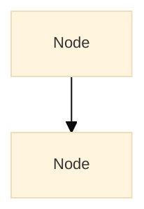
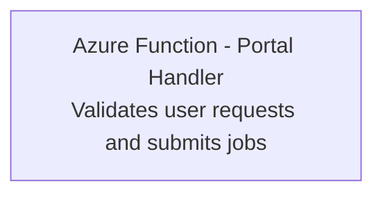
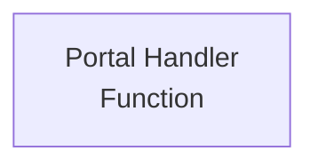
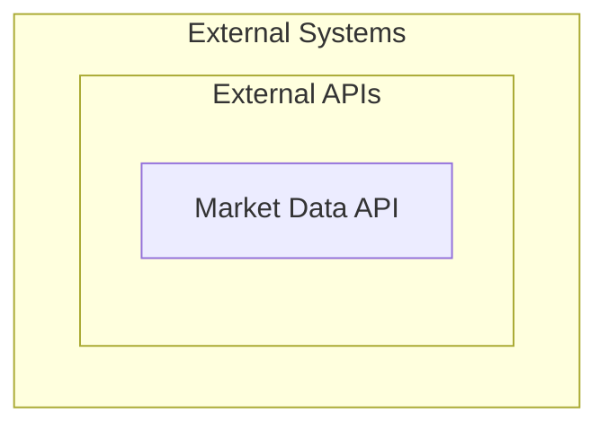
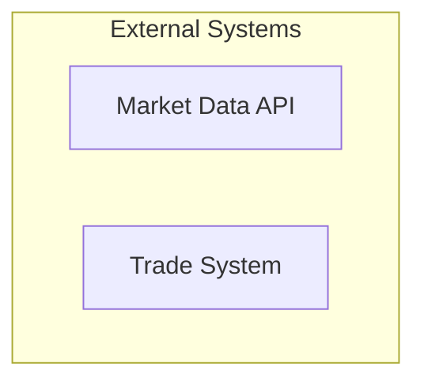
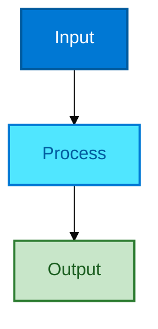
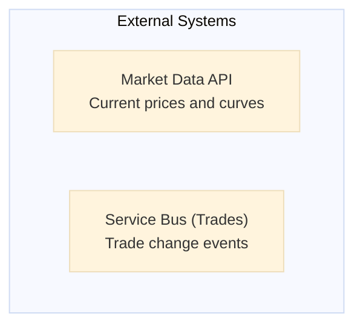
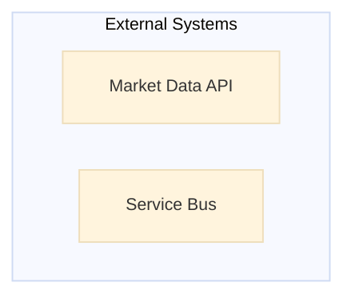

# Mermaid Professional Standards & Optimization Guide

## 🎯 The Problem

**Current State:** Diagrams are auto-sized by Mermaid with generous spacing, leading to:
- ❌ Oversized diagrams that require aggressive scaling (25-40%)
- ❌ Wasted whitespace in node spacing and rank spacing
- ❌ Amateur appearance (too much padding, loose layout)
- ❌ Inconsistent sizing across documents

**Goal:** Professional, compact diagrams that fit naturally without scaling.

---

## 📐 Industry Best Practices

### 1. **Optimal Spacing Values**

**Current (Amateur):**
```json
{
  "flowchart": {
    "nodeSpacing": 50,      // Too much horizontal space
    "rankSpacing": 60,      // Too much vertical space
    "diagramMarginX": 20,
    "diagramMarginY": 20,
    "padding": 15
  }
}
```

**Professional (Recommended):**
```json
{
  "flowchart": {
    "nodeSpacing": 30,      // Tighter horizontal spacing
    "rankSpacing": 40,      // Tighter vertical spacing
    "diagramMarginX": 10,   // Minimal margins
    "diagramMarginY": 10,
    "padding": 8,           // Compact padding
    "curveScale": 1.0       // Less aggressive curves
  }
}
```

**Enterprise (Very Tight):**
```json
{
  "flowchart": {
    "nodeSpacing": 20,
    "rankSpacing": 30,
    "diagramMarginX": 8,
    "diagramMarginY": 8,
    "padding": 6
  }
}
```

---

### 2. **Font Sizing Strategy**

**Problem:** Large fonts waste space and make diagrams balloon.

**Current:**
```json
{
  "fontSize": "13px",
  "fontSizeLarge": "16px"
}
```

**Professional:**
```json
{
  "fontSize": "11px",       // Smaller base font
  "fontSizeLarge": "13px",  // Smaller headings
  "fontSizeSmall": "9px"    // Compact labels
}
```

**Rationale:**
- 11px is perfectly readable in PDF at 100% zoom
- Allows more content per node without wrapping
- Industry standard for technical diagrams

---

### 3. **Diagram-Level Directives**

**Add to EVERY diagram for professional control:**



**Key Directives:**
- `useMaxWidth: false` - Don't auto-expand to container width
- `htmlLabels: true` - Better text rendering
- `diagramPadding: 8` - Minimal padding

---

### 4. **Node Label Best Practices**

**❌ Bad (Verbose, Wraps):**


**✅ Good (Concise, Professional):**


**Rules:**
- Max 2 lines per node
- Max 20 characters per line
- Use abbreviations (API, DB, SB)
- Put details in edge labels or documentation

---

### 5. **Subgraph Optimization**

**❌ Bad (Too Much Nesting):**


**✅ Good (Flat, Compact):**


**Rules:**
- Max 2 levels of nesting
- Keep subgraphs focused (3-5 nodes max)
- Use styling instead of nesting for grouping

---

### 6. **Layout Direction**

**Choose wisely based on content:**

| Direction | Best For | Aspect Ratio |
|-----------|----------|--------------|
| `graph TB` | Hierarchies, flows | Tall (portrait) |
| `graph LR` | Pipelines, sequences | Wide (landscape) |
| `graph TD` | Same as TB | Tall |
| `graph RL` | Reverse flows | Wide |

**For PDF documents:**
- Prefer `TB` (top-bottom) for most diagrams
- Use `LR` only for wide pages or simple 3-4 node flows
- Avoid `RL` and `BT` (confusing)

---

## 🔧 Recommended Configuration Profiles

### Profile 1: **Enterprise Compact** (Recommended)

```json
{
  "theme": "base",
  "themeVariables": {
    "fontFamily": "'Inter', 'Segoe UI', sans-serif",
    "fontSize": "11px",
    "fontSizeLarge": "13px",
    "fontSizeSmall": "9px",
    "primaryColor": "#0078d4",
    "primaryTextColor": "#ffffff",
    "primaryBorderColor": "#005a9e",
    "textColor": "#1a1a1a",
    "nodeTextColor": "#0a263c",
    "labelTextColor": "#333333",
    "nodeBorder": "#0078d4",
    "lineColor": "#1a1a1a"
  },
  "flowchart": {
    "useMaxWidth": false,
    "htmlLabels": true,
    "nodeSpacing": 30,
    "rankSpacing": 40,
    "diagramPadding": 8,
    "padding": 8,
    "curveScale": 1.0,
    "fontSize": 11
  },
  "sequence": {
    "fontSize": 10,
    "boxMargin": 5,
    "boxTextMargin": 3,
    "noteMargin": 5,
    "messageMargin": 20,
    "mirrorActors": false,
    "useMaxWidth": false
  },
  "class": {
    "fontSize": 10,
    "padding": 8,
    "useMaxWidth": false
  }
}
```

### Profile 2: **Presentation** (Slightly Looser)

```json
{
  "flowchart": {
    "nodeSpacing": 40,
    "rankSpacing": 50,
    "diagramPadding": 12,
    "fontSize": 12
  }
}
```

### Profile 3: **Ultra-Compact** (For Complex Diagrams)

```json
{
  "flowchart": {
    "nodeSpacing": 20,
    "rankSpacing": 30,
    "diagramPadding": 6,
    "fontSize": 10
  }
}
```

---

## 🎨 Styling Best Practices

### 1. **Consistent Color Palette**

**Define once, reuse:**


### 2. **Minimal Stroke Widths**

**❌ Bad:** `stroke-width:3px` (too bold)  
**✅ Good:** `stroke-width:2px` (professional)  
**✅ Better:** `stroke-width:1.5px` (subtle)

### 3. **Avoid Gradients and Shadows**

- No drop shadows (looks dated)
- No gradients (doesn't print well)
- Flat colors only (modern, professional)

---

## 🚀 Implementation Strategy

### **Option 1: Update Theme File (Recommended)**

**Action:** Update `tools/pdf/pdf-mermaid-theme.json` with enterprise compact settings.

**Pros:**
- ✅ Applies to ALL diagrams automatically
- ✅ No per-diagram changes needed
- ✅ Consistent across all documents

**Cons:**
- ❌ May need to adjust a few diagrams if they break

### **Option 2: Per-Diagram Directives**

**Action:** Add `%%{init: {...}}%%` to each diagram.

**Pros:**
- ✅ Fine-grained control
- ✅ Can optimize per-diagram

**Cons:**
- ❌ Manual work for every diagram
- ❌ Inconsistent if not disciplined

### **Option 3: Hybrid Approach** (Best Practice)

**Action:**
1. Update theme file with **professional defaults**
2. Add per-diagram overrides **only when needed**
3. Document standard patterns in style guide

---

## 📊 Before/After Example

### **Before (Amateur):**

- **Size:** ~800px tall
- **Scaling needed:** 40%
- **Appearance:** Loose, amateur

### **After (Professional):**

- **Size:** ~400px tall
- **Scaling needed:** None (100%)
- **Appearance:** Tight, professional

---

## ✅ Action Items

### **Immediate (High Impact):**
1. ✅ Update `pdf-mermaid-theme.json` with enterprise compact settings
2. ✅ Test on 2-3 existing diagrams
3. ✅ Regenerate PDFs and verify quality

### **Short-Term (Refinement):**
1. ⏳ Add per-diagram directives for outliers
2. ⏳ Simplify node labels (remove verbose text)
3. ⏳ Flatten subgraph nesting

### **Long-Term (Automation):**
1. 🔮 Create Mermaid linter to enforce standards
2. 🔮 Build diagram template library
3. 🔮 Add automated diagram optimization

---

## 📚 References

- [Mermaid v11 Documentation](https://mermaid.js.org/config/setup/modules/mermaidAPI.html)
- [Flowchart Configuration](https://mermaid.js.org/config/schema-docs/config.html#flowchart)
- [Theme Variables](https://mermaid.js.org/config/theming.html)
- [Enterprise Diagram Best Practices](https://c4model.com/)

---

**Bottom Line:** Professional diagrams are **compact, consistent, and clear**. Optimize the theme file first, then refine individual diagrams only as needed.

