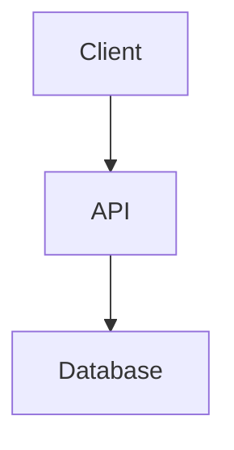

# PDF Generation Setup Guide

Professional Markdown to PDF conversion using **Pandoc + WeasyPrint + Mermaid-CLI**.

## Quick Start

```bash
# 1. Navigate to pdf-tools directory
cd pdf-tools

# 2. Install Python dependencies
pip install -r requirements-pdf.txt

# 3. Check system dependencies
python convert_final.py --check

# 4. Convert a document (paths relative to project root)
python convert_final.py ../docs/report.md
```

## System Dependencies

### Required

#### 1. Pandoc
Universal document converter. Required for Markdown parsing.

**Windows:**
```powershell
choco install pandoc
```

**macOS:**
```bash
brew install pandoc
```

**Linux:**
```bash
sudo apt install pandoc
```

**Verify:**
```bash
pandoc --version
```

#### 2. Mermaid-CLI
Pre-renders Mermaid diagrams to SVG for crisp PDF output.

```bash
npm install -g @mermaid-js/mermaid-cli
```

**Verify:**
```bash
mmdc --version
```

**Note:** On Windows, this installs to `%APPDATA%\npm\mmdc.cmd`

### Windows-Specific: GTK Runtime (for WeasyPrint)

WeasyPrint requires GTK libraries on Windows. Two options:

#### Option 1: MSYS2 (Recommended)
```powershell
# Install MSYS2
choco install msys2-installer

# Open MSYS2 terminal and install GTK
pacman -S mingw-w64-x86_64-gtk3

# Add to PATH (or set in Python script)
# C:\msys64\mingw64\bin
```

#### Option 2: Chocolatey GTK Runtime
```powershell
choco install gtk-runtime
```

**Note:** The `convert_final.py` script automatically adds MSYS2 GTK to PATH if installed.

## Python Dependencies

```bash
pip install -r requirements-pdf.txt
```

**Packages:**
- `weasyprint` - HTML/CSS to PDF converter
- `pyyaml` - YAML frontmatter parsing

## Usage

### Command-Line Interface

#### Single File

**Easiest (Batch File):**
```batch
# From project root
md2pdf.bat docs\report.md

# Specify output
md2pdf.bat docs\report.md output\report.pdf
```

**Python Direct:**
```bash
# From project root
python pdf-tools/convert_final.py docs/report.md

# From pdf-tools directory (paths relative to project root)
cd pdf-tools
python convert_final.py ../docs/report.md
```

#### Batch Conversion

**Easiest (Batch File):**
```batch
# From project root
md2pdf.bat --batch docs\*.md
```

**Python Direct:**
```bash
# From project root
python pdf-tools/convert_final.py --batch docs/*.md

# From pdf-tools directory
cd pdf-tools
python convert_final.py --batch ../docs/*.md
```

#### Configuration File
Create `pdf-config.json` (paths relative to project root):
```json
{
  "files": [
    {"input": "docs/report1.md", "output": "output/report1.pdf"},
    {"input": "docs/report2.md", "output": "output/report2.pdf"}
  ]
}
```

Then:
```bash
python convert_final.py --config pdf-config.json
```

### Markdown Syntax

#### YAML Frontmatter (Optional)
Extract metadata for dynamic title pages:

```markdown
---
title: System Architecture – Phase 0 Foundation
author: Your Name
organization: Your Organization
date: January 2025
version: 1.0
type: Technical Specification
classification: INTERNAL USE ONLY
---

# Document Title
```

**Metadata Fields:**
- `title` - Document title (default: first H1)
- `author` - Author name (default: "Matt Jeffcoat")
- `organization` - Organization name (default: "Your Organization")
- `date` - Document date (default: "November 2025")
- `version` - Version number (default: "1.0")
- `type` - Document type (default: "Technical Specification")
- `classification` - Classification banner (default: "CONFIDENTIAL – INTERNAL USE ONLY")

#### Mermaid Diagrams
Automatically pre-rendered to SVG:

```markdown

```

**Supported Diagram Types:**
- Flowcharts (`graph`, `flowchart`)
- Sequence diagrams (`sequenceDiagram`)
- Class diagrams (`classDiagram`)
- State diagrams (`stateDiagram`)
- Gantt charts (`gantt`)
- And more...

#### Logo Support
Default logo location: `docs/logo.png` (relative to project root).

To use a different logo:
```batch
# Using batch file (easiest)
md2pdf.bat --logo assets\logo.png docs\report.md
```

```bash
# Python direct
python pdf-tools/convert_final.py --logo assets/logo.png docs/report.md
```

### Programmatic Usage

```python
from convert_final import markdown_to_pdf

# Convert single file
markdown_to_pdf('docs/report.md', 'output/report.pdf')
```

## Output Features

### Professional Layout
- **Title Page:** Logo, document title, metadata, classification banner
- **Table of Contents:** Auto-generated with Roman numeral page numbers
- **Running Headers:** Document title and current section
- **Page Numbers:** Arabic numerals for content, Roman for TOC
- **Page Breaks:** Intelligent handling of orphans/widows

### Typography
- **Font:** Segoe UI (fallback: Arial, sans-serif)
- **Code:** Consolas/Monaco monospace
- **Sizes:** Optimized for print (11pt body, 24pt H1, 18pt H2)
- **Spacing:** Professional line-height and margins

### Diagram Rendering
- Mermaid diagrams pre-rendered to high-quality SVG
- Automatic sizing and page-break avoidance
- Crisp vector output suitable for print

## Troubleshooting

### "Pandoc not found"
- Install Pandoc: `choco install pandoc` (Windows) or `brew install pandoc` (macOS)
- Verify: `pandoc --version`
- Check PATH environment variable

### "Mermaid-CLI not found"
- Install: `npm install -g @mermaid-js/mermaid-cli`
- On Windows, check: `%APPDATA%\npm\mmdc.cmd`
- Diagrams will show as placeholders if not installed

### "Cannot load library 'libgobject-2.0-0'" (Windows)
- Install GTK runtime via MSYS2 (see above)
- Or install via Chocolatey: `choco install gtk-runtime`
- Ensure `C:\msys64\mingw64\bin` is in PATH

### Diagrams not rendering
- Check Mermaid-CLI installation: `mmdc --version`
- Verify Mermaid syntax is correct
- Check console output for rendering errors

### PDF looks wrong / formatting issues
- Check that Pandoc is latest version
- Verify WeasyPrint version: `pip show weasyprint`
- Review CSS in `convert_final.py` if custom styling needed

### Logo not appearing
- Verify logo path: `docs/logo.png`
- Check file permissions
- Ensure image format is PNG or JPEG

## File Structure

```
.
├── pdf-tools/                # PDF generation tools directory
│   ├── convert_final.py             # CLI wrapper script
│   ├── convert_final.py      # Core conversion logic
│   ├── requirements-pdf.txt  # Python dependencies
│   ├── PDF_GENERATION_SETUP.md  # This file
│   ├── README.md             # Quick reference
│   └── pdf-config.json.example  # Example config
└── docs/
    ├── logo.png              # Company logo (default location)
    └── *.md                  # Markdown source files
```

## Advanced Configuration

### Custom CSS
Modify the `custom_css` variable in `convert_final.py` to adjust:
- Fonts and typography
- Page margins and layout
- Colors and styling
- Header/footer content

### Custom Logo Path
Edit `pdf-tools/convert_final.py` around line 150:
```python
logo_path = Path(__file__).parent.parent / 'docs' / 'logo.png'
logo_path = logo_path.resolve()
```

### Running Headers
Modify `@top-left` and `@top-right` in CSS (line 211-222):
```css
@top-left {
    content: "Your Document Title";
}
```

## Examples

### Basic Document
```markdown
---
title: My Report
author: John Doe
date: November 2025
---

# Introduction
Content here...
```

### With Diagrams
```markdown
# Architecture


```

### Batch Processing Script
```python
from pathlib import Path
from convert_final import markdown_to_pdf

docs_dir = Path('docs')
for md_file in docs_dir.glob('*.md'):
    pdf_file = md_file.with_suffix('.pdf')
    markdown_to_pdf(str(md_file), str(pdf_file))
```

## Support

For issues or questions:
1. Check dependencies: `python convert_final.py --check`
2. Review console output for specific errors
3. Verify all system dependencies are installed
4. Check file paths and permissions

---

**Last Updated:** November 2025

