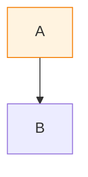

# PDF Styling Guide

This document explains where all colors, fonts, and formatting are defined for PDF generation.

## Overview

Styling is defined in **four main places**:

1. **Mermaid Diagram Colors** - Inline in Markdown files
2. **External CSS File** - `pdf-tools/custom.css.playwright` (FAANG-grade stylesheet)
3. **PDF Document CSS** - `pdf-tools/pdf_playwright.py` → `inject_pagination_css()` (page breaks)
4. **Pandoc Default HTML** - Generated by Pandoc (fallback defaults)

---

## 1. Mermaid Diagram Colors

**Location:** Inline in Markdown files (e.g., `docs/architecture-proposal.md`)

**Example:**
```mermaid
style Base fill:#fff3e0,stroke:#f57c00,stroke-width:2px
style Val fill:#c8e6c9,stroke:#2e7d32,stroke-width:2px
```

**Color Palette Used:**
- **Baseline/Orange**: `#fff3e0` (fill), `#f57c00` (stroke)
- **Success/Green**: `#c8e6c9` (fill), `#2e7d32` (stroke)
- **Batch/Purple**: `#f3e5f5` (fill), `#7b1fa2` (stroke)
- **API/Blue**: `#e1f5fe` (fill), `#01579b` (stroke)
- **Functions/Orange**: `#ffe0b2` (fill), `#f57c00` (stroke)

**Mermaid Default Font:** `Segoe UI, Arial, sans-serif` (set by Mermaid CLI)

---

## 2. External CSS File (Primary Styling)

**Location:** `pdf-tools/custom.css.playwright`

**Usage:**
```bash
python pdf-tools/md2pdf.py input.md output.pdf \
  --css pdf-tools/custom.css.playwright \
  --renderer playwright \
  --generate-cover --generate-toc
```

**Features:**
- **CSS Variables** - Centralized color scheme and typography scale
- **FAANG-Grade Typography** - Based on Microsoft Azure, AWS, and Stripe documentation
- **Professional Tables** - Striped rows, hover states, captions
- **Enhanced Code Blocks** - Colored left borders, syntax highlighting support
- **Callout Boxes** - Info, warning, success, danger variants
- **Print Optimization** - Color preservation, page break control

### CSS Variables (Design Tokens)

**Brand Colors:**
```css
--primary-color: #0078d4;        /* Primary blue for links, borders, accents */
--primary-dark: #005a9e;         /* Darker blue for table headers */
--accent-color: #2e7d32;         /* Green accent for special sections */
--text-primary: #1a1a1a;          /* Dark text for headings */
--text-secondary: #555555;         /* Medium text for body */
--text-tertiary: #777777;        /* Light text for metadata */
--background-code: #f5f7fa;      /* Code block background */
--background-table-header: #0078d4; /* Table header background */
--background-table-stripe: #f9fafb; /* Alternating table rows */
--border-light: #e1e4e8;         /* Light borders */
--border-medium: #999999;        /* Medium borders */
```

**Typography Scale:**
```css
--font-family-sans: 'Segoe UI', -apple-system, BlinkMacSystemFont, 'Helvetica Neue', Arial, sans-serif;
--font-family-serif: 'Georgia', 'Times New Roman', serif;
--font-family-mono: 'SF Mono', 'Monaco', 'Cascadia Code', 'Courier New', monospace;
--font-size-base: 11pt;
--line-height-base: 1.6;
--line-height-tight: 1.4;
```

### Typography Hierarchy

**Headings:**
- **H1**: `28pt`, `font-weight: 600`, `border-bottom: 3px solid var(--primary-color)`
- **H2**: `20pt`, `font-weight: 600`, `border-bottom: 2px solid var(--border-medium)`
- **H3**: `16pt`, `font-weight: 600`, `border-left: 4px solid var(--primary-color)`
- **H4**: `14pt`, `font-weight: 700`
- **H5**: `12pt`, `text-transform: uppercase`, `letter-spacing: 0.05em`
- **H6**: `11pt`, `font-style: italic`

**Body Text:**
- **Font Size**: `11pt`
- **Line Height**: `1.6`
- **Font Family**: `Segoe UI` (with fallbacks)
- **Color**: `#1a1a1a` (primary text)

### Code Blocks

**Inline Code:**
- Font: `SF Mono`, `Monaco`, `Cascadia Code`, `Courier New`
- Size: `9.5pt`
- Background: `#f5f7fa`
- Border: `1px solid #e1e4e8`
- Color: `#c7254e` (red for inline code)

**Code Blocks (pre):**
- Font: Monospace stack
- Size: `9pt`
- Background: `#f5f7fa`
- Border: `1px solid #e1e4e8` + `4px solid var(--primary-color)` (left border)
- Padding: `14pt`
- Line Height: `1.45`

### Tables

**Professional Styling:**
- Header: Blue background (`#0078d4`), white text
- Striped rows: Alternating `#f9fafb` background
- Hover state: `#f0f4f8` (for preview)
- Borders: `1px solid #e1e4e8`
- Font Size: `10pt`
- Padding: `10pt 12pt`

### Callout Boxes

**Usage in Markdown:**
```markdown
::: callout-info
This is an informational note.
:::

::: callout-warning
This is a warning.
:::

::: callout-success
This is a success message.
:::

::: callout-danger
This is a danger/error message.
:::
```

**Styles:**
- **Info**: Blue background (`#e7f3ff`), blue border (`#0078d4`)
- **Warning**: Orange background (`#fff4e5`), orange border (`#ff9800`)
- **Success**: Green background (`#e8f5e9`), green border (`#4caf50`)
- **Danger**: Red background (`#ffebee`), red border (`#f44336`)

### Customization

**To rebrand:** Edit CSS variables in `:root` section:
```css
:root {
    --primary-color: #your-color;
    --accent-color: #your-accent;
    /* ... */
}
```

**To create variants:** Copy `custom.css.playwright` and modify variables.

---

## 3. PDF Document CSS (Page Breaks)

**Location:** `pdf-tools/pdf_playwright.py` → `inject_pagination_css()` function (lines 88-175)

**Purpose:** Chromium PDF-specific page break rules (always injected)

**Current CSS:**
```css
@page {
    size: A4;
    margin: 0.75in;
}

/* Prevent awkward breaks */
h1, h2, h3, h4, h5, h6 {
    page-break-after: avoid !important;
    break-after: avoid !important;
    page-break-inside: avoid !important;
    break-inside: avoid !important;
}

figure, table, pre, blockquote {
    page-break-inside: avoid !important;
    break-inside: avoid !important;
}

/* Force breaks where needed */
.cover-page-wrapper,
.toc-wrapper {
    page-break-after: always !important;
    break-after: page !important;
}

/* SVG diagrams */
svg {
    max-width: 100% !important;
    height: auto !important;
    page-break-inside: avoid !important;
}

/* Chromium PDF quirks */
* {
    -webkit-print-color-adjust: exact !important;
    print-color-adjust: exact !important;
}
```

**Note:** This CSS is always injected AFTER custom CSS (if provided), so pagination rules take precedence.

---

## 4. Cover Page Styling

**Location:** `pdf-tools/pdf_playwright.py` → `inject_cover_page()` function (lines 249-310)

**Styles:**
- **Title**: `font-size: 36pt`, `color: #1a1a1a`, `font-weight: 600`
- **Organization**: `font-size: 18pt`, `color: #666`
- **Author/Date**: `font-size: 14pt`, `color: #999`
- **Logo**: `max-width: 200px`, `margin-bottom: 40px`
- **Layout**: Fixed height (`10in`) with spacer div for reliable page break

**Usage:**
```bash
python pdf-tools/md2pdf.py input.md output.pdf \
  --renderer playwright \
  --generate-cover
```

---

## 5. Table of Contents Styling

**Location:** `pdf-tools/pdf_playwright.py` → `inject_toc()` function (lines 178-246)

**Styles:**
- **TOC Title**: `font-size: 24pt`, `border-bottom: 2px solid #333`, `padding-bottom: 10px`
- **TOC Links**: `color: #1976d2`, `font-size: 14pt` (decreases by level)
- **Indentation**: `20px` per level
- **Page Break**: CSS-only approach with `page-break-after: always`

**Usage:**
```bash
python pdf-tools/md2pdf.py input.md output.pdf \
  --renderer playwright \
  --generate-toc
```

---

## 6. Header/Footer Styling

**Location:** `pdf-tools/pdf_playwright.py` → `generate_pdf_from_html()` function (lines 658-699)

**Header Template:**
- `font-size: 9px`
- `border-bottom: 1px solid #ddd`
- Title: `font-weight: 600`
- Organization: `color: #666`, `font-size: 8px`
- Centered layout

**Footer Template:**
- `font-size: 9px`
- Page numbers: `color: #666`
- Author/Date: Displayed if provided
- Format: `Author | Date | Page X of Y`

**Note:** Headers/footers are generated by Playwright's PDF API, not CSS.

---

## 7. Pandoc Default HTML (Fallback)

**What Pandoc Generates:**
- Uses browser default fonts (usually Times New Roman or serif)
- Basic heading sizes (h1=2em, h2=1.5em, etc.)
- No custom colors or spacing
- Tables use default browser styling

**Override:** Custom CSS file (`--css`) takes precedence over Pandoc defaults.

---

## Color Palette Reference

### Document Colors (CSS Variables)
- **Primary Blue**: `#0078d4` (links, borders, accents, table headers)
- **Primary Dark**: `#005a9e` (table header borders)
- **Accent Green**: `#2e7d32` (special sections, success states)
- **Text Primary**: `#1a1a1a` (headings)
- **Text Secondary**: `#555555` (body text)
- **Text Tertiary**: `#777777` (metadata, footers)
- **Background Code**: `#f5f7fa` (code blocks)
- **Background Table Stripe**: `#f9fafb` (alternating rows)
- **Border Light**: `#e1e4e8` (light borders)
- **Border Medium**: `#999999` (medium borders)

### Diagram Colors (Mermaid)
- **Baseline/Orange**: `#fff3e0` (fill), `#f57c00` (stroke)
- **Success/Green**: `#c8e6c9` (fill), `#2e7d32` (stroke)
- **Batch/Purple**: `#f3e5f5` (fill), `#7b1fa2` (stroke)
- **API/Blue**: `#e1f5fe` (fill), `#01579b` (stroke)
- **Functions**: `#ffe0b2` (fill), `#f57c00` (stroke)

### Callout Colors
- **Info**: `#e7f3ff` (background), `#0078d4` (border)
- **Warning**: `#fff4e5` (background), `#ff9800` (border)
- **Success**: `#e8f5e9` (background), `#4caf50` (border)
- **Danger**: `#ffebee` (background), `#f44336` (border)

---

## Font Stack

**Primary Sans-Serif:** `'Segoe UI', -apple-system, BlinkMacSystemFont, 'Helvetica Neue', Arial, sans-serif`

**Serif:** `'Georgia', 'Times New Roman', serif`

**Monospace:** `'SF Mono', 'Monaco', 'Cascadia Code', 'Courier New', monospace`

**Font Sizes:**
- Cover title: `36pt`
- Cover org: `18pt`
- Cover author: `14pt`
- TOC title: `24pt`
- TOC links: `14pt` (decreasing by level)
- H1: `28pt`
- H2: `20pt`
- H3: `16pt`
- H4: `14pt`
- H5: `12pt`
- H6: `11pt`
- Body: `11pt`
- Code: `9pt` (blocks), `9.5pt` (inline)
- Headers/Footers: `9px`

---

## Where to Make Changes

### 1. Mermaid Diagram Colors
**Edit:** Inline `style` directives in Markdown files
```markdown

```

### 2. Document Typography & Colors
**Edit:** `pdf-tools/custom.css.playwright`
- Modify CSS variables in `:root` section for quick rebranding
- Adjust typography rules for headings, paragraphs, tables, etc.
- Add custom utility classes

### 3. Page Break Rules
**Edit:** `pdf-tools/pdf_playwright.py` → `inject_pagination_css()` function
- Modify Chromium-specific page break rules
- Adjust `@page` margins
- Control orphan/widow behavior

### 4. Cover Page
**Edit:** `pdf-tools/pdf_playwright.py` → `inject_cover_page()` function
- Modify title, organization, author styling
- Adjust logo size/position
- Change layout structure

### 5. Table of Contents
**Edit:** `pdf-tools/pdf_playwright.py` → `inject_toc()` function
- Modify TOC title styling
- Adjust link colors and sizes
- Change indentation levels

### 6. Headers/Footers
**Edit:** `pdf-tools/pdf_playwright.py` → `generate_pdf_from_html()` function
- Modify header/footer templates
- Adjust font sizes and colors
- Change layout (centered, left-aligned, etc.)

---

## Usage Examples

### Basic PDF Generation
```bash
python pdf-tools/md2pdf.py docs/report.md docs/report.pdf \
  --renderer playwright \
  --css pdf-tools/custom.css.playwright \
  --generate-cover \
  --generate-toc
```

### Custom CSS Variant
```bash
# Create custom-brand.css with modified CSS variables
python pdf-tools/md2pdf.py docs/report.md docs/report.pdf \
  --renderer playwright \
  --css pdf-tools/custom-brand.css \
  --generate-cover \
  --generate-toc
```

### Without Custom CSS (Uses Pagination CSS Only)
```bash
python pdf-tools/md2pdf.py docs/report.md docs/report.pdf \
  --renderer playwright \
  --generate-cover \
  --generate-toc
```

---

## Best Practices

1. **Use CSS Variables** - Centralize colors and typography for easy rebranding
2. **Test Page Breaks** - Verify diagrams and tables don't break across pages
3. **Consistent Color Palette** - Use CSS variables instead of hardcoded colors
4. **Print Optimization** - Test with `--renderer playwright` for best results
5. **Callout Boxes** - Use Pandoc fenced divs for visual emphasis
6. **Diagram Colors** - Keep Mermaid colors consistent with document theme

---

## References

- **FAANG-Grade CSS**: Based on Microsoft Azure Architecture Center, AWS Well-Architected Framework, and Stripe API documentation styling
- **Playwright PDF API**: [Playwright Documentation](https://playwright.dev/python/docs/api/class-page#page-pdf)
- **CSS Paged Media**: [MDN @page Documentation](https://developer.mozilla.org/en-US/docs/Web/CSS/@page)
- **Mermaid Styling**: [Mermaid Documentation](https://mermaid.js.org/config/theming.html)
