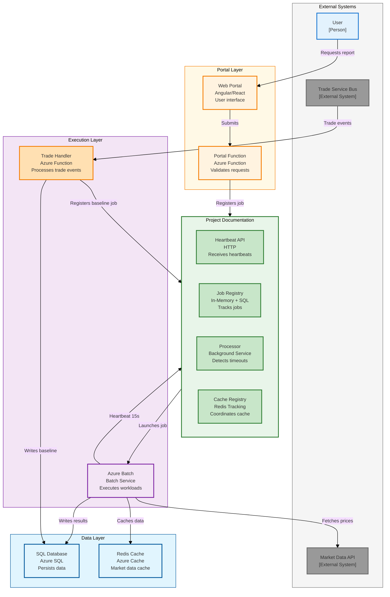
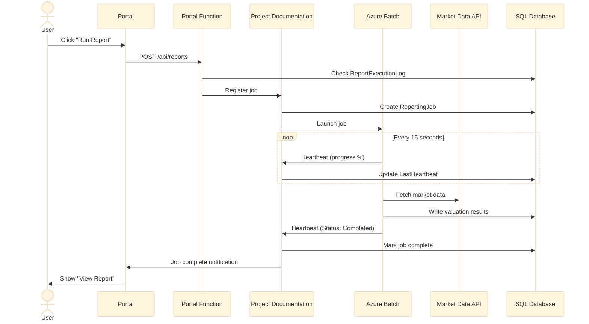
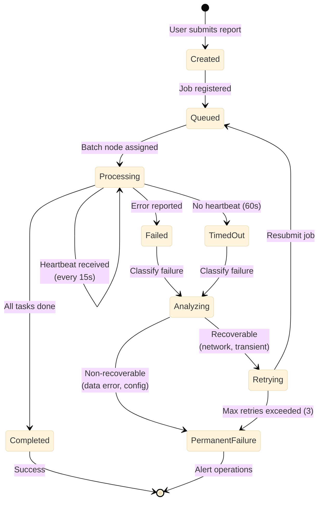

# Multi-Diagram Test Document

This document contains three large diagrams to test the scaling logic across multiple diagrams.

## Introduction

This test document validates that the PDF generation pipeline correctly scales multiple large diagrams within a single document, accounting for front matter (cover page and table of contents).

## Background

The project documentation system provides comprehensive orchestration capabilities. This document includes three key architectural diagrams that demonstrate different aspects of the system.

---

## Architecture Overview (Phase 0)

The project documentation architecture consists of multiple layers working together to provide unified job tracking and orchestration.

---

## Job Execution Flow

The job execution flow demonstrates the sequence of interactions between components during a typical report generation.

---

## Failure Detection and Recovery

The failure detection and recovery mechanism ensures system resilience through automatic timeout detection and recovery classification.

---

## Conclusion

This test document validates that all three diagrams are properly scaled and positioned within the PDF, accounting for front matter and page boundaries.

